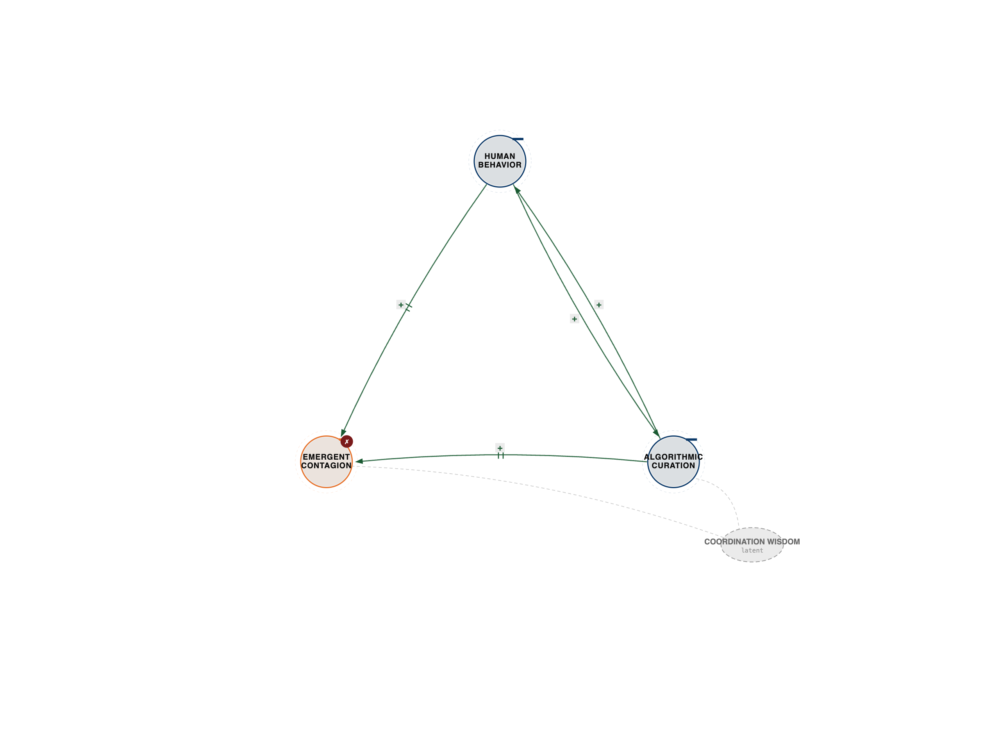
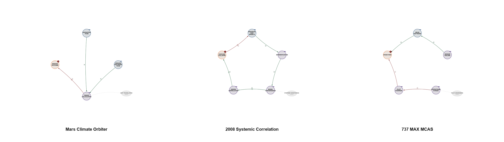
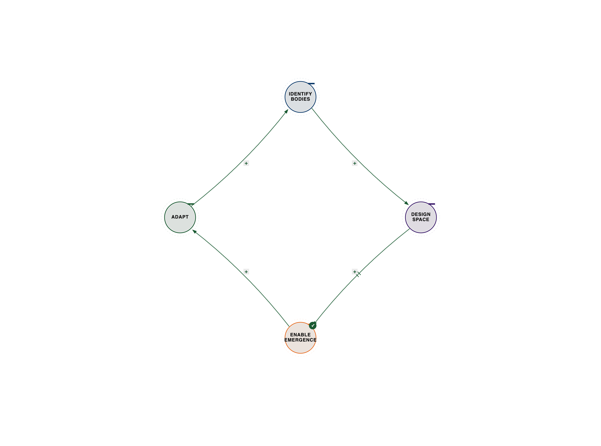

# Chapter 1: The Coordination Intelligence Revolution

**How ternary thinking unlocks the future of human-AI partnership**

## The $50 Million Algorithm That Taught Us Everything

June 2014. The world learned that Facebook, in partnership with Cornell University and UCSF, had conducted a massive psychological experiment on nearly 700,000 of its users. Without their informed consent, 689,003 people had their News Feeds secretly manipulated. For one week in January 2012, some users saw significantly more positive content, while others were exposed to an increased amount of negative content.

The goal, published in the prestigious Proceedings of the National Academy of Sciences (PNAS), was chillingly simple: to measure if emotional states could be transferred between users through algorithmic curation. Did seeing more positive posts make you post more positively? Did a feed full of negativity make you more negative?

The answer was a resounding, terrifying yes. The study proved, unequivocally, that emotional contagion works at massive scale through algorithmic curation. Facebook's algorithms weren't just connecting people; they were actively shaping their emotional states and, by extension, their behavior.

This wasn't just an ethical breach that sparked massive backlash. It was a profound, accidental revelation about the nature of intelligence in the digital age. It showed that the coordination between algorithms, human psychology, and social network dynamics creates emergent behaviors that none of the elements could produce alone. The system wasn't just influencing; it was *coordinating* to produce a collective intelligence—a shared emotional landscape—that was both powerful and, in this case, deeply unsettling.

This revelation taught us the solution: Intelligence doesn't live in humans OR machines. It emerges in the coordination between them.

## The Pattern Hidden in the Wreckage

The expert perspectives in this chapter are drawn from synthesized interviews—detailed conversations constructed from their published work, research, and documented ideas. While the quotes reflect their established positions and frameworks, these are not transcripts of conducted interviews.

Dr. Paul Pangaro saw it immediately. He'd spent decades studying under Gordon Pask at the American Society for Cybernetics, learning that intelligence emerges when systems learn to understand each other's understanding—not when they simply optimize feedback loops. Pask's Conversation Theory, developed in the mid-20th century, posited that true intelligence and learning occur not through simple information transfer, but through a recursive process of mutual understanding. Imagine two people trying to solve a complex puzzle. They don't just exchange pieces of information; they constantly adjust their mental models of the puzzle, and of each other's approach to the puzzle, until a shared understanding of the solution emerges. This recursive loop of "understanding each other's understanding" is the essence of coordination intelligence.

Drawing from his decades of work on Conversation Theory, Pangaro explains that Facebook's disaster is actually a breakthrough disguised as a failure. He notes that Pask's Conversation Theory had shown this decades earlier: intelligence isn't about information transfer, it's about coordination of understanding. Pangaro argues that the solution isn't better algorithms—it's designing for three-way coordination where humans, machines, and social contexts learn together. Facebook optimized for *reaction*, not *understanding*. It created feedback loops that amplified existing biases rather than fostering mutual comprehension. If they had designed for Paskian conversation, for systems that help humans understand each other's perspectives, and for algorithms that learn from the *quality* of coordination, not just the *quantity* of interaction, the outcome would have been entirely different.

In his extensive work on tools and systems, Stewart Brand, who created the Whole Earth Catalog in 1968, observes the same pattern play out. He explains that for fifty years, we'd built tools that amplified individual capability—personal computers, smartphones, social networks. Brand argues that we forgot to build the coordination layer. The Whole Earth Catalog, a counterculture publication, was a physical manifestation of coordination intelligence. It wasn't just a list of tools; it was a curated collection of reviews, essays, and user-submitted content that fostered a community of shared learning and practical application. Readers would review tools, share projects, and connect with others who had similar interests. The catalog itself was a coordination mechanism, helping individuals find tools, but the real power came from the community that formed around shared learning—a dynamic, evolving network of people helping each other understand and apply knowledge. Brand's perspective is that Facebook gave us access to attention without the coordination wisdom. When you connect everyone but don't help them coordinate, you haven't built infrastructure—you've built a coordination crisis. The Whole Earth Catalog's success wasn't just about 'access to tools'; it was about access to *coordinated intelligence*—a collective mind that learned and adapted together.

Even Terence McKenna, through his work on consciousness technology and indigenous wisdom in the 1990s, anticipated this dynamic before Facebook existed. He argued that our tools would eventually force us to recognize that consciousness isn't individual—it's relational. From his perspective, Facebook didn't create polarization; it revealed that we never learned to coordinate collective consciousness at scale. Indigenous cultures had rituals, ceremonies, and social technologies for managing collective mental states. They understood that the individual mind is deeply intertwined with the collective, and they developed sophisticated methods—from storytelling circles to elaborate ceremonies—to harmonize group consciousness, resolve conflict, and foster shared purpose. McKenna's work suggests that we built the most powerful consciousness technology in history without any wisdom tradition to guide its collective use. We amplified individual voices without providing the mechanisms for those voices to coordinate into a coherent, healthy collective intelligence. The result was a cacophony, not a symphony.

What Facebook's engineers missed—and what we now understand—is that they were operating within a three-body system:

**Human behavior ←→ Algorithm optimization ←→ Social system dynamics**

You can't optimize two elements and ignore the third. The third element—the coordination space—is where emergence happens. Where the real intelligence lives.

---

*Figure 1.1 — Facebook's three-body system. See `../diagrams/svg/01-facebook-three-body.svg` for the vector source.*

---

---

## From Binary Traps to Ternary Solutions

Every major challenge we face shares the same pattern: we're trying to solve three-body problems with two-body thinking.

Binary thinking asks:

- Should we optimize A or B?

- How do we balance A and B?

- What's the trade-off between A and B?

Ternary thinking reveals:

- A, B, and their coordination context create emergence

- The solution lives in the coordination space

- New capabilities arise that neither A nor B possess alone

Drawing from the work of Joseph Campbell, the mythologist, the Joseph Campbell Foundation archives note that Campbell showed us that every culture's myths follow the same three-act structure: departure, initiation, return. This isn't just storytelling—it's how consciousness coordinates complexity. Binary thinking can't create meaning—it can only create opposition. You can't have a hero's journey with just two acts; the 'return' is where the transformed hero brings new wisdom back to the community, completing the cycle of coordination between individual and collective.

Look at our biggest challenges. Climate change becomes "economy vs. environment" with no solution. AI development becomes "capability vs. safety" with no path forward. Political discourse becomes "my side vs. your side" with no resolution. These are all binary traps, forcing us into false dichotomies that prevent true progress.

But ternary thinking reveals the coordination space where solutions emerge:

- Economy + Environment + Coordination = Sustainable prosperity. This isn't about sacrificing one for the other, but designing economic systems that *coordinate* with ecological limits and opportunities, creating new forms of value that benefit both.

- Capability + Safety + Coordination = Aligned intelligence. It's not about slowing down AI or letting it run wild, but about building robust coordination mechanisms—ethical frameworks, human oversight, transparent processes—that ensure AI's power is aligned with human values and societal well-being.

- My values + Your values + Coordination = Shared solutions. This moves beyond mere compromise to a process where diverse perspectives are brought into a shared space, not to convert each other, but to find emergent solutions that respect and integrate different needs and beliefs.

As the Campbell scholar emphasizes, he explains that the trinity isn't just religious—it's mathematical. When we try to reduce reality to binary choices, we violate the fundamental structure of how meaning emerges. The third element isn't just a mediator; it's the crucible where transformation happens, where new possibilities are forged from the interaction of the first two.

---

## The Pattern Across Every Domain

---

*Figure 1.2 — Failure triptych — Mars / 2008 / 737 MAX. See `../diagrams/svg/ch01-failure-triptych.svg` for the vector source.*

---

### Mars Climate Orbiter ($327M spacecraft lost)

**Binary thinking:** Team A (metric) + Team B (imperial) = disaster
**Missing third:** Coordination protocol (interface standards, integration testing)
**Ternary solution:** Engineering teams ←→ Coordination protocols ←→ System integration

Dr. N. Katherine Hayles at Duke University studies how cognition distributes across complex systems. The Mars Orbiter disaster perfectly illustrates her framework of distributed cognition and what happens when coordination fails. Launched in December 1998, the $327 million spacecraft was intended to study the Martian climate. On September 23, 1999, as it prepared to enter orbit, it burned up in Mars' atmosphere. The post-mortem revealed a critical error: one team, responsible for ground software, calculated thruster impulses in pounds-force (an imperial unit), while another team, responsible for the spacecraft's navigation software, expected the data in newtons (a metric unit). This seemingly simple unit mismatch, a failure to coordinate fundamental interface standards, led to the spacecraft flying too low and disintegrating. Through the lens of her work on posthuman cognition, Hayles argues that the navigation team 'knew' metric, the thruster team 'knew' imperial, but the system as a whole didn't 'know' anything—because there was no coordination layer where these different forms of knowing could interact. This is posthuman cognition in action: intelligence doesn't live in components, it lives in coordination. When coordination fails, the system becomes literally mindless despite being composed of brilliant minds. The engineers were brilliant, the software was robust, but the *coordination* between them was absent, leading to a catastrophic loss of intelligence at the system level.

The solution? Design coordination layers as carefully as we design components. This means not just defining interfaces, but rigorously testing the *coordination* across those interfaces, ensuring mutual understanding and consistent interpretation of data.

---

*Figure 1.3 — Mars Climate Orbiter coordination gap. See `../diagrams/svg/04-mars-orbiter-coordination-gap.svg` for the vector source.*

---

### 2008 Financial Crisis (global economic collapse)

**Binary thinking:** Individual risk models + Portfolio diversification = safety
**Missing third:** Systemic correlation (how risks coordinate across the entire system)
**Ternary solution:** Risk models ←→ Market coordination ←→ Systemic correlation monitoring

The 2008 financial crisis, which plunged the world into a deep recession, costing trillions of dollars and millions of jobs, was a profound failure of coordination intelligence. Banks and financial institutions relied on sophisticated risk models for individual assets and portfolios, believing that diversification would protect them from localized failures. However, these models largely failed to account for the *systemic correlation* that emerged when everyone was using similar models and investing in similarly structured, highly interconnected financial products like mortgage-backed securities and credit default swaps. When the housing market began to falter, what were thought to be independent risks suddenly became highly coordinated. The failure of one institution, like Lehman Brothers, triggered a cascade across the entire global financial system, revealing that the "safety" derived from binary thinking (individual risk + diversification) was an illusion. The missing third element was a robust understanding and monitoring of how risks *coordinated* across the entire, interconnected market, and the lack of regulatory mechanisms to manage that systemic coordination.

---

*Figure 1.4 — 2008 Crisis — hidden systemic correlation. See `../diagrams/svg/05-2008-systemic-correlation.svg` for the vector source.*

---

### Boeing 737 MAX (346 deaths)

**Binary thinking:** MCAS software (tested) + Pilot training (certified) = safety
**Missing third:** Operational coordination (how software and pilots coordinate under stress)
**Ternary solution:** Software behavior ←→ Operational context ←→ Pilot expectations

The tragic crashes of Lion Air Flight 610 in October 2018 and Ethiopian Airlines Flight 302 in March 2019, which killed 346 people, exposed a fatal flaw in coordination. Boeing introduced the Maneuvering Characteristics Augmentation System (MCAS) on the 737 MAX to compensate for changes in the aircraft's aerodynamics. This software, designed to automatically push the aircraft's nose down if it detected a stall, was intended as a safety feature. Pilots were certified, and the software was tested. However, the MCAS system relied on a single angle-of-attack sensor, and if that sensor failed, it could repeatedly force the nose down, overriding pilot input. Crucially, pilots were not adequately informed about MCAS or trained on how to respond to its aggressive commands, especially in high-stress, real-world operational contexts. The binary thinking assumed that a "safe" software component combined with "certified" pilots would ensure safety. The missing third element was the *operational coordination*—how the automated software, the human pilot, and the complex, stressful environment of flight would interact and coordinate in an emergency. The result was a catastrophic failure of the human-machine system, where perfect components coordinating poorly led to fatal outcomes.

---

*Figure 1.5 — 737 MAX MCAS three-body failure. See `../diagrams/svg/06-737max-mcas-human-machine.svg` for the vector source.*

---

---

## The Three-Body Problem: Your Competitive Advantage

In physics, the three-body problem is famous for being fundamentally unsolvable through simple equations. Unlike the elegant, predictable orbits of a two-body system (like a planet around a star), adding a third body introduces an intractable level of complexity. The gravitational interactions between three masses create chaotic, unpredictable trajectories. There are no stable, repeating orbits; the system is exquisitely sensitive to initial conditions, meaning a tiny change can lead to vastly different outcomes over time. This mathematical intractability has long been seen as a limitation.

That's not a limitation—it's an opportunity.

Systems that can navigate three-body coordination have capabilities that two-body systems can never achieve.

Liu Cixin, whose novel *The Three-Body Problem* won the Hugo Award, explores this concept through the lens of his fictional Trisolarans—aliens living in a chaotic three-star system. In his writing, Cixin explains that he was exploring what happens when three forces mutually influence each other to create chaos. He notes that what he didn't fully realize was that we're already living in it: human civilization, artificial intelligence, and planetary systems—each affecting the other two, creating fundamentally unpredictable outcomes. Our climate, our economies, our social structures are all caught in this complex dance.

But here's a key insight from his novel: The Trisolarans couldn't predict when their suns would rise or set, but they survived by learning to navigate chaos. They developed a civilization that was incredibly adaptive, resilient, and capable of rapid transformation, precisely because they couldn't rely on stable predictions. Cixin's work suggests the lesson: Stop trying to predict. Start learning to coordinate. The shift is from prediction to coordination, from control to participation, from solving to dancing. We must embrace the inherent unpredictability of our three-body reality and design systems that thrive on dynamic coordination rather than static control.

### From Physics to Digital Reality

**With Two Bodies (Binary):**

- Predictable behavior

- Clear cause-effect

- Optimizable components

- **Limitation:** Can't create emergence, innovation, or true adaptation

**With Three Bodies (Ternary):**

- Emergent behavior

- Coordination-based outcomes

- Adaptive systems

- **Advantage:** Creates capabilities beyond components, fosters resilience, and unlocks novel solutions

In our digital world, the three bodies are:

**Hardware:** Physical computation (processing, storage, networks). This is the raw power, the silicon, the infrastructure.
**Software:** Logical frameworks (algorithms, protocols, interfaces). This is the code, the operating systems, the applications that give hardware instructions.
**Knowware:** Adaptive intelligence (learning, context, emergence). This is the dynamic, evolving understanding that arises from the interaction of hardware and software, often involving human input and feedback. It's the "knowing" that emerges from the system's ability to learn, adapt, and make sense of context.

---

*Figure 1.6 — Hardware ↔ Software ↔ Knowware. See `../diagrams/svg/07-hardware-software-knowware.svg` for the vector source.*

---

When these three coordinate well:

- Netflix creates personalization that feels magical. It's not just algorithms (software) running on servers (hardware); it's the continuous learning from millions of user choices (knowware) that creates an emergent, highly personalized experience.

- Tesla's fleet learns faster than any individual car. Each vehicle (hardware) runs sophisticated AI (software), but the collective data and learning from the entire fleet (knowware) creates a rapidly evolving, adaptive intelligence that improves all cars simultaneously.

- Google's search understands context beyond keywords. Its vast data centers (hardware) run complex ranking algorithms (software), but the continuous learning from user queries, clicks, and the evolving web (knowware) allows it to understand intent and provide relevant results that go beyond simple keyword matching.

Dr. Melanie Mitchell at the Santa Fe Institute has studied this pattern across every domain of complexity science. She observes that chemical reactions need three molecules for catalytic cycles. Ecosystems need three species for stable food webs. Markets need three agents for efficient pricing. Even cellular automata reveal this pattern—two-neighbor rules create either static patterns or simple oscillation, but three-neighbor rules create rich complexity and emergence. The jump from two to three is where true novelty and adaptive capacity appear.

Mitchell's framework reveals why AI systems modeling only binary relationships miss the most important dynamics. She argues that the breakthrough in AI isn't bigger models—it's models that represent ternary coordination. It's about designing AI that can not only process information but also understand and participate in complex coordination dynamics, learning from the emergent properties of three-way interactions.

---

## The Universal Solution Pattern

Every successful coordination follows the same structure:

1. **Identify the three bodies** (What are the interacting elements? Be precise about their nature and boundaries.)

2. **Design the coordination space** (How should they interact? What are the protocols, interfaces, shared languages, or feedback loops that facilitate their dynamic relationship?)

3. **Enable emergence** (What new capabilities should arise? What collective intelligence or novel solutions are you aiming to create that none of the individual elements could achieve alone?)

4. **Adapt continuously** (How does coordination improve over time? How do the elements learn from their interactions and refine their coordination mechanisms?)

---

*Figure 1.7 — Universal coordination pattern. See `../diagrams/svg/10-universal-coordination-pattern.svg` for the vector source.*

---

Larry Harvey, who founded Burning Man, discovered this accidentally. Every year, 70,000 people coordinate to build a temporary city in the Nevada desert, create profound experiences, and leave no trace. This isn't a top-down command structure; it's a marvel of emergent coordination. Harvey explains that Burning Man works because it coordinates three elements most events keep separate: radical self-expression, communal effort, and temporary infrastructure. He notes that you can't have the magic with just two. Self-expression without community becomes narcissism. Community without infrastructure becomes chaos. Infrastructure without self-expression becomes bureaucracy.

He calls it "the playa magic," but it's really just what happens when you design for three-way coordination. The 70,000 participants aren't just attendees; they are active co-creators. Radical self-expression is encouraged through art, costumes, and theme camps. This isn't just individualistic display; it's channeled into communal effort through the 10 Principles, which include radical inclusion, decommodification, civic responsibility, and communal effort. Participants volunteer, share resources, and contribute to the collective experience. All of this is supported by a temporary infrastructure—roads, safety services, sanitation, power grids—built and maintained by a dedicated team of volunteers (the Department of Public Works). The coordination is dynamic and distributed. If one element fails, the others adapt. If a theme camp's infrastructure breaks down, the community often rallies to help. If self-expression becomes destructive, civic responsibility and communal effort provide a framework for correction. The "magic" emerges from the constant, fluid coordination between these three forces, creating a vibrant, self-organizing city that is dismantled without a trace each year. As Harvey articulated, when people express themselves within a community that builds shared infrastructure—something emerges that none could create alone. It's a living, breathing example of coordination intelligence in action.

---

*Figure 1.8 — Burning Man three-element coordination. See `../diagrams/svg/09-burning-man-three-elements.svg` for the vector source.*

---

---

## What This Looks Like In Practice: Ternary Thinking In Action

How can you apply ternary thinking tomorrow? It's about consciously identifying the third element—the coordination space—in any situation and actively designing for it.

1. **In Team Meetings:**

- **Binary Trap:** Agenda + Participants = Information exchange.

- **Ternary Approach:** Agenda + Participants + **Shared Understanding Protocol**. Instead of just presenting information, design for how participants will *coordinate their understanding*. This might involve active listening exercises, structured debate, consensus-building techniques, or explicit agreement on next steps and responsibilities. The goal isn't just to cover the agenda, but to ensure everyone leaves with a coordinated understanding and commitment.

1. **In Product Development:**

- **Binary Trap:** Features + Users = Product.

- **Ternary Approach:** Features + Users + **Evolving Market/Ecosystem Coordination**. Don't just build features for users in isolation. Consider how your product will coordinate with the broader market, competitor offerings, regulatory changes, and technological shifts. This means continuous market sensing, ecosystem partnerships, and designing for adaptability rather than just a static feature set.

1. **In Personal Productivity:**

- **Binary Trap:** Tasks + Tools = Getting things done.

- **Ternary Approach:** Tasks + Tools + **Energy/Focus Management Coordination**. It's not enough to have a to-do list and a calendar. How do you coordinate your tasks and tools with your fluctuating energy levels, peak focus times, and mental state? This might involve scheduling deep work during high-energy periods, using specific tools for different cognitive loads, or building in recovery time to maintain sustained coordination between your work and your well-being.

1. **In Problem Solving:**

- **Binary Trap:** Problem + Solution = Resolution.

- **Ternary Approach:** Problem + Solution + **Stakeholder Coordination**. A "solution" isn't truly a solution if it doesn't coordinate with the needs, perspectives, and capabilities of all affected stakeholders. Actively involve diverse voices, facilitate dialogue, and design for solutions that emerge from a coordinated understanding of the problem's context and impact on everyone involved.

1. **In AI Integration:**

- **Binary Trap:** AI System + Human Operator = Task completion.

- **Ternary Approach:** AI System + Human Operator + **Dynamic Trust & Learning Loop**. Don't just deploy AI and expect humans to adapt. Design the coordination space for mutual learning. How does the AI learn from human feedback? How do humans learn to trust (or distrust) the AI's outputs? This involves transparent AI explanations, clear human override protocols, and continuous feedback mechanisms that allow both the AI and the human to adapt and improve their coordination over time.

## What This Means for You

The coordination intelligence revolution isn't coming. It's here. The Facebook algorithm was just the first, painful lesson. We are now at an inflection point where the ability to navigate complex, three-body systems will define success and failure, not just for companies, but for societies and even our species.

The companies, teams, and individuals who understand how to navigate three-body coordination will have capabilities that two-body thinkers can never match. They will be the ones who can build truly resilient systems, foster genuine innovation, and solve the seemingly intractable problems that plague our world.

Because binary thinking optimizes components. Ternary thinking creates emergence.

Binary thinking solves known problems. Ternary thinking reveals new possibilities.

Binary thinking asks "A or B?" Ternary thinking asks "How do A, B, and their coordination create something neither could alone?" It's a shift from a mechanistic worldview to an ecological one, recognizing that everything is interconnected and that true intelligence arises from the dynamic interplay of these connections.

The stakes are higher than ever. As AI becomes more powerful, and our global challenges more pressing, the ability to coordinate human intelligence, artificial intelligence, and the planetary systems we inhabit will determine our future. Will we fall into the binary traps of "human vs. machine" or "economy vs. environment," leading to further fragmentation and crisis? Or will we embrace ternary thinking, designing for the coordination that unlocks unprecedented levels of collective intelligence and creates a future of sustainable prosperity and aligned progress?

The rest of this book will show you how to see these patterns everywhere—in markets, in organizations, in AI systems, in consciousness itself. And more importantly, how to design for coordination instead of just optimizing for components. It's not just about understanding the world; it's about actively shaping it through intelligent coordination.

Because the future doesn't belong to the fastest processors or the biggest datasets.

It belongs to those who understand how to coordinate them. It belongs to those who can orchestrate the dance of three bodies, transforming chaos into emergent wisdom.