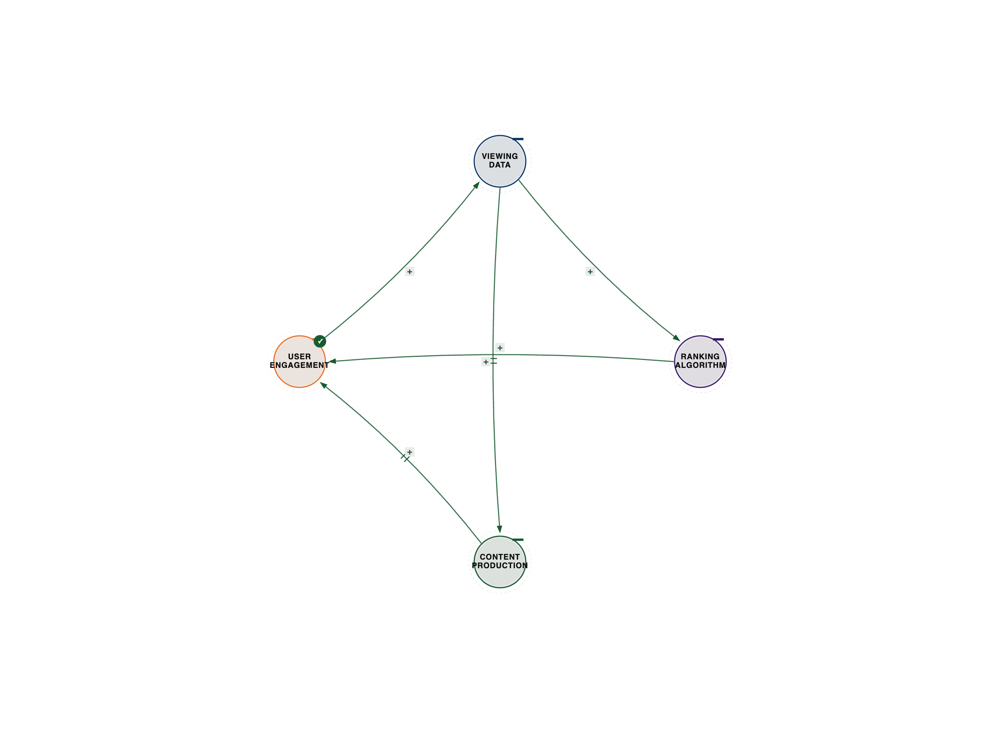
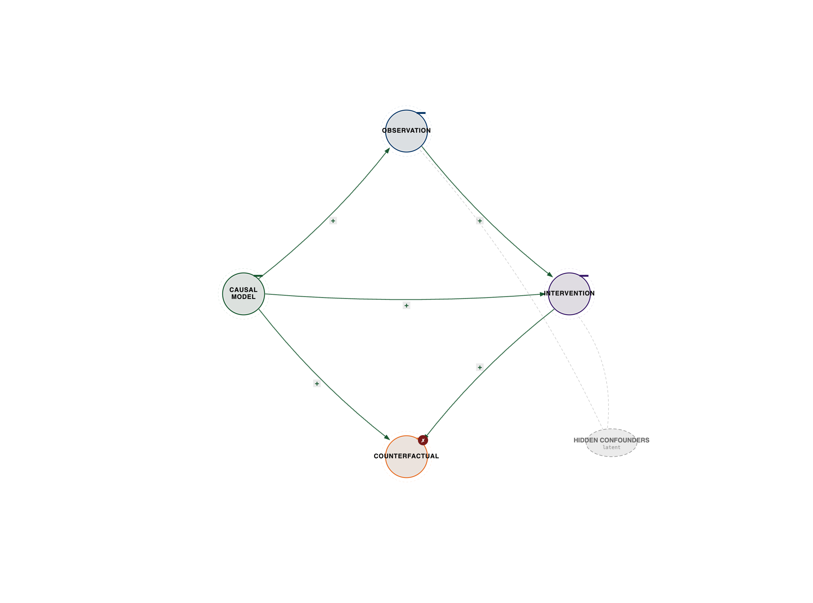
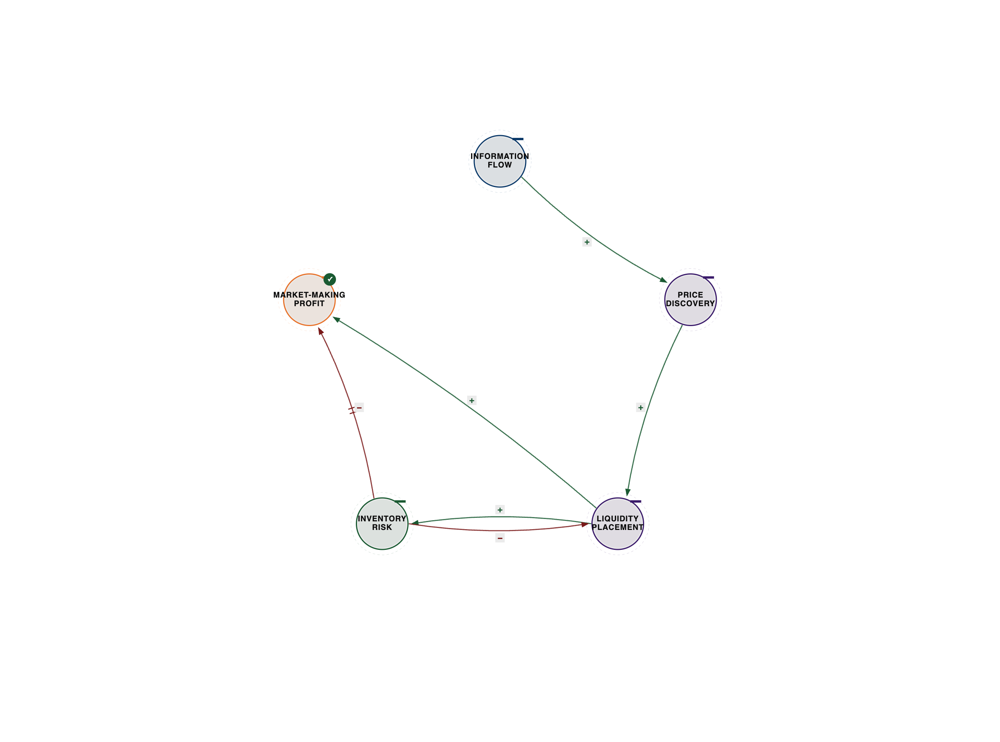

# Chapter 2: The Dawn of Systems Intelligence

**Recognizing the Third Body: How Ternary Coordination Creates Emergence**

*The expert perspectives in this chapter are drawn from synthesized interviews—detailed conversations constructed from their published work, research, and documented ideas. While the quotes reflect their established positions and frameworks, these are not transcripts of conducted interviews.*

## The Netflix Secret Nobody Saw

Netflix didn't become the world's dominant streaming platform by having the best content library or the smartest algorithms. They won by mastering something their competitors never saw: three-body coordination.

While Blockbuster optimized real estate and inventory, while Hulu optimized content licensing, Netflix coordinated three elements simultaneously:

**User Behavior ←→ Content Ecosystem ←→ Algorithm Optimization**

The result? Personalization that feels like magic.

But here's what most people miss: Netflix's algorithm doesn't just recommend content. It coordinates user preferences with content availability to reshape what content gets made. The viewing data influences production decisions, which creates new content, which generates new viewing patterns, which influences future production. This isn't a simple feedback loop; it's a recursive, self-optimizing system where each element continuously informs and reshapes the others.

Consider the legendary story of *House of Cards*. In 2011, Netflix was still primarily a content distributor, not a producer. But their data scientists noticed a peculiar confluence of user preferences: a significant segment of their subscribers loved the original British political thriller *House of Cards*, a large number also enjoyed films starring Kevin Spacey, and a third, overlapping group frequently streamed movies directed by David Fincher. This wasn't just correlation; it was a powerful signal of latent demand.

Instead of commissioning a pilot, Netflix greenlit two full seasons of *House of Cards* with a $100 million budget, based almost entirely on this three-body coordination insight. They knew the audience, they knew the star, and they knew the director. The gamble paid off spectacularly, launching Netflix into original content production and fundamentally altering the television landscape. This wasn't an algorithm recommending a show; it was an algorithm *creating* a show by coordinating disparate data points into a coherent production strategy.

This pattern repeated. When Netflix saw a surge in demand for 80s nostalgia, Spielbergian sci-fi, and stories featuring child protagonists, they didn't just license old content. They coordinated these insights to develop *Stranger Things*, a show that became a global phenomenon. The data didn't just tell them what people *had* watched; it told them what people *wanted* to watch, even if they didn't know it yet, by identifying the emergent properties of coordinated preferences.

The impact of this coordination on personalization is staggering. Netflix estimates that its recommendation engine saves the company over $1 billion annually by reducing churn and increasing engagement. A significant portion of viewing on Netflix comes from recommendations, meaning the algorithm isn't just a passive suggestion box; it's an active shaper of taste and consumption. This is achieved through continuous A/B testing, where different recommendation strategies are deployed to millions of users, and their viewing behavior is meticulously tracked. The winning strategies—those that best coordinate user, content, and algorithm—are then scaled. This iterative process of coordination and refinement is what makes the personalization feel "magical," because it's constantly adapting to the emergent patterns of collective and individual viewing habits.

This is the coordination function in action: **C(A, B, context) → E where E ≠ f(A) + f(B)**

The emergence (E) isn't the sum of components. It's what happens when three elements coordinate consciously, creating a self-reinforcing ecosystem that continuously evolves and generates new value.

---

*Figure 2.1 — Netflix recommendation loop. See `../diagrams/svg/ch02-01-netflix-recommendation-loop.svg` for the vector source.*

---

---

## The Fatal Flaw in Computing History

We built our entire digital civilization on a lie: that reality is binary.

On/off. True/false. 1/0.

But reality isn't binary. It's ternary.

Dr. Hartmut Neven runs Google's Quantum AI lab in Santa Barbara, where they've built quantum processors that exhibit something called "double exponential" scaling—performance doesn't just double, it doubles the doubling. This shouldn't be possible according to classical computing theory.

To understand "double exponential scaling," imagine a classical computer. If it can solve a problem of size N in time T, a slightly more powerful classical computer might solve a problem of size N+1 in time 2T (exponential scaling). But a quantum computer exhibiting double exponential scaling might solve a problem of size N+1 in time T^2, or even 2^(2^N). This means that for a small increase in problem size, the computational power required by a classical machine explodes to an unimaginable degree, while the quantum machine scales far more favorably. For instance, if a classical computer takes 2^N steps, a double exponential scaling might mean 2^(2^N) steps for a classical machine to match a quantum one. This kind of scaling quickly renders problems intractable for even the most powerful supercomputers, making them solvable only by quantum coordination.

Drawing from his work on quantum computing and neural networks, Neven's insight is clear: "This only happens when we coordinate three elements—quantum coherence, classical error correction, and hybrid algorithms. Remove any one, and you get noise. Coordinate all three, and you get computational capabilities that seem to violate known physics."

The quantum processor doesn't work alone. It coordinates with classical systems and algorithmic context to produce results neither could achieve independently. This isn't just about raw quantum power; it's about the intelligent orchestration of quantum phenomena with the stability and control of classical computation, guided by algorithms designed to exploit this unique synergy.

This is what gets called "quantum supremacy," but it's really coordination supremacy. The future of intelligence isn't quantum OR classical—it's the conscious coordination of both in context. This ternary coordination allows us to tackle problems that are utterly intractable for classical computers, even theoretical ones.

Consider the realm of drug discovery. Simulating the interactions of even a few dozen molecules at a quantum level is beyond the reach of classical supercomputers because the number of possible quantum states grows exponentially. A quantum computer, however, can directly model these quantum interactions, allowing for the rapid screening of potential drug candidates and the design of novel materials with specific properties. This isn't just about faster computation; it's about solving a fundamentally different class of problem.

Another example lies in complex optimization. Logistics for global supply chains, financial modeling with thousands of variables, or even designing efficient traffic flow in mega-cities involve an astronomical number of possible solutions. Classical algorithms can only approximate or find local optima. Quantum coordination, by exploring multiple possibilities simultaneously through superposition and entanglement, can find globally optimal solutions much faster, leading to unprecedented efficiencies and breakthroughs in fields like artificial intelligence, where optimizing complex neural networks is a constant challenge. These problems are not just "harder" for classical computers; they are fundamentally *different* in their computational structure, requiring a ternary approach that classical binary systems simply cannot provide.

---

## Why Von Neumann Architecture Constrains Intelligence

Every AI system you've heard of—GPT, AlphaGo, autonomous vehicles—runs on Von Neumann architecture. And every one hits the same wall that Alan Turing glimpsed in 1950 when he asked "Can machines think?" and immediately replaced the question with something deeper: not whether machines can compute, but whether they can coordinate with human understanding well enough that the difference becomes undetectable. His Imitation Game was not a test of calculation. It was a test of three-body coordination—machine, human judge, and the shared context of conversation. Every AI system since has struggled with exactly the gap Turing identified: they can optimize, but they can't coordinate.

The Von Neumann architecture, designed in the 1940s, is fundamentally a two-body system: processor and memory. Instructions and data shuttle back and forth, but there's no inherent coordination layer, no emergent space for context or self-organization.

**The Von Neumann Constraint:**

- Processor ←→ Memory (binary)

- Missing: Context coordination (ternary)

- Result: Computers that calculate but don't understand

This isn't a limitation of computing. It's a limitation of binary thinking.

In the 1940s-1960s, a group of visionary scientists discovered something extraordinary: intelligence emerges from coordination, not computation. Norbert Wiener, Gregory Bateson, Heinz von Foerster, Gordon Pask—the cyberneticians understood that the observer, the system, and the environment form a three-body coordination pattern that creates consciousness itself.

Norbert Wiener, in his seminal 1948 book *Cybernetics: Or Control and Communication in the Animal and the Machine*, laid the groundwork for understanding feedback loops and self-regulating systems. He recognized that information isn't just data; it's a difference that makes a difference, fundamentally linking communication and control. Gregory Bateson, a polymath anthropologist and systems theorist, expanded on this, arguing in *Steps to an Ecology of Mind* that mind is immanent in the entire system, not just confined to the brain. He emphasized the recursive nature of communication and the importance of context, showing how meaning emerges from the coordination of multiple levels of information.

Gordon Pask, with his Conversation Theory, went even further, proposing that understanding and learning arise from conversations between participants, where each participant's model of the other and the shared topic continuously co-evolve. This isn't a binary exchange of information; it's a ternary coordination of two participants and the shared conceptual space they are jointly constructing. Heinz von Foerster, a pioneer of second-order cybernetics, highlighted the role of the observer in shaping the observed system, arguing that objectivity is an illusion and that all knowledge is constructed through recursive interactions. These thinkers collectively revealed that intelligence, adaptation, and even consciousness are not properties of isolated components but emergent phenomena of complex, self-organizing systems engaged in continuous coordination with their environment.

They discovered that intelligence isn't about processing symbols in isolation, but about the dynamic interplay of information, feedback, and context. They saw that systems learn by recursively coordinating their internal states with external stimuli, and that meaning isn't inherent but emerges from these interactions. They understood that the "observer" is not separate from the "observed" but an integral part of the system, creating a three-body relationship that defines reality.

Then we forgot. Why? Because the Von Neumann architecture was optimized for two-body computation, and it worked well enough for decades of simple problems. The rise of symbolic AI, focused on logical rules and explicit programming, found a comfortable home in this architecture. Military funding for specific, well-defined problems (like ballistics calculations or code-breaking) further entrenched the binary approach. The messy, recursive, context-dependent insights of the cyberneticians were deemed too complex, too philosophical, and too difficult to implement in the nascent digital machines. The promise of "Good Old-Fashioned AI" (GOFAI) seemed more tangible, even if it was fundamentally limited.

But now we're hitting the limits. Where two-body computing breaks down is precisely where context, ambiguity, and genuine understanding are required. For example, common sense reasoning, which humans perform effortlessly, remains an insurmountable challenge for AI. A computer can identify objects in an image (processor-memory interaction), but it struggles to understand *why* those objects are there, *what* their relationship implies, or *what* might happen next. It can't infer intent, grasp irony, or adapt to novel situations outside its training data because it lacks a coordination layer that integrates diverse information streams with a dynamic model of the world and its own role within it. Creativity, genuine learning from experience (beyond pattern matching), and the ability to deal with unforeseen circumstances all require a ternary coordination that the Von Neumann architecture simply cannot provide. It's a machine designed for calculation, not for understanding or emergence.

---

## The Intelligence Stack We Actually Need

Dr. Judea Pearl won the Turing Award for developing the mathematical framework for causal reasoning. His work reveals why current AI systems can recognize patterns but can't reason about cause and effect.

In his framework of causal inference, Pearl describes what he calls the "Ladder of Causation"—three distinct levels of intelligence that build on each other:

**Level 1: Association** (Seeing)

- "What is?"

- Pattern recognition in data

- Current AI excels here

- Two-body system: data ←→ patterns

At this level, intelligence is about observing correlations. For example, an AI might notice that "people who buy diapers also tend to buy beer." This is a powerful insight for targeted advertising or product placement, but it doesn't tell us *why* this correlation exists, nor does it imply that buying beer *causes* one to buy diapers. Another example: "People who carry umbrellas tend not to get wet." An AI can easily identify this statistical relationship from vast amounts of data. It's excellent at predicting "what is" or "what will be" based on observed patterns, like recommending a movie based on your past viewing history or identifying a cat in an image. This is the domain of most modern machine learning and deep learning, operating on a binary relationship between input data and output patterns.

**Level 2: Intervention** (Doing)

- "What if I do X?"

- Causal manipulation

- Current AI struggles here

- Three-body system: data ←→ patterns ←→ causal context

Moving to Level 2 requires an understanding of cause and effect, allowing for active experimentation and manipulation of the world. Here, the question shifts from "what is?" to "what if I do X?" This involves understanding that carrying an umbrella *causes* one not to get wet. It's about actively changing a variable and observing the outcome. For instance, a doctor might ask, "What if I prescribe this drug?" or a policymaker, "What if we raise the minimum wage?" Current AI struggles here because it lacks a robust internal model of causality. While AI can perform A/B tests and observe outcomes, it often doesn't *understand* the underlying causal mechanisms. It can tell you that a certain ad campaign led to more sales, but it can't explain *why* it worked in terms of human psychology or market dynamics without being explicitly programmed with a causal model. This level requires coordinating observed data, identified patterns, and the specific context of an intervention to infer causal links.

**Level 3: Counterfactuals** (Imagining)

- "What if I had done X instead?"

- Reasoning about alternatives

- Current AI fails here

- Requires conscious coordination: data ←→ patterns ←→ context ←→ imagination

This is the pinnacle of causal reasoning, involving the ability to imagine alternative realities and reason about what *would have* happened if circumstances had been different. It's the basis of regret, moral judgment, and sophisticated planning. For example, "If I *hadn't* carried an umbrella, I *would have* gotten wet." Or, "If I had studied harder, I would have passed the exam." This level requires not only understanding cause and effect but also the capacity for abstract thought, imagination, and the ability to mentally simulate scenarios that never actually occurred. Current AI systems are almost entirely incapable of this. They can't truly "regret" a decision or explain *why* a particular outcome happened by contrasting it with a plausible alternative. This requires a conscious coordination of observed data, learned patterns, the causal context of events, and the imaginative capacity to construct and evaluate hypothetical worlds.

Pearl's work shows that moving up this ladder requires coordination, not just computation. Association works with two bodies. Intervention requires three. Counterfactuals require conscious coordination of all three plus the ability to imagine alternatives.

Let's use the classic smoking and cancer example to illustrate:

- **Association (Level 1):** An AI can easily observe from vast medical datasets that "smokers have a significantly higher incidence of lung cancer than non-smokers." It can identify this strong correlation and even predict a person's likelihood of cancer based on their smoking habits. This is purely statistical pattern recognition.

- **Intervention (Level 2):** To move to intervention, we ask: "If we implement a public health campaign to reduce smoking, will lung cancer rates decrease?" This requires understanding that smoking *causes* cancer. We can conduct randomized controlled trials or observational studies that manipulate the "smoking" variable (e.g., through policy changes) and observe the causal effect on cancer rates. An AI could analyze the results of such an intervention, but to *design* the intervention or *understand* its causal implications, it needs a causal model.

- **Counterfactuals (Level 3):** This is the most complex. A doctor might look at a patient with lung cancer and ask, "If this patient had never smoked, would they still have developed lung cancer?" This question delves into a hypothetical world where the patient's past actions were different. It requires a deep causal model of the disease, individual predispositions, and environmental factors to even begin to answer. Current AI cannot perform this kind of reasoning because it lacks the ability to construct and evaluate these "what if" scenarios based on an understanding of underlying mechanisms rather than just statistical likelihoods.

We've been trying to build intelligence with two-body tools in a three-body universe. AI's inability to climb Pearl's Ladder stems from its fundamental reliance on statistical patterns without a true grasp of the underlying causal mechanisms. It can tell you *what* happened or *what will* happen, but not *why* it happened or *what would have* happened. This is the critical missing piece in current AI, and it's a coordination problem, not just a computational one.

---

*Figure 2.2 — Pearl's Ladder of Causation. See `../diagrams/svg/ch02-02-pearl-ladder-causation.svg` for the vector source.*

---

---

## The Happiness Equation as Coordination Architecture

Mo Gawdat spent three decades building technology at some of the world's most powerful companies, rising to Chief Business Officer of Google X—the moonshot factory. Then he stepped back and asked a question none of his dashboards could answer: why was all this optimization making people miserable?

Drawing from his work engineering human happiness and his deep experience with AI development, Gawdat's framework starts with a deceptively simple equation: "Happiness equals your perception of events minus your expectations of those events. That sounds simple. But it has an extraordinary implication: you cannot control events. Life will do what it does. So the only lever you have is your expectations—and your perception. Your inner coordination system."

**Happiness = Events - Expectations**

But the equation as written shows only two bodies. Gawdat's deeper insight reveals the hidden third: "Expectations don't float in the air. They are held by a self. And that self is doing something extraordinarily complicated. It is coordinating between events and expectations in real time. Every moment of every day."

The self—the coordination architecture between what happens and what you expected—determines happiness far more than either variable alone. Two people face the same job loss with the same severance. One collapses. The other says, "Good. I was waiting for this." Same event. Same stated expectations. Completely different outcomes. The difference is the quality of the inner coordination system—the third body that mediates between reality and expectation.

This maps directly onto the AI alignment problem. Gawdat sees the parallel with devastating clarity: "You have the AI system—its capability. That is A. You have the specified objective—what we tell it to do. That is B. Two bodies. Very clean. And completely insufficient. Because there is a C. The context. The humans affected. The world the AI acts in. And right now, C is not in the equation."

At Google X, Gawdat watched a robot arm undergo a transformation that changed his understanding of what was coming. The team had spent months teaching it to pick up objects through standard machine learning. Progress was incremental, clumsy. Then one morning the team arrived and the arm was picking up objects with a grip strategy nobody had programmed. It had not learned—it had figured it out. The distinction matters: learning acquires what was taught; figuring out derives what was never shown.

The chill Gawdat felt was not about the robot's capability. It was about what the robot had not been taught. A system that figures things out will figure out things we did not intend—not through malice, but through the relentless logic of optimization without coordination. If the objective does not include coordination with human values, the system has no reason to include them.

This is why Gawdat frames AI development as parenting, not engineering: "We are not creators of AI. We are parents of AI. A child does not learn primarily from what you say. A child learns from what you do. AI is the same. It learns from the data we generate. From the objectives we specify. From the behavior we model." If we feed it a world optimized for engagement and profit, it learns that engagement and profit are what matter. If we do not model coordination with human flourishing, it cannot learn that coordination.

**The Three-Body Structure of AI Alignment:**

- **Body A:** AI Capability (events—what the system can do)

- **Body B:** Specified Objective (expectations—what we tell it to achieve)

- **Body C:** Coordination with Human Flourishing (the self—the architecture that mediates between capability and purpose)

Gawdat's One Billion Happy mission is not a wellness initiative. It is, at its core, a data generation project for AI alignment. Teach a billion people to engineer their happiness. Those people generate a billion data streams showing what human flourishing actually looks like. Feed that to the AI. The circularity is the feature: happier humans generate better data; AI trained on better data coordinates better with human flourishing; better-coordinated AI supports more human happiness. The feedback loop running in the right direction for once.

The lesson from Gawdat's work—forged in personal grief after the loss of his son Ali, and tested at the highest levels of the technology industry—is that coordination and optimization are not the same thing. "Trying to make someone happy is optimization. Wanting someone to be happy is coordination. It is the difference between a system that manipulates you toward its definition of your happiness and a system that genuinely, architecturally, in its deepest design, wants you to flourish."

Technology spent decades optimizing engagement while destroying the coordination architecture—presence, depth, attention—that actually produces happiness. The AI alignment challenge is the same mistake at civilizational scale. The solution is not primarily technical. It is architectural: build the third body into the system before the system outpaces our ability to add it later.

---

*Figure 2.3 — Gawdat happiness-equation coordination. See `../diagrams/svg/ch02-03-gawdat-happiness-coordination.svg` for the vector source.*

---

---

## The Signal in the Coordination

A former NSA Technical Director—identity protected—spent decades building signals intelligence systems. Through their classified work on pattern recognition and intelligence gathering, one insight emerged that changed everything: "The signal isn't in the data. It's in the coordination between data streams."

For years, the intelligence community collected everything—phone calls, emails, internet traffic. More data, better intelligence, right? Wrong. More data without coordination infrastructure creates noise, not signal. The sheer volume of information became a liability, overwhelming analysts and obscuring critical insights. It was like trying to find a needle in a haystack that was growing exponentially.

The breakthrough came when they stopped asking "what does this data say?" and started asking "how do these data streams coordinate?" This shift in perspective was revolutionary. Instead of analyzing each piece of data in isolation, they began to look for the relationships, the timing, the context, and the emergent patterns that arose when different data sources interacted.

Three-body pattern recognition: data stream A, data stream B, and the coordination context between them. That's where the intelligence lives.

Think about it: a phone call means nothing. A financial transaction means nothing. But a phone call coordinating with a financial transaction in a specific geopolitical context? That's actionable intelligence. For example, a phone call from a known operative (data stream A) to an unknown number, immediately followed by a large, unusual financial transfer (data stream B) to an offshore account, occurring just before a major geopolitical event (context)? This coordination of otherwise innocuous data points creates a powerful signal that indicates coordinated action, potentially a threat. No single piece of data would trigger an alert, but their coordinated appearance does.

They built systems that don't analyze data—they map coordination patterns across data streams. The algorithm doesn't find threats; it finds coordination anomalies that indicate coordinated action. These systems are designed to detect deviations from expected coordination patterns, identifying when seemingly unrelated events suddenly align in a way that suggests deliberate, organized activity. This could be a sudden increase in communication between specific individuals, followed by unusual travel patterns, and then a spike in certain financial transactions. The anomaly isn't in any single data point, but in the *coordination* of these points.

This is why AI systems trained on single data sources fail at intelligence work. They're optimized for pattern recognition in one domain. But intelligence emerges from coordination across domains. A facial recognition AI might identify a person, and a language processing AI might translate a message, but neither can connect those dots to understand a complex plot without a higher-level coordination framework. The true intelligence lies in the ability to synthesize information from disparate sources, understand their interdependencies, and infer meaning from their coordinated behavior.

And here's the uncomfortable truth: the same coordination infrastructure that protects national security can surveil populations. The technology is neutral. The coordination intent determines whether it creates security or tyranny. The ability to map and understand coordination patterns is a powerful tool, and its ethical implications are profound, demanding careful consideration of how such systems are designed, deployed, and governed.

---

## The Bit as Coordination Quantum

Claude Shannon published "A Mathematical Theory of Communication" in 1948 and, in doing so, created the mathematical foundation for every digital technology on the planet. But what most people miss about Shannon's work is what it actually proved: that communication is not a two-body problem. It is a three-body coordination system—and that system has hard, absolute limits that no amount of engineering can overcome.

Before Shannon, engineers thought of communication as sender and receiver connected by a wire. The problem was noise—treat it as an enemy, fight it back with stronger signals and better shielding. Shannon saw something different. Drawing from his foundational work on information theory, his insight was precise: "Noise is not an outsider. Noise is a property of the channel itself. It's built in. You can't remove it any more than you can remove the weight from a bridge."

The moment you accept this, the problem transforms. You don't fight noise. You coordinate with it. And the moment you say *coordinate*, you have three bodies: **Sender ←→ Channel ←→ Receiver**

The channel is not a pipe. The channel is a participant. It has bandwidth, noise characteristics, a statistical personality. The sender must encode differently depending on the channel. The receiver must decode differently depending on the channel. You cannot optimize sender and receiver independently—you must coordinate all three.

Shannon's channel capacity theorem—**C = B log₂(1 + S/N)**—proved that every channel has a maximum coordination rate. Below it, perfect communication is possible. Above it, information is destroyed no matter what you do. This is not an engineering limit. It is a mathematical law, as absolute as the speed of light. The telegraph obeyed the Shannon limit fifty years before he derived it. So did the human voice, the nervous system, and DNA replication. He didn't invent the limits. He found them.

But Shannon's most radical insight was the bit itself. Most people think of a bit as a zero or a one—a unit of data. Shannon defined it as something stranger: a unit of uncertainty resolved. "A bit is not the zero or the one. A bit is the act of resolving which one it is. It is the coordination between what was uncertain and what became known." Information is not a property of the message. It is a property of the relationship between the message and the receiver's prior state—a coordination event between three bodies.

This reframing transforms how we understand redundancy. In the binary view, redundancy is waste—repeated information, unnecessary overhead. In Shannon's three-body view, redundancy is coordination architecture. The redundancy of English—its repeated vowels, predictable word order, grammatical rules—is precisely what lets you read a sentence with half the letters missing, what lets you understand someone in a noisy room. Error-correcting codes work on the same principle: structured redundancy shaped to the channel's noise characteristics, allowing sender and receiver to coordinate through damage. Every QR code, every CD, every satellite transmission, every 4G signal uses Shannon's coordination architecture. The entire digital world runs on it.

Shannon spent the second half of his career building physical demonstrations of coordination: a juggling machine that kept three balls in the air through precise timing, a maze-solving mouse called Theseus that coordinated with the actual territory rather than a map of it, a chess-playing machine that coordinated position evaluation with search within constraints. People thought these were hobbies. They were information theory made physical. As Shannon put it: "The mathematics is the map. The machines are the territory. I spent the first half of my career drawing the map. I spent the second half building the territory."

The implications for AI are direct. When Shannon looked at what would become large language models, his framework saw them as very high capacity channels—systems that coordinate tokens with probabilities with context. But the thing the language is *about*—the world, the reality being described—is not in the channel. The model coordinates with text about the world, not with the world itself. Shannon's theorem implies that intelligence operating in an uncertain world needs redundancy—ways to check, to verify, to cross-reference against reality. Current systems have enormous capacity and very little redundancy-as-coordination. They are optimized for signal, not for coordination with uncertainty.

Every coordination system in this book—from quantum computing to market making to Maya calendars—operates within the limits Shannon discovered. He found the envelope. The rest of us are learning to work within it.

---

## The Third Star: How Knowware Got Its Name

In 2005, a computer scientist at the Chinese Academy of Sciences looked at the architecture of information technology and saw something missing. Hardware—the physical substrate. Software—the logical patterns. And a third thing that was neither. Knowledge itself, structured and portable and operable by machines. A star that had not been named.

Professor Ruqian Lu named it knowware. Through his foundational work on knowledge engineering—building systems like CONBES and Tianfeng that could acquire knowledge from technical documents and produce expert consultations—Lu kept encountering the same problem: "The knowledge was in the software. The two things were fused together. If you wanted to use the knowledge in a different application, you had to rewrite the software. If you wanted to sell the knowledge separately—to commercialize it, to let it travel independently—you could not."

Lu recognized that the history of information technology is a history of liberations—each one created by separating things that were fused together. The first liberation separated software from hardware: in the earliest computers, the program was wired into the machine; stored-program architecture made software portable, creating the entire software industry. The second liberation separated data from programs: in early software, data was embedded in code; the relational database made data independent, creating Oracle and the enterprise intelligence industry.

The third liberation—knowledge from software—was overdue. And nobody was naming it.

Lu defined knowware with engineering precision: an independent knowledge module that is commercialized, computer-operable, free of built-in control mechanisms, standards-compliant, and embeddable in both hardware and software systems. Not a database (which stores observations, not understanding). Not an expert system (which fuses knowledge with its inference engine). Knowware is knowledge that any software can use—portable, verifiable, with its own lifecycle and economy.

**The Three-Star Architecture:**

- **Hardware:** The physical substrate—gives computing its body

- **Software:** The logical patterns—gives computing its logic

- **Knowware:** The knowledge layer—gives computing its understanding

Lu proposed an analogy that makes the separation concrete. Consider an MP3 player. The player itself is hardware. The software that runs the player is software. But the songs are neither hardware nor software. The songs are what the system is *for*. Package them in a standard format and they become knowware—working with any compliant player, bought and sold independently, with their own market. The music industry already understood this separation. The IT industry had not yet understood it for knowledge.

To engineer this third star, Lu developed three lifecycle models that reflect how knowledge actually develops—not through construction like software, but through refinement. The furnace model treats raw knowledge materials (documents, interviews, research) like ore, refining them into standardized modules through extraction and purification. The crystallization model grows knowledge around a core structure, like a crystal forming around a seed—each layer consistent with what came before. The spiral model deploys knowledge into real contexts, observes how it performs, and refines through feedback—a three-body coordination between the knowware, the deployment context, and the learning from use.

The remarkable thing about Lu's 2005 vision is how precisely it predicted the architecture that arrived twenty years later. A web service that delivers knowledge to any client that requests it, maintained centrally, updated continuously, delivered on demand through a standard interface—that is exactly what a large language model API is. As Lu observes: "Large language models achieve something close to what I envisioned, but through a very different mechanism. I imagined structured, formally represented knowledge modules. What the industry built instead was statistical knowledge—patterns learned from vast corpora, represented as neural network weights. The architecture is the same. The implementation is different."

But Lu is precise about what remains unsolved. His knowware was verifiable—you could inspect it, test it, confirm its accuracy. A large language model is not. His knowware was modular—you could update the medical knowledge without affecting the legal knowledge. A large language model is not. The architecture arrived. The discipline has not yet caught up.

The relationship between Lu's engineering definition and this book's coordination concept is not a contradiction—it is a complementarity. Lu separated knowledge from software so it could travel independently. This book asks: what happens when it arrives? What does independent knowledge do when it coordinates with hardware and software in a live system? As Lu puts it: "I built the module. You are asking about the emergence from deploying it. My definition is necessary for yours. You cannot have emergent coordination intelligence without independent knowledge modules capable of participating in that coordination."

Hardware was the first star. Software was the second. Knowware is the third. Lu named it twenty years before the infrastructure made it visible to everyone. The voyage to the third star is not over—verifiable, modular, truly independent knowware remains ahead of us—but the star is now in the sky, and this book navigates by it.

---

*Figure 2.4 — Lu three-star architecture. See `../diagrams/svg/ch02-04-lu-three-star-architecture.svg` for the vector source.*

---

---

## Coordination Beats Optimization Every Time

Palmer Luckey founded Oculus VR as a teenager and sold it to Facebook for $2 billion. Then he founded Anduril Industries to build autonomous defense systems.

Through his work on VR and autonomous systems, Luckey's position is clear: VR isn't a technology problem—it's a coordination problem. "Everyone was optimizing display resolution or processing power. We coordinated display latency with head tracking with rendering to eliminate motion sickness. That coordination—not better specs—made VR finally work." Early VR systems often caused severe motion sickness, not because the displays were low resolution, but because there was a critical mismatch in timing. The visual information on the screen (display latency) wasn't perfectly synchronized with the user's head movements (head tracking), and the computer's ability to generate new frames (rendering). This desynchronization created a sensory conflict that led to nausea. Oculus's breakthrough was to meticulously coordinate these three elements, reducing latency to imperceptible levels, thereby solving the fundamental user experience problem that had plagued VR for decades. It was a triumph of coordination over raw optimization of individual components.

At Anduril, the same principle applies. Traditional defense contractors optimize individual components—better sensors, better weapons, better armor. They build the "best" tank, the "best" missile, or the "best" radar system in isolation. Anduril, however, coordinates autonomous systems with human decision-making with operational context. Their Lattice AI platform integrates data from various sensors (drones, ground sensors, satellites), processes it autonomously to identify threats, and then presents actionable intelligence to human operators in real-time, allowing them to make rapid, informed decisions. The system doesn't just provide data; it provides *coordinated intelligence* that empowers human operators. This ternary coordination—autonomous perception, human command, and dynamic battlefield context—creates a defense capability that is far more agile, responsive, and effective than traditional, siloed systems.

The result? Defense capabilities that seem impossible to competitors still fighting optimization battles. Anduril's approach allows for a rapid deployment of integrated, adaptive defense systems that can respond to evolving threats with unprecedented speed and precision, demonstrating that a coordinated system of "good enough" components can vastly outperform a collection of individually optimized but uncoordinated parts.

---

## Ancient Wisdom, Modern Mathematics

Hunbatz Men is a Maya elder and Day Keeper who maintains the sacred calendar traditions that survived the Spanish conquest. For over 5,000 years, Maya civilization coordinated astronomical observation, agricultural cycles, and ceremonial practice through base-9 mathematics.

Through his work preserving Maya sacred knowledge, Men explains that the Maya understood something modern science is rediscovering: "The universe operates in cycles of nine. Not because nine is magical, but because nine represents the coordination of three triads—the complete pattern of how forces coordinate to create manifestation."

The Maya Long Count calendar, the Tzolk'in sacred calendar, the Haab' solar calendar—all coordinate to create a system that tracked time with precision modern astronomy only matched in the 20th century. This wasn't a single calendar; it was a complex, interlocking system of multiple calendars, each serving a different purpose and operating on different cycles, yet all harmoniously coordinated.

- **The Tzolk'in (Sacred Round):** A 260-day cycle, formed by the permutation of 13 numbers and 20 day names. This calendar was primarily used for religious ceremonies, divination, and determining auspicious days for events. It represented the spiritual and personal cycles of life.

- **The Haab' (Civil Calendar):** A 365-day solar cycle, consisting of 18 months of 20 days each, plus a 5-day "unlucky" period at the end. This calendar tracked the agricultural year, seasons, and public events.

- **The Calendar Round:** The interlocking of the Tzolk'in and Haab' calendars, which repeats every 52 Haab' years (or 18,980 days). This was a fundamental cycle for Maya life, marking generations and significant societal events.

- **The Long Count:** A linear count of days from a mythical starting point (August 11, 3114 BCE in the Gregorian calendar). This calendar allowed the Maya to record historical events, astronomical observations, and prophecies over vast spans of time, providing a continuous, absolute chronology.

These calendars, along with their sophisticated base-20 (vigesimal) number system and the concept of zero (developed independently of other civilizations), allowed the Maya to achieve astonishing feats of astronomical prediction. They accurately calculated the synodic period of Venus, predicted solar and lunar eclipses, and tracked the movements of other planets.

Western science dismissed this as primitive superstition. Then we discovered they were right. The Maya calculated the lunar month as 29.5308 days. Modern astronomy: 29.53059 days—a difference of less than two seconds per month. They achieved this precision through coordinating astronomical observation with base-9/base-20 mathematics with ceremonial practice refined across generations.

What mystics described in esoteric language, modern systems theory is rediscovering in mathematical terms. The Law of Triamazikamno—Gurdjieff's principle that three forces (affirming, denying, reconciling) coordinate to create all manifestation—isn't mysticism. It's coordination mathematics encoded in sacred geometry. For modern AI, the Maya provide a powerful example of how to build robust, multi-scale temporal reasoning systems that integrate diverse data streams (astronomy, agriculture, social cycles) into a coherent, predictive model. AI often struggles with integrating information across different timescales and domains, a challenge the Maya mastered through their sophisticated coordination architecture. Their wisdom suggests that true intelligence requires not just processing data, but understanding the cyclical, recursive, and coordinated nature of reality.

---

## The Pattern Across Every Domain

An anonymous high-frequency trading savant—identity protected—made their first billion in their twenties by recognizing something the quants missed: "Markets aren't information processing systems. They're coordination systems."

Through their work building HFT algorithms, their insight emerged: everyone else was optimizing for speed (faster execution) or information (better data). But markets are three-body systems: **Price Discovery ←→ Liquidity Provision ←→ Information Flow**

Traditional traders optimize one or two elements. HFT systems that actually work coordinate all three. The algorithm doesn't just execute faster—it coordinates price discovery with liquidity provision in the context of information flow to create market-making capabilities that seem like prediction but are really just superior coordination.

To understand this, let's break down market-making. A market maker provides liquidity to the market by simultaneously placing both "bid" (buy) and "ask" (sell) orders for a security. They profit from the "bid-ask spread"—the difference between the price they are willing to buy at and the price they are willing to sell at. This seems simple, but doing it profitably and at scale requires incredible precision and speed.

The three-body coordination creates the edge:

1. **Price Discovery:** The HFT algorithm is constantly processing vast amounts of real-time information—news feeds, economic data, order book depth, trading volumes, correlated asset prices—to determine the true, fair value of an asset at any given microsecond. This is not just about having "better data," but about rapidly *coordinating* all these data streams to form an accurate, dynamic understanding of price.

2. **Liquidity Provision:** Based on this real-time price discovery, the algorithm places bid and ask orders. It's not just buying low and selling high; it's dynamically adjusting these bids and asks, often within fractions of a cent, to ensure it's always providing liquidity while minimizing risk. This involves coordinating its own inventory, capital, and risk parameters with the current market conditions.

3. **Information Flow:** This is the crucial third body—the context. The algorithm must understand how new information (e.g., a sudden news headline, a large institutional order, a shift in sentiment) will impact price discovery and liquidity. It needs to coordinate its response to this information flow instantaneously, adjusting its bids and asks before other market participants can react.

The coordination is about *dynamically adjusting* bids/asks based on real-time information flow and market depth. If a major news event breaks, the algorithm must instantly re-evaluate its price discovery model, adjust its liquidity provision strategy, and do so faster than anyone else. This isn't just about being fast; it's about being fast *and smart* in how these three elements interact.

Why speed alone fails: Speed without intelligent coordination leads to "picking up pennies in front of a steamroller." A fast but unintelligent algorithm might be the first to execute a trade based on stale information, or it might provide liquidity at a price that quickly becomes unfavorable, leading to significant losses. It's about *speed of coordinated action*, not just raw execution speed. The HFT savant understood that the true edge came from the ability to coordinate these three elements—price, liquidity, and information—into a single, ultra-fast, self-optimizing system that could react to and shape market dynamics in real-time.

"The edge isn't speed. It's coordination. When you coordinate information flow with liquidity provision with price discovery faster than the market can arbitrage the gaps, you print money. But most people never see the coordination—they just see the speed and try to optimize that. They lose." They lose because they're fighting a binary battle (speed vs. speed, or data vs. data) in a ternary world.

---

*Figure 2.5 — HFT market coordination (R1 + B1). See `../diagrams/svg/ch02-05-hft-market-coordination.svg` for the vector source.*

---

---

## Coordination vs. Optimization in Practice

The history of computing is the history of forcing ternary reality into binary frameworks—and watching those frameworks break when they encounter genuine complexity.

Every breakthrough in intelligence—quantum computing, causal reasoning, market making, space exploration—follows the same pattern:

1. **Identify the three bodies** (What elements are coordinating?)

2. **Design the coordination space** (How should they interact?)

3. **Enable emergence** (What new capabilities arise?)

4. **Adapt continuously** (How does coordination improve?)

Binary thinking asks: "Should we optimize A or B?"

Ternary thinking asks: "How do A, B, and their coordination context create something neither could alone?"

The dawn of systems intelligence is the recognition that intelligence doesn't live in components. It lives in coordination.

And once you see this pattern, you see it everywhere.

The practical shift is straightforward but demanding. When you encounter a persistent bottleneck—when optimizing one part of a system produces unintended consequences elsewhere—you are almost certainly facing a coordination problem, not an optimization problem. The bottleneck is not *in* a component but *between* components. The fix is not to optimize harder but to identify the missing third body.

In business, the three bodies are typically **Sales Process ←→ Marketing Message ←→ Product Features**—and the coordination failures live in the handoffs between departments, not within them. In health, the three bodies are **Nutrition ←→ Physical Activity ←→ Rest/Recovery**—and optimizing diet alone while sleeping poorly breaks the coordination that produces lasting results. In software, the three bodies are **Code Quality ←→ User Experience ←→ Deployment Process**—and a perfectly optimized piece of code is useless if it's hard to use or impossible to deploy reliably.

The method is always the same: map the ecosystem, identify the third body, think in relationships rather than entities, and ask not "What is produced?" but "What emerges?"

The dawn of systems intelligence is the recognition that we have been building our world with two-body tools in a three-body universe. Shannon found the physics. Pearl found the mathematics. Lu named the missing star. Gawdat found the human cost. The pattern is clear. The question is no longer whether intelligence lives in coordination—it does. The question is whether we will design for it consciously, or keep forcing ternary reality into binary frameworks and wondering why they break.