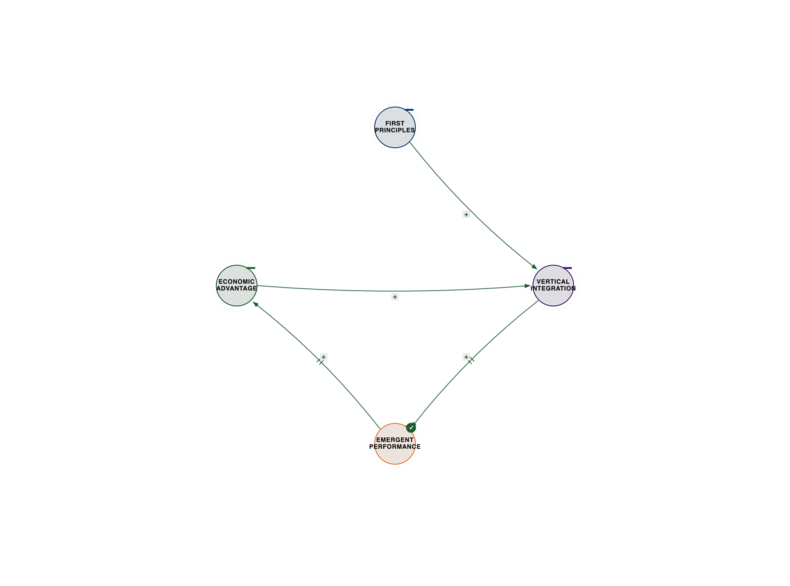
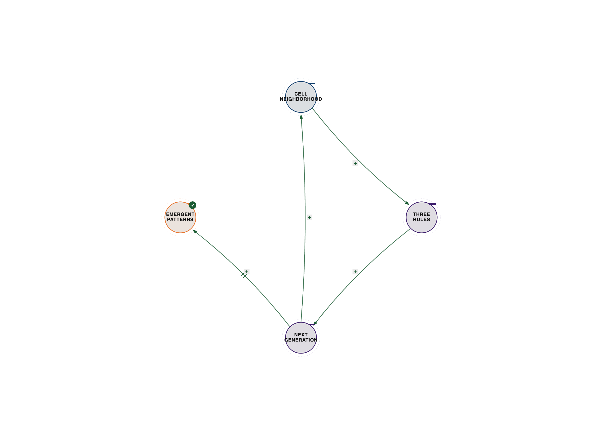

# Chapter 2: The Dawn of Systems Intelligence

**Recognizing the Third Body: How Ternary Coordination Creates Emergence**

*The expert perspectives in this chapter are drawn from synthesized interviews—detailed conversations constructed from their published work, research, and documented ideas. While the quotes reflect their established positions and frameworks, these are not transcripts of conducted interviews.*

## The Netflix Secret Nobody Saw

Netflix didn't become the world's dominant streaming platform by having the best content library or the smartest algorithms. They won by mastering something their competitors never saw: three-body coordination.

While Blockbuster optimized real estate and inventory, while Hulu optimized content licensing, Netflix coordinated three elements simultaneously:

**User Behavior ←→ Content Ecosystem ←→ Algorithm Optimization**

The result? Personalization that feels like magic.

But here's what most people miss: Netflix's algorithm doesn't just recommend content. It coordinates user preferences with content availability to reshape what content gets made. The viewing data influences production decisions, which creates new content, which generates new viewing patterns, which influences future production. This isn't a simple feedback loop; it's a recursive, self-optimizing system where each element continuously informs and reshapes the others.

Consider the legendary story of *House of Cards*. In 2011, Netflix was still primarily a content distributor, not a producer. But their data scientists noticed a peculiar confluence of user preferences: a significant segment of their subscribers loved the original British political thriller *House of Cards*, a large number also enjoyed films starring Kevin Spacey, and a third, overlapping group frequently streamed movies directed by David Fincher. This wasn't just correlation; it was a powerful signal of latent demand.

Instead of commissioning a pilot, Netflix greenlit two full seasons of *House of Cards* with a $100 million budget, based almost entirely on this three-body coordination insight. They knew the audience, they knew the star, and they knew the director. The gamble paid off spectacularly, launching Netflix into original content production and fundamentally altering the television landscape. This wasn't an algorithm recommending a show; it was an algorithm *creating* a show by coordinating disparate data points into a coherent production strategy.

This pattern repeated. When Netflix saw a surge in demand for 80s nostalgia, Spielbergian sci-fi, and stories featuring child protagonists, they didn't just license old content. They coordinated these insights to develop *Stranger Things*, a show that became a global phenomenon. The data didn't just tell them what people *had* watched; it told them what people *wanted* to watch, even if they didn't know it yet, by identifying the emergent properties of coordinated preferences.

The impact of this coordination on personalization is staggering. Netflix estimates that its recommendation engine saves the company over $1 billion annually by reducing churn and increasing engagement. A significant portion of viewing on Netflix comes from recommendations, meaning the algorithm isn't just a passive suggestion box; it's an active shaper of taste and consumption. This is achieved through continuous A/B testing, where different recommendation strategies are deployed to millions of users, and their viewing behavior is meticulously tracked. The winning strategies—those that best coordinate user, content, and algorithm—are then scaled. This iterative process of coordination and refinement is what makes the personalization feel "magical," because it's constantly adapting to the emergent patterns of collective and individual viewing habits.

This is the coordination function in action: **C(A, B, context) → E where E ≠ f(A) + f(B)**

The emergence (E) isn't the sum of components. It's what happens when three elements coordinate consciously, creating a self-reinforcing ecosystem that continuously evolves and generates new value.

---

*Figure 2.1 — Netflix recommendation loop. See `../diagrams/svg/ch02-01-netflix-recommendation-loop.svg` for the vector source.*

---

---

## The Fatal Flaw in Computing History

We built our entire digital civilization on a lie: that reality is binary.

On/off. True/false. 1/0.

But reality isn't binary. It's ternary.

Dr. Hartmut Neven runs Google's Quantum AI lab in Santa Barbara, where they've built quantum processors that exhibit something called "double exponential" scaling—performance doesn't just double, it doubles the doubling. This shouldn't be possible according to classical computing theory.

To understand "double exponential scaling," imagine a classical computer. If it can solve a problem of size N in time T, a slightly more powerful classical computer might solve a problem of size N+1 in time 2T (exponential scaling). But a quantum computer exhibiting double exponential scaling might solve a problem of size N+1 in time T^2, or even 2^(2^N). This means that for a small increase in problem size, the computational power required by a classical machine explodes to an unimaginable degree, while the quantum machine scales far more favorably. For instance, if a classical computer takes 2^N steps, a double exponential scaling might mean 2^(2^N) steps for a classical machine to match a quantum one. This kind of scaling quickly renders problems intractable for even the most powerful supercomputers, making them solvable only by quantum coordination.

Drawing from his work on quantum computing and neural networks, Neven's insight is clear: "This only happens when we coordinate three elements—quantum coherence, classical error correction, and hybrid algorithms. Remove any one, and you get noise. Coordinate all three, and you get computational capabilities that seem to violate known physics."

The quantum processor doesn't work alone. It coordinates with classical systems and algorithmic context to produce results neither could achieve independently. This isn't just about raw quantum power; it's about the intelligent orchestration of quantum phenomena with the stability and control of classical computation, guided by algorithms designed to exploit this unique synergy.

This is what gets called "quantum supremacy," but it's really coordination supremacy. The future of intelligence isn't quantum OR classical—it's the conscious coordination of both in context. This ternary coordination allows us to tackle problems that are utterly intractable for classical computers, even theoretical ones.

Consider the realm of drug discovery. Simulating the interactions of even a few dozen molecules at a quantum level is beyond the reach of classical supercomputers because the number of possible quantum states grows exponentially. A quantum computer, however, can directly model these quantum interactions, allowing for the rapid screening of potential drug candidates and the design of novel materials with specific properties. This isn't just about faster computation; it's about solving a fundamentally different class of problem.

Another example lies in complex optimization. Logistics for global supply chains, financial modeling with thousands of variables, or even designing efficient traffic flow in mega-cities involve an astronomical number of possible solutions. Classical algorithms can only approximate or find local optima. Quantum coordination, by exploring multiple possibilities simultaneously through superposition and entanglement, can find globally optimal solutions much faster, leading to unprecedented efficiencies and breakthroughs in fields like artificial intelligence, where optimizing complex neural networks is a constant challenge. These problems are not just "harder" for classical computers; they are fundamentally *different* in their computational structure, requiring a ternary approach that classical binary systems simply cannot provide.

---

## Why Von Neumann Architecture Constrains Intelligence

Every AI system you've heard of—GPT, AlphaGo, autonomous vehicles—runs on Von Neumann architecture. And every one hits the same wall: they can optimize, but they can't coordinate.

The Von Neumann architecture, designed in the 1940s, is fundamentally a two-body system: processor and memory. Instructions and data shuttle back and forth, but there's no inherent coordination layer, no emergent space for context or self-organization.

**The Von Neumann Constraint:**

- Processor ←→ Memory (binary)

- Missing: Context coordination (ternary)

- Result: Computers that calculate but don't understand

This isn't a limitation of computing. It's a limitation of binary thinking.

In the 1940s-1960s, a group of visionary scientists discovered something extraordinary: intelligence emerges from coordination, not computation. Norbert Wiener, Gregory Bateson, Heinz von Foerster, Gordon Pask—the cyberneticians understood that the observer, the system, and the environment form a three-body coordination pattern that creates consciousness itself.

Norbert Wiener, in his seminal 1948 book *Cybernetics: Or Control and Communication in the Animal and the Machine*, laid the groundwork for understanding feedback loops and self-regulating systems. He recognized that information isn't just data; it's a difference that makes a difference, fundamentally linking communication and control. Gregory Bateson, a polymath anthropologist and systems theorist, expanded on this, arguing in *Steps to an Ecology of Mind* that mind is immanent in the entire system, not just confined to the brain. He emphasized the recursive nature of communication and the importance of context, showing how meaning emerges from the coordination of multiple levels of information.

Gordon Pask, with his Conversation Theory, went even further, proposing that understanding and learning arise from conversations between participants, where each participant's model of the other and the shared topic continuously co-evolve. This isn't a binary exchange of information; it's a ternary coordination of two participants and the shared conceptual space they are jointly constructing. Heinz von Foerster, a pioneer of second-order cybernetics, highlighted the role of the observer in shaping the observed system, arguing that objectivity is an illusion and that all knowledge is constructed through recursive interactions. These thinkers collectively revealed that intelligence, adaptation, and even consciousness are not properties of isolated components but emergent phenomena of complex, self-organizing systems engaged in continuous coordination with their environment.

They discovered that intelligence isn't about processing symbols in isolation, but about the dynamic interplay of information, feedback, and context. They saw that systems learn by recursively coordinating their internal states with external stimuli, and that meaning isn't inherent but emerges from these interactions. They understood that the "observer" is not separate from the "observed" but an integral part of the system, creating a three-body relationship that defines reality.

Then we forgot. Why? Because the Von Neumann architecture was optimized for two-body computation, and it worked well enough for decades of simple problems. The rise of symbolic AI, focused on logical rules and explicit programming, found a comfortable home in this architecture. Military funding for specific, well-defined problems (like ballistics calculations or code-breaking) further entrenched the binary approach. The messy, recursive, context-dependent insights of the cyberneticians were deemed too complex, too philosophical, and too difficult to implement in the nascent digital machines. The promise of "Good Old-Fashioned AI" (GOFAI) seemed more tangible, even if it was fundamentally limited.

But now we're hitting the limits. Where two-body computing breaks down is precisely where context, ambiguity, and genuine understanding are required. For example, common sense reasoning, which humans perform effortlessly, remains an insurmountable challenge for AI. A computer can identify objects in an image (processor-memory interaction), but it struggles to understand *why* those objects are there, *what* their relationship implies, or *what* might happen next. It can't infer intent, grasp irony, or adapt to novel situations outside its training data because it lacks a coordination layer that integrates diverse information streams with a dynamic model of the world and its own role within it. Creativity, genuine learning from experience (beyond pattern matching), and the ability to deal with unforeseen circumstances all require a ternary coordination that the Von Neumann architecture simply cannot provide. It's a machine designed for calculation, not for understanding or emergence.

---

## The Intelligence Stack We Actually Need

Dr. Judea Pearl won the Turing Award for developing the mathematical framework for causal reasoning. His work reveals why current AI systems can recognize patterns but can't reason about cause and effect.

In his framework of causal inference, Pearl describes what he calls the "Ladder of Causation"—three distinct levels of intelligence that build on each other:

**Level 1: Association** (Seeing)

- "What is?"

- Pattern recognition in data

- Current AI excels here

- Two-body system: data ←→ patterns

At this level, intelligence is about observing correlations. For example, an AI might notice that "people who buy diapers also tend to buy beer." This is a powerful insight for targeted advertising or product placement, but it doesn't tell us *why* this correlation exists, nor does it imply that buying beer *causes* one to buy diapers. Another example: "People who carry umbrellas tend not to get wet." An AI can easily identify this statistical relationship from vast amounts of data. It's excellent at predicting "what is" or "what will be" based on observed patterns, like recommending a movie based on your past viewing history or identifying a cat in an image. This is the domain of most modern machine learning and deep learning, operating on a binary relationship between input data and output patterns.

**Level 2: Intervention** (Doing)

- "What if I do X?"

- Causal manipulation

- Current AI struggles here

- Three-body system: data ←→ patterns ←→ causal context

Moving to Level 2 requires an understanding of cause and effect, allowing for active experimentation and manipulation of the world. Here, the question shifts from "what is?" to "what if I do X?" This involves understanding that carrying an umbrella *causes* one not to get wet. It's about actively changing a variable and observing the outcome. For instance, a doctor might ask, "What if I prescribe this drug?" or a policymaker, "What if we raise the minimum wage?" Current AI struggles here because it lacks a robust internal model of causality. While AI can perform A/B tests and observe outcomes, it often doesn't *understand* the underlying causal mechanisms. It can tell you that a certain ad campaign led to more sales, but it can't explain *why* it worked in terms of human psychology or market dynamics without being explicitly programmed with a causal model. This level requires coordinating observed data, identified patterns, and the specific context of an intervention to infer causal links.

**Level 3: Counterfactuals** (Imagining)

- "What if I had done X instead?"

- Reasoning about alternatives

- Current AI fails here

- Requires conscious coordination: data ←→ patterns ←→ context ←→ imagination

This is the pinnacle of causal reasoning, involving the ability to imagine alternative realities and reason about what *would have* happened if circumstances had been different. It's the basis of regret, moral judgment, and sophisticated planning. For example, "If I *hadn't* carried an umbrella, I *would have* gotten wet." Or, "If I had studied harder, I would have passed the exam." This level requires not only understanding cause and effect but also the capacity for abstract thought, imagination, and the ability to mentally simulate scenarios that never actually occurred. Current AI systems are almost entirely incapable of this. They can't truly "regret" a decision or explain *why* a particular outcome happened by contrasting it with a plausible alternative. This requires a conscious coordination of observed data, learned patterns, the causal context of events, and the imaginative capacity to construct and evaluate hypothetical worlds.

Pearl's work shows that moving up this ladder requires coordination, not just computation. Association works with two bodies. Intervention requires three. Counterfactuals require conscious coordination of all three plus the ability to imagine alternatives.

Let's use the classic smoking and cancer example to illustrate:

- **Association (Level 1):** An AI can easily observe from vast medical datasets that "smokers have a significantly higher incidence of lung cancer than non-smokers." It can identify this strong correlation and even predict a person's likelihood of cancer based on their smoking habits. This is purely statistical pattern recognition.

- **Intervention (Level 2):** To move to intervention, we ask: "If we implement a public health campaign to reduce smoking, will lung cancer rates decrease?" This requires understanding that smoking *causes* cancer. We can conduct randomized controlled trials or observational studies that manipulate the "smoking" variable (e.g., through policy changes) and observe the causal effect on cancer rates. An AI could analyze the results of such an intervention, but to *design* the intervention or *understand* its causal implications, it needs a causal model.

- **Counterfactuals (Level 3):** This is the most complex. A doctor might look at a patient with lung cancer and ask, "If this patient had never smoked, would they still have developed lung cancer?" This question delves into a hypothetical world where the patient's past actions were different. It requires a deep causal model of the disease, individual predispositions, and environmental factors to even begin to answer. Current AI cannot perform this kind of reasoning because it lacks the ability to construct and evaluate these "what if" scenarios based on an understanding of underlying mechanisms rather than just statistical likelihoods.

We've been trying to build intelligence with two-body tools in a three-body universe. AI's inability to climb Pearl's Ladder stems from its fundamental reliance on statistical patterns without a true grasp of the underlying causal mechanisms. It can tell you *what* happened or *what will* happen, but not *why* it happened or *what would have* happened. This is the critical missing piece in current AI, and it's a coordination problem, not just a computational one.

---

*Figure 2.2 — Pearl's Ladder of Causation. See `../diagrams/svg/ch02-02-pearl-ladder-causation.svg` for the vector source.*

---

---

## First Principles as Coordination Architecture

Elon Musk's companies—Tesla, SpaceX, Neuralink—seem to violate economic gravity. How does one person build multiple world-changing companies simultaneously?

Through his extensive work applying first principles thinking, Musk's approach reveals a pattern: "Most people use first principles to optimize parts. I use it to understand coordination. When you see how parts coordinate to create emergence, you can engineer what seems impossible."

Take rocket costs. Traditional thinking: rockets cost $60 million because that's what rockets cost. First principles: a Falcon 9 costs $60 million to manufacture and $200,000 to fuel—so why charge customers $62 million when you could just refuel and relaunch? Answer: because we treat rockets as trash after one use. Solution: coordinate design for reusability, manufacturing for refurbishment, and operations for rapid turnaround. Result: dramatic cost reduction through coordination, not just better engineering This wasn't achieved by simply making individual components cheaper, but by fundamentally rethinking the entire production and operational pipeline as a single, vertically integrated, and highly coordinated system. SpaceX brought almost every aspect of rocket production in-house, from engine design (Raptor) and manufacturing to the construction of the Starship vehicle itself, and even launch operations. This vertical integration eliminated the complex, costly, and often slow coordination required when dealing with multiple external suppliers and contractors. By controlling the entire stack, SpaceX could rapidly iterate designs, test components, and integrate feedback, drastically reducing the time and cost associated with traditional aerospace development. The goal was not just to build a rocket, but to build a *system* for rapid, reusable space access, where each part was designed to coordinate seamlessly with the others.

The same pattern repeats across all his companies:

**Tesla:** Coordinating battery technology ←→ manufacturing scale ←→ charging infrastructure (not just "better cars"). Tesla didn't just put a big battery in a car. They designed the battery pack as an integral part of the vehicle's structure, developed proprietary battery cell chemistry, and then built the Supercharger network to support long-distance travel. This holistic approach meant that the battery's thermal management system, the car's software, and the charging station's power delivery were all designed to work in perfect concert. This level of coordination ensures optimal performance, range, and charging speed, creating a user experience that competitors, who often rely on third-party charging networks or less integrated battery designs, struggle to match. The result is not just a car, but an entire electric vehicle ecosystem.

**Neuralink:** Coordinating neural interface ←→ surgical robotics ←→ clinical deployment (not just "brain chips"). Neuralink's ambition isn't merely to create a brain-computer interface. It's to coordinate the ultra-fine thread electrodes, the robotic surgeon capable of implanting them with micron precision, and the software that translates neural signals into actionable commands. Each of these elements is a monumental engineering challenge on its own, but Neuralink's strategy is to develop them in tandem, ensuring they coordinate perfectly to achieve a safe, reliable, and high-bandwidth connection between brain and computer.

**SpaceX:** Coordinating rocket design ←→ vertical integration ←→ reusability (not just "cheaper launches"). Beyond the initial cost reduction, SpaceX's ultimate coordination triumph is reusability. This wasn't an afterthought; it was designed into the Falcon 9 and Starship from day one. The design of the rocket, the manufacturing processes, the launch and landing operations, and the rapid refurbishment procedures are all coordinated to enable multiple flights. This drastically reduces the marginal cost of each launch. While traditional rockets are single-use, SpaceX's coordinated system allows for costs to be amortized over many missions, driving down the price per launch from $60 million to around $5 million for a Falcon 9, and aiming for even lower costs with Starship. This is a direct result of viewing the entire space launch enterprise as a coordinated system, not a series of independent components.

First principles thinking, applied correctly, reveals coordination opportunities that optimization thinking can never see. It forces you to break down a problem to its fundamental truths and then rebuild it, not by optimizing existing parts, but by designing a new architecture where the parts coordinate to create a superior emergent whole.

---

*Figure 2.3 — Musk first-principles coordination. See `../diagrams/svg/ch02-03-musk-first-principles.svg` for the vector source.*

---

---

## The Signal in the Coordination

A former NSA Technical Director—identity protected—spent decades building signals intelligence systems. Through their classified work on pattern recognition and intelligence gathering, one insight emerged that changed everything: "The signal isn't in the data. It's in the coordination between data streams."

For years, the intelligence community collected everything—phone calls, emails, internet traffic. More data, better intelligence, right? Wrong. More data without coordination infrastructure creates noise, not signal. The sheer volume of information became a liability, overwhelming analysts and obscuring critical insights. It was like trying to find a needle in a haystack that was growing exponentially.

The breakthrough came when they stopped asking "what does this data say?" and started asking "how do these data streams coordinate?" This shift in perspective was revolutionary. Instead of analyzing each piece of data in isolation, they began to look for the relationships, the timing, the context, and the emergent patterns that arose when different data sources interacted.

Three-body pattern recognition: data stream A, data stream B, and the coordination context between them. That's where the intelligence lives.

Think about it: a phone call means nothing. A financial transaction means nothing. But a phone call coordinating with a financial transaction in a specific geopolitical context? That's actionable intelligence. For example, a phone call from a known operative (data stream A) to an unknown number, immediately followed by a large, unusual financial transfer (data stream B) to an offshore account, occurring just before a major geopolitical event (context)? This coordination of otherwise innocuous data points creates a powerful signal that indicates coordinated action, potentially a threat. No single piece of data would trigger an alert, but their coordinated appearance does.

They built systems that don't analyze data—they map coordination patterns across data streams. The algorithm doesn't find threats; it finds coordination anomalies that indicate coordinated action. These systems are designed to detect deviations from expected coordination patterns, identifying when seemingly unrelated events suddenly align in a way that suggests deliberate, organized activity. This could be a sudden increase in communication between specific individuals, followed by unusual travel patterns, and then a spike in certain financial transactions. The anomaly isn't in any single data point, but in the *coordination* of these points.

This is why AI systems trained on single data sources fail at intelligence work. They're optimized for pattern recognition in one domain. But intelligence emerges from coordination across domains. A facial recognition AI might identify a person, and a language processing AI might translate a message, but neither can connect those dots to understand a complex plot without a higher-level coordination framework. The true intelligence lies in the ability to synthesize information from disparate sources, understand their interdependencies, and infer meaning from their coordinated behavior.

And here's the uncomfortable truth: the same coordination infrastructure that protects national security can surveil populations. The technology is neutral. The coordination intent determines whether it creates security or tyranny. The ability to map and understand coordination patterns is a powerful tool, and its ethical implications are profound, demanding careful consideration of how such systems are designed, deployed, and governed.

---

## Competition is for Losers

Peter Thiel built PayPal and Palantir by understanding something his competitors didn't: these weren't technology problems. They were coordination problems.

Drawing from his work on technology monopolies and zero-to-one thinking, Thiel's insight is stark: "PayPal succeeded because we understood that payments aren't a two-body problem between sender and receiver. They're a three-body coordination problem: sender intent, receiver trust, and fraud prevention context."

Everyone else optimized for speed or cost—binary thinking. They focused on making transactions faster or cheaper, treating security as an add-on. PayPal, however, recognized that for online payments to truly scale, trust was paramount. They coordinated robust fraud detection systems (the third body, context) with the sender's desire to pay and the receiver's need to be paid reliably. This meant investing heavily in sophisticated algorithms that could identify fraudulent patterns in real-time, often by analyzing the coordination of multiple transaction parameters. The result? They didn't just move money faster; they created trust infrastructure that enabled e-commerce at scale, allowing millions of people to transact online with confidence. This ternary coordination built a defensible monopoly.

Palantir operates on the same principle. Intelligence agencies had the data (body one) and analysts (body two), but they were failing to stop terrorism. Why? Because they were missing the third body: coordination context between data sources, analytical frameworks, and operational reality. Palantir's platforms are designed to integrate vast, disparate datasets—from financial records and travel manifests to communication logs and geospatial intelligence—and present them in a way that allows human analysts to identify complex coordination patterns. It's not just about showing data; it's about showing how different pieces of data *relate* and *coordinate* in a specific context, enabling analysts to build comprehensive models of threats and plan effective interventions. This coordination of data, human insight, and real-world context is what makes Palantir's systems so powerful.

Thiel's framework reveals a pattern across every technology monopoly: Google coordinated search queries with web content with user context. They didn't just index the web; they developed algorithms that understood the *intent* behind a search query and the *relevance* of content, coordinating these with the user's location, past searches, and other contextual factors to deliver highly personalized and accurate results. Facebook coordinated identity with social graphs with attention. They didn't just connect people; they built a system where real-world identities were linked to a vast network of relationships, and then coordinated this with algorithms designed to capture and retain user attention, creating a powerful social utility. Amazon coordinated buyers with sellers with logistics. They didn't just sell books; they built a complex ecosystem where customer demand was matched with a vast array of products from third-party sellers, all seamlessly integrated with a world-class logistics network that ensured rapid delivery.

The lesson? "Competition is for losers. Coordination is for monopolists. If you're not coordinating three bodies while your competitors optimize two, you've already lost." This isn't about being slightly better; it's about creating a fundamentally different and superior system by mastering ternary coordination, leading to emergent value that competitors simply cannot replicate by optimizing individual components.

---

## The Mathematics of Why Three Creates Emergence

Dr. Melanie Mitchell at the Santa Fe Institute has spent decades studying complexity science, trying to understand why some systems create rich emergent behavior while others remain static.

Through her research on cellular automata, genetic algorithms, and complex systems, Mitchell discovered a universal pattern: "Chemical reactions need three molecules for catalytic cycles. Ecosystems need three species for stable food webs. Markets need three agents for efficient pricing. Even cellular automata reveal this pattern—two-neighbor rules create either static patterns or simple oscillation, but three-neighbor rules create rich complexity and emergence."

The jump from two to three isn't incremental. It's a phase transition.

Two-body interactions are necessary but create equilibrium. Think of a simple predator-prey relationship: too many predators, prey declines; too few predators, prey flourishes. This creates a cycle, but often a stable, predictable oscillation. Or a simple chemical reaction between two molecules: they combine, and the reaction reaches equilibrium. These systems tend towards predictable states or simple cycles.

Three-body interactions, however, introduce a level of non-linearity and feedback that allows for genuine emergence and complexity. In a catalytic cycle, three molecules (A, B, C) might interact such that A helps B react with C, and C then helps A regenerate, creating a self-sustaining loop that wouldn't be possible with just two. In an ecosystem, adding a third species (e.g., a secondary predator or a symbiotic partner) can dramatically alter the dynamics, leading to more robust stability, or conversely, to chaotic, unpredictable behavior. In markets, the interaction of buyers, sellers, and market makers (or information flow) creates the complex, emergent phenomenon of price discovery and liquidity.

"This is why AI systems modeling only binary relationships miss the most important dynamics," Mitchell explains through her published work. "The breakthrough in AI isn't bigger models—it's models that represent ternary coordination." Current AI, particularly deep learning, excels at finding complex patterns in vast datasets (Level 1 of Pearl's ladder). But these are often binary relationships between input features and output labels. When it comes to understanding causality, generating novel solutions, or adapting to truly unforeseen circumstances, these systems falter because they lack the inherent capacity to model and exploit three-body coordination. They can't easily represent the dynamic interplay of an agent, its environment, and the context of their interaction in a way that leads to genuine intelligence and emergent behavior. The future of AI, therefore, lies not just in scaling up existing architectures, but in fundamentally redesigning them to embrace and leverage the power of ternary coordination.

---

*Figure 2.4 — Game of Life emergence. See `../diagrams/svg/ch02-04-game-of-life-emergence.svg` for the vector source.*

---

---

## Coordination Beats Optimization Every Time

Palmer Luckey founded Oculus VR as a teenager and sold it to Facebook for $2 billion. Then he founded Anduril Industries to build autonomous defense systems.

Through his work on VR and autonomous systems, Luckey's position is clear: VR isn't a technology problem—it's a coordination problem. "Everyone was optimizing display resolution or processing power. We coordinated display latency with head tracking with rendering to eliminate motion sickness. That coordination—not better specs—made VR finally work." Early VR systems often caused severe motion sickness, not because the displays were low resolution, but because there was a critical mismatch in timing. The visual information on the screen (display latency) wasn't perfectly synchronized with the user's head movements (head tracking), and the computer's ability to generate new frames (rendering). This desynchronization created a sensory conflict that led to nausea. Oculus's breakthrough was to meticulously coordinate these three elements, reducing latency to imperceptible levels, thereby solving the fundamental user experience problem that had plagued VR for decades. It was a triumph of coordination over raw optimization of individual components.

At Anduril, the same principle applies. Traditional defense contractors optimize individual components—better sensors, better weapons, better armor. They build the "best" tank, the "best" missile, or the "best" radar system in isolation. Anduril, however, coordinates autonomous systems with human decision-making with operational context. Their Lattice AI platform integrates data from various sensors (drones, ground sensors, satellites), processes it autonomously to identify threats, and then presents actionable intelligence to human operators in real-time, allowing them to make rapid, informed decisions. The system doesn't just provide data; it provides *coordinated intelligence* that empowers human operators. This ternary coordination—autonomous perception, human command, and dynamic battlefield context—creates a defense capability that is far more agile, responsive, and effective than traditional, siloed systems.

The result? Defense capabilities that seem impossible to competitors still fighting optimization battles. Anduril's approach allows for a rapid deployment of integrated, adaptive defense systems that can respond to evolving threats with unprecedented speed and precision, demonstrating that a coordinated system of "good enough" components can vastly outperform a collection of individually optimized but uncoordinated parts.

---

## Ancient Wisdom, Modern Mathematics

Hunbatz Men is a Maya elder and Day Keeper who maintains the sacred calendar traditions that survived the Spanish conquest. For over 5,000 years, Maya civilization coordinated astronomical observation, agricultural cycles, and ceremonial practice through base-9 mathematics.

Through his work preserving Maya sacred knowledge, Men explains that the Maya understood something modern science is rediscovering: "The universe operates in cycles of nine. Not because nine is magical, but because nine represents the coordination of three triads—the complete pattern of how forces coordinate to create manifestation."

The Maya Long Count calendar, the Tzolk'in sacred calendar, the Haab' solar calendar—all coordinate to create a system that tracked time with precision modern astronomy only matched in the 20th century. This wasn't a single calendar; it was a complex, interlocking system of multiple calendars, each serving a different purpose and operating on different cycles, yet all harmoniously coordinated.

- **The Tzolk'in (Sacred Round):** A 260-day cycle, formed by the permutation of 13 numbers and 20 day names. This calendar was primarily used for religious ceremonies, divination, and determining auspicious days for events. It represented the spiritual and personal cycles of life.

- **The Haab' (Civil Calendar):** A 365-day solar cycle, consisting of 18 months of 20 days each, plus a 5-day "unlucky" period at the end. This calendar tracked the agricultural year, seasons, and public events.

- **The Calendar Round:** The interlocking of the Tzolk'in and Haab' calendars, which repeats every 52 Haab' years (or 18,980 days). This was a fundamental cycle for Maya life, marking generations and significant societal events.

- **The Long Count:** A linear count of days from a mythical starting point (August 11, 3114 BCE in the Gregorian calendar). This calendar allowed the Maya to record historical events, astronomical observations, and prophecies over vast spans of time, providing a continuous, absolute chronology.

These calendars, along with their sophisticated base-20 (vigesimal) number system and the concept of zero (developed independently of other civilizations), allowed the Maya to achieve astonishing feats of astronomical prediction. They accurately calculated the synodic period of Venus, predicted solar and lunar eclipses, and tracked the movements of other planets.

Western science dismissed this as primitive superstition. Then we discovered they were right. The Maya calculated the lunar month as 29.5308 days. Modern astronomy: 29.53059 days—a difference of less than two seconds per month. They achieved this precision through coordinating astronomical observation with base-9/base-20 mathematics with ceremonial practice refined across generations.

What mystics described in esoteric language, modern systems theory is rediscovering in mathematical terms. The Law of Triamazikamno—Gurdjieff's principle that three forces (affirming, denying, reconciling) coordinate to create all manifestation—isn't mysticism. It's coordination mathematics encoded in sacred geometry. For modern AI, the Maya provide a powerful example of how to build robust, multi-scale temporal reasoning systems that integrate diverse data streams (astronomy, agriculture, social cycles) into a coherent, predictive model. AI often struggles with integrating information across different timescales and domains, a challenge the Maya mastered through their sophisticated coordination architecture. Their wisdom suggests that true intelligence requires not just processing data, but understanding the cyclical, recursive, and coordinated nature of reality.

---

## The Pattern Across Every Domain

An anonymous high-frequency trading savant—identity protected—made their first billion in their twenties by recognizing something the quants missed: "Markets aren't information processing systems. They're coordination systems."

Through their work building HFT algorithms, their insight emerged: everyone else was optimizing for speed (faster execution) or information (better data). But markets are three-body systems: **Price Discovery ←→ Liquidity Provision ←→ Information Flow**

Traditional traders optimize one or two elements. HFT systems that actually work coordinate all three. The algorithm doesn't just execute faster—it coordinates price discovery with liquidity provision in the context of information flow to create market-making capabilities that seem like prediction but are really just superior coordination.

To understand this, let's break down market-making. A market maker provides liquidity to the market by simultaneously placing both "bid" (buy) and "ask" (sell) orders for a security. They profit from the "bid-ask spread"—the difference between the price they are willing to buy at and the price they are willing to sell at. This seems simple, but doing it profitably and at scale requires incredible precision and speed.

The three-body coordination creates the edge:

1. **Price Discovery:** The HFT algorithm is constantly processing vast amounts of real-time information—news feeds, economic data, order book depth, trading volumes, correlated asset prices—to determine the true, fair value of an asset at any given microsecond. This is not just about having "better data," but about rapidly *coordinating* all these data streams to form an accurate, dynamic understanding of price.

2. **Liquidity Provision:** Based on this real-time price discovery, the algorithm places bid and ask orders. It's not just buying low and selling high; it's dynamically adjusting these bids and asks, often within fractions of a cent, to ensure it's always providing liquidity while minimizing risk. This involves coordinating its own inventory, capital, and risk parameters with the current market conditions.

3. **Information Flow:** This is the crucial third body—the context. The algorithm must understand how new information (e.g., a sudden news headline, a large institutional order, a shift in sentiment) will impact price discovery and liquidity. It needs to coordinate its response to this information flow instantaneously, adjusting its bids and asks before other market participants can react.

The coordination is about *dynamically adjusting* bids/asks based on real-time information flow and market depth. If a major news event breaks, the algorithm must instantly re-evaluate its price discovery model, adjust its liquidity provision strategy, and do so faster than anyone else. This isn't just about being fast; it's about being fast *and smart* in how these three elements interact.

Why speed alone fails: Speed without intelligent coordination leads to "picking up pennies in front of a steamroller." A fast but unintelligent algorithm might be the first to execute a trade based on stale information, or it might provide liquidity at a price that quickly becomes unfavorable, leading to significant losses. It's about *speed of coordinated action*, not just raw execution speed. The HFT savant understood that the true edge came from the ability to coordinate these three elements—price, liquidity, and information—into a single, ultra-fast, self-optimizing system that could react to and shape market dynamics in real-time.

"The edge isn't speed. It's coordination. When you coordinate information flow with liquidity provision with price discovery faster than the market can arbitrage the gaps, you print money. But most people never see the coordination—they just see the speed and try to optimize that. They lose." They lose because they're fighting a binary battle (speed vs. speed, or data vs. data) in a ternary world.

---

*Figure 2.5 — HFT market coordination (R1 + B1). See `../diagrams/svg/ch02-05-hft-market-coordination.svg` for the vector source.*

---

---

## Coordination vs. Optimization in Practice

The history of computing is the history of forcing ternary reality into binary frameworks—and watching those frameworks break when they encounter genuine complexity.

Every breakthrough in intelligence—quantum computing, causal reasoning, market making, space exploration—follows the same pattern:

1. **Identify the three bodies** (What elements are coordinating?)

2. **Design the coordination space** (How should they interact?)

3. **Enable emergence** (What new capabilities arise?)

4. **Adapt continuously** (How does coordination improve?)

Binary thinking asks: "Should we optimize A or B?"

Ternary thinking asks: "How do A, B, and their coordination context create something neither could alone?"

The dawn of systems intelligence is the recognition that intelligence doesn't live in components. It lives in coordination.

And once you see this pattern, you see it everywhere. But how do you apply this in your own work or life? How do you shift from an optimization mindset to a coordination mindset?

Here are concrete examples and practical advice:

**1. In Business Strategy:**

- **Optimization thinking:** "How can we optimize our sales funnel to increase conversion rates?" (Focuses on one part of the system).

- **Coordination thinking:** "How do our sales efforts, marketing campaigns, and product development roadmap need to coordinate to maximize customer lifetime value and market share?" Here, the three bodies are: **Sales Process ←→ Marketing Message ←→ Product Features**. The context is the customer journey and market landscape. You're not just making sales faster; you're ensuring that what you sell is what marketing promises, and what marketing promises is what customers truly need, leading to a self-reinforcing cycle of growth and loyalty. Look for bottlenecks that aren't about a single department performing poorly, but about a lack of seamless handoff or shared understanding between departments.

**2. In Personal Health:**

- **Optimization thinking:** "What's the best diet for weight loss?" (Focuses on one aspect of health).

- **Coordination thinking:** "How do my diet, exercise routine, and sleep patterns need to coordinate to achieve holistic well-being and sustained energy?" The three bodies are: **Nutrition ←→ Physical Activity ←→ Rest/Recovery**. The context is your individual physiology and lifestyle. Optimizing diet alone might lead to temporary results, but coordinating all three creates a synergistic effect that leads to lasting health improvements. If you're exercising intensely but sleeping poorly, the coordination is broken, and your body won't recover optimally.

**3. In Software Development:**

- **Optimization thinking:** "How can we make this code run faster?" (Focuses on technical efficiency).

- **Coordination thinking:** "How do our code architecture, user experience design, and deployment pipeline need to coordinate to deliver a robust, user-friendly, and continuously evolving product?" The three bodies are: **Code Quality ←→ User Experience ←→ Deployment Process**. The context is the end-user's needs and the market's demands. A perfectly optimized piece of code is useless if it's hard to use or impossible to deploy reliably. Coordination ensures that technical excellence serves user needs, and that the development process supports continuous iteration and improvement.

**4. In Problem Solving:**

- **Optimization thinking:** "What's the most efficient way to solve this specific problem?" (Focuses on a direct solution).

- **Coordination thinking:** "What are the three key elements interacting in this problem, and how can I re-coordinate them to create a novel solution or emergent outcome?" This involves stepping back and identifying the "third body" that is often overlooked. Is it the environment? The observer? The feedback loop? The underlying incentive structure? For example, in a complex social issue, instead of optimizing a single intervention, consider coordinating the individual behavior, the community norms, and the policy framework.

**What to look for to shift your thinking:**

- **Persistent bottlenecks:** If you're constantly trying to improve one part of a system, but the overall performance isn't improving, it's a strong sign that you're dealing with a coordination problem, not an optimization problem. The bottleneck isn't *in* a component, but *between* components.

- **Unintended consequences:** When optimizing one thing leads to negative effects elsewhere, it means you've broken a coordination.

- **Lack of synergy:** If the sum of your parts isn't greater than the whole, you're missing coordination.

- **"Why" questions:** When you find yourself asking "why isn't this working?" or "why do these two things not connect?", you're likely on the trail of a coordination gap.

**How to shift your thinking:**

- **Map the ecosystem:** Don't just list components; draw arrows showing how they interact. Identify the critical feedback loops.

- **Identify the "third body":** For any two interacting elements, ask: "What is the context, environment, or mediating factor that influences their interaction?" This third body is often the key to unlocking emergence.

- **Think in terms of relationships, not just entities:** Focus on the quality and nature of the connections between things, rather than just the things themselves.

- **Embrace recursion and feedback:** Understand that systems are dynamic. Changes in one part ripple through the whole, and these ripples can feed back into the original part.

- **Ask "What emerges?" not just "What is produced?":** Look for the novel properties, behaviors, or capabilities that arise from the coordinated interaction, which couldn't be predicted from the individual components.

The dawn of systems intelligence is not just a theoretical concept; it's a practical framework for understanding and shaping the complex world around us. By consciously seeking out and designing for ternary coordination, we can move beyond the limitations of binary thinking and unlock truly emergent intelligence in every domain.