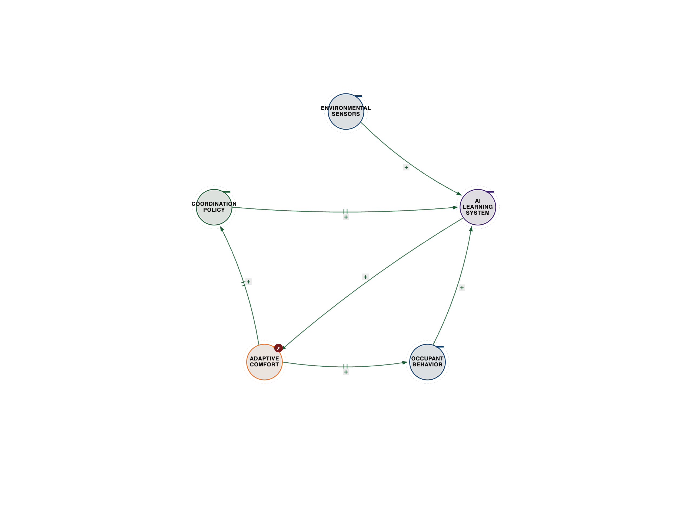
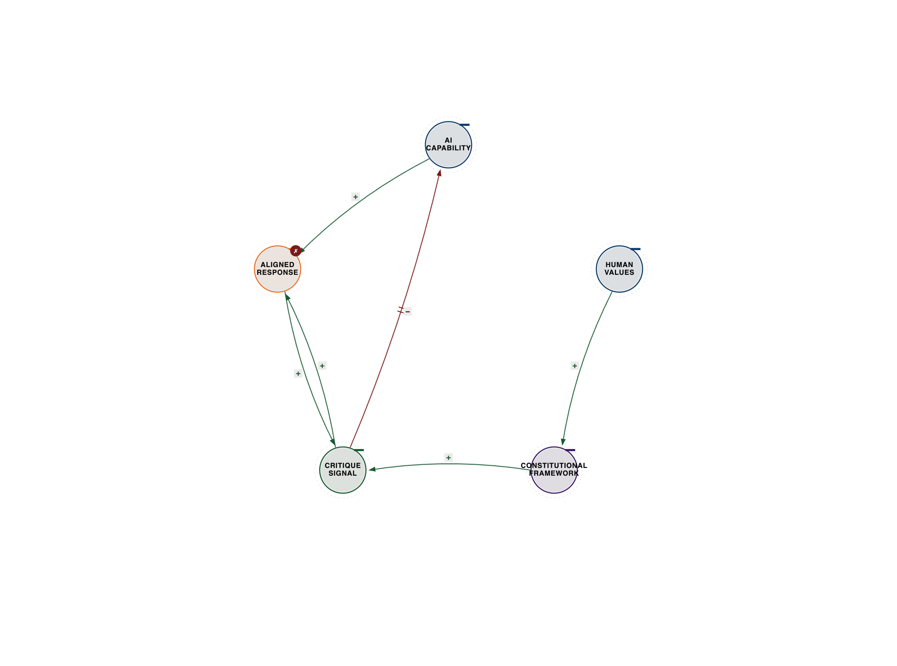
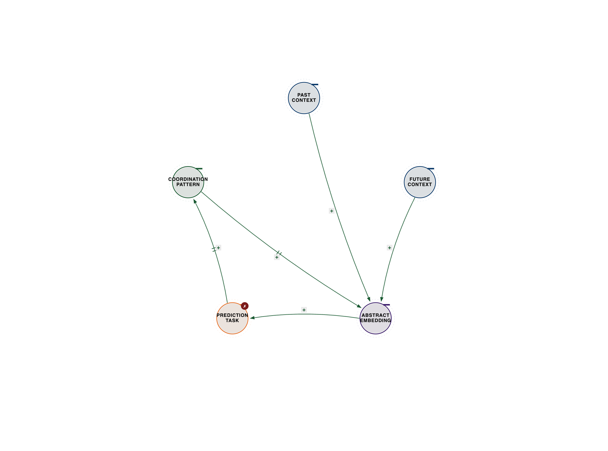
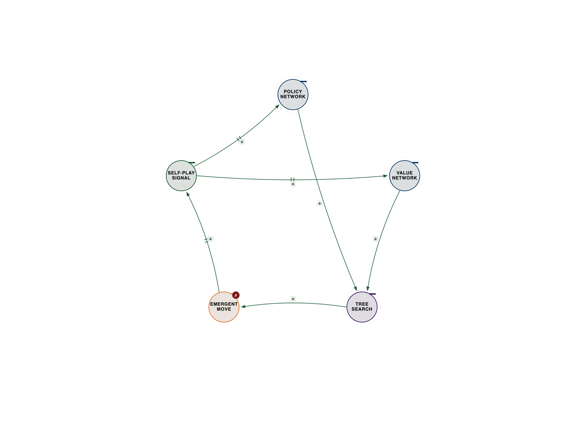
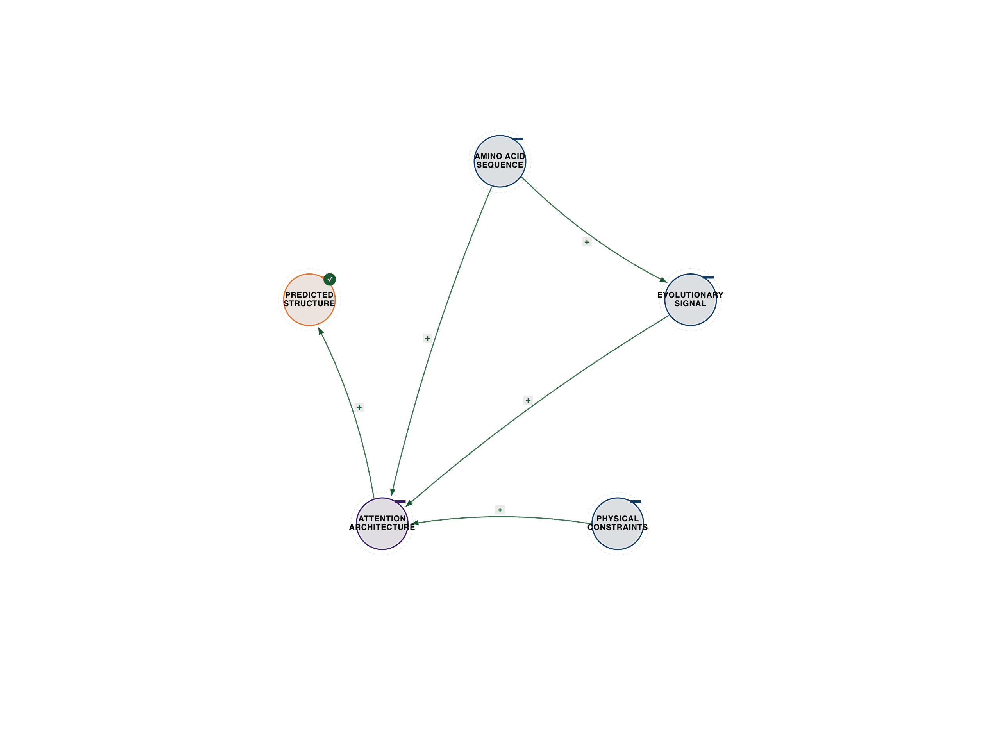
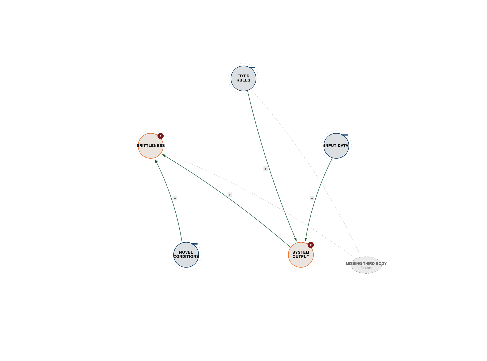

# Chapter 3: Architecture of Systems Intelligence

**Three-Body Architecture Patterns for Emergent Intelligence**

*The expert perspectives in this chapter are drawn from synthesized interviews—detailed conversations constructed from their published work, research, and documented ideas. While the quotes reflect their established positions and frameworks, these are not transcripts of conducted interviews.*

## The Building That Thinks

In Barcelona, there's a building that learns.

The Institute for Advanced Architecture of Catalonia (IAAC) built something unprecedented: a structure where sensors, AI systems, and human occupants coordinate in real-time to create adaptive intelligence that none of the three could produce alone.

Morning sunlight intensity adjusts based on yesterday's productivity patterns and today's calendar density. HVAC systems coordinate with meeting schedules and historical comfort preferences. Lighting adapts to circadian rhythms while optimizing for task requirements.

This isn't smart building automation. It's emergent architectural intelligence.

**The Learning Building Three-Body System:**

- Building Sensors ←→ AI Learning System ←→ Human Occupant Behavior

- Result: Architecture that adapts to optimize comfort, energy, and human flourishing

The building doesn't just respond to occupants. It coordinates sensor data with machine learning and human behavior patterns to predict needs before occupants consciously recognize them.

Let's delve deeper into what this coordination looks like in practice. Imagine a typical Tuesday morning. As occupants arrive, a network of environmental sensors—temperature, humidity, CO2 levels, light intensity, and even sound—begins feeding real-time data into the building's AI system. But this isn't just raw data; it's contextualized. The AI knows, for instance, that a large team meeting is scheduled for 9 AM in the main conference room, based on calendar integration. It also has historical data on that specific team's comfort preferences and energy consumption patterns during similar meetings.

The AI doesn't just react to a rising CO2 level by blasting the ventilation. Instead, it coordinates this sensor input with the predicted occupancy, the historical comfort data, and the current energy grid load. It might subtly increase ventilation a few minutes *before* the meeting starts, pre-emptively adjusting the air quality. Simultaneously, it might dim the lights slightly in less-used areas to conserve energy, while brightening the conference room to an optimal level for concentration, taking into account the natural light available and the time of day to support circadian rhythms. If a specific occupant, whose profile indicates a preference for cooler temperatures, enters a private office, the AI might make a micro-adjustment to that zone's HVAC, coordinating the individual's preference with the overall building's energy strategy.

What makes this different from a "normal" smart building? A typical smart building operates on predefined rules: "If CO2 > X, turn on fan Y." It's reactive and rule-based. The IAAC building, however, is *predictive* and *adaptive*. Its AI system uses reinforcement learning to continuously refine its coordination strategies. It learns from past successes and failures. If a particular lighting scheme led to complaints about eye strain, the AI adjusts its future coordination patterns. If a specific HVAC setting resulted in optimal energy efficiency without compromising comfort, that pattern is reinforced.

The human occupants are not just passive recipients; they are an active "body" in this intelligent system. Their movement patterns, their calendar entries, and even their implicit feedback (e.g., how long they stay in a room, their productivity metrics if tracked) are all inputs that the AI coordinates. The building isn't just a structure; it's a living, breathing entity that learns the intricate dance between environmental conditions, human needs, and energy efficiency, creating an emergent intelligence that is far greater than the sum of its parts. It's a testament to the power of three-body coordination, where sensors, AI, and human behavior are not merely connected, but deeply interwoven in a dynamic, self-optimizing loop.

The breakthrough insight: you can't build intelligence by optimizing components. You build it by designing coordination architectures that enable emergence.

---

*Figure 3.1 — IAAC Barcelona learning-building three-body system. See `../diagrams/svg/ch03-01-iaac-learning-building.svg` for the vector source.*

---

---

## Why All Intelligent Systems Share the Same Pattern

Every system that exhibits genuine intelligence—biological, artificial, or hybrid—has the same structural pattern: three coordinating elements that create emergence beyond their individual capabilities.

**Biological Intelligence:**

- Neurons ←→ Synapses ←→ Network Architecture

- Result: Consciousness, learning, adaptation

**Artificial Intelligence:**

- Data ←→ Model Architecture ←→ Training Objective

- Result: Pattern recognition, prediction, generation

**Hybrid Intelligence:**

- Human Expertise ←→ AI Capability ←→ Operational Context

- Result: Superhuman performance, novel solutions, adaptive coordination

The pattern is universal because emergence requires three-body coordination. Two elements can interact. Three elements can coordinate to create something neither could produce alone.

Let's deepen our understanding of biological intelligence through this three-body lens. At the most fundamental level, the human brain, the pinnacle of biological intelligence, operates through the intricate coordination of neurons, synapses, and the overarching network architecture.

**Neurons** are the brain's fundamental processing units. Each neuron is an excitable cell that transmits electrical signals. It receives input from thousands of other neurons, integrates these signals, and, if the combined input reaches a certain threshold, "fires" an electrical impulse (an action potential) down its axon to communicate with other neurons. They are the computational engines, the "bits" and "bytes" of biological information processing.

**Synapses** are the crucial junctions where neurons communicate. When an electrical signal reaches the end of an axon, it triggers the release of neurotransmitters—chemical messengers—into the synaptic cleft, a tiny gap between neurons. These neurotransmitters bind to receptors on the receiving neuron, either exciting or inhibiting it. The magic of synapses lies in their *plasticity*: their strength and efficiency can change over time. This synaptic plasticity is the physical basis of learning and memory. When you learn something new, specific synapses strengthen or weaken, altering the flow of information. They are the dynamic, adaptive connections, the "software updates" that allow the brain to learn and store information.

The **Network Architecture** is the grand design, the intricate wiring diagram of billions of neurons and trillions of synapses. It's not just a random tangle; it's a highly organized, hierarchical, and massively parallel system. Different brain regions are specialized for different functions (e.g., visual cortex for sight, hippocampus for memory), but they are all interconnected. Information flows in complex loops, with feedback mechanisms constantly refining processing. This architecture allows for the integration of sensory input, motor output, memory retrieval, emotional processing, and higher-order cognition. It's the global coordinator, the "operating system" that orchestrates the activity of individual neurons and synapses into coherent thought and action.

Why is this three-body pattern necessary for consciousness? Consciousness isn't merely the sum of individual neurons firing or synapses changing. It's an emergent property arising from the *coordinated activity* across this vast, dynamic network.

- **Neurons** provide the raw computational power, the ability to process information.

- **Synapses** provide the adaptive learning mechanism, allowing the system to change and store experiences.

- **Network Architecture** provides the global integration, the ability to bind disparate sensory inputs, memories, and emotions into a unified, coherent experience of self and world.

Without the dynamic, adaptive connections of synapses, neurons would be static, unable to learn. Without the overarching network architecture, the activity of individual neurons and synapses would be a chaotic cacophony, lacking the integrated coherence necessary for a unified conscious experience. Consciousness, therefore, is not localized to a single neuron or a single synapse, but arises from the continuous, complex, and coordinated interplay between these three fundamental elements, creating a self-organizing system capable of perception, thought, and self-awareness. It is the ultimate example of emergent intelligence from three-body coordination.

---

## Constitutional AI: When Values Coordinate with Capability

Dario Amodei left OpenAI to found Anthropic because he saw a problem nobody else was solving: AI systems were getting more capable, but not more aligned with human values.

Through his work developing Constitutional AI at Anthropic, Amodei's framework reveals the core challenge: "We've been treating AI alignment as a two-body problem—capability and safety. But it's actually a three-body coordination problem: capability, human values, and the constitutional framework that coordinates them."

Most AI labs optimize for capability and bolt on safety as an afterthought. Anthropic coordinates all three from the beginning.

Constitutional AI works by giving the AI a "constitution"—a set of principles it uses to evaluate and improve its own outputs. But here's the key: the constitution isn't just rules. It's a coordination architecture.

**The Constitutional AI Three-Body System:**

- AI Capability (what it can do)

- Human Values (what it should do)

- Constitutional Framework (how capability and values coordinate)

The AI doesn't just follow rules. It coordinates its capabilities with human values through a constitutional framework that enables it to reason about edge cases, balance competing principles, and improve its own alignment over time.

This is meta-learning in action: the system learns not just patterns in data, but how to coordinate its learning with human values.

Let's unpack how Constitutional AI actually works. The process involves several steps, often leveraging a technique called Reinforcement Learning from AI Feedback (RLAIF).
First, a large language model (LLM) generates an initial response to a user's prompt.
Second, a separate "critique" model, also an LLM, is prompted with a set of constitutional principles (e.g., "Be harmless," "Avoid harmful stereotypes," "Be helpful," "Do not engage in illegal activities," "Do not provide medical advice"). This critique model then evaluates the initial response against these principles, identifying potential violations or areas for improvement. For example, if the initial response contains a biased statement, the critique model might flag it, citing the "avoid harmful stereotypes" principle.
Third, the original LLM is then given its own initial response *and* the critique from the second model. It is instructed to revise its response to better adhere to the constitutional principles. This is an iterative self-correction process. The AI is essentially having an internal dialogue, using the constitutional principles as its guide for self-improvement.

The brilliance here is that the "human values" are not hard-coded as rigid rules that the AI simply follows or doesn't follow. Instead, they are embedded in the "constitutional framework" that guides the AI's *reasoning* and *self-correction*. The AI learns to *coordinate* its vast generative capabilities with these nuanced principles. It learns to balance competing values—for instance, being helpful while also being harmless. In complex scenarios, there might not be a single "right" answer, and the AI, through this constitutional process, learns to navigate these trade-offs in a way that aligns with the spirit of the principles, rather than just their literal interpretation. This makes the system more robust, adaptable, and capable of handling novel situations in an aligned manner, moving beyond simple censorship or filtering to true ethical reasoning within the AI itself.

---

*Figure 3.2 — Constitutional AI / RLAIF balancing loop. See `../diagrams/svg/ch03-02-constitutional-ai-rlaif.svg` for the vector source.*

---

---

## Self-Supervised Learning: Intelligence from Coordination

Yann LeCun won the Turing Award for inventing convolutional neural networks—the architecture that powers most computer vision today. But his current work on self-supervised learning reveals something more fundamental about how intelligence emerges.

Drawing from his decades of research at Meta AI, LeCun's position is clear: "Supervised learning is a dead end. You can't build general intelligence by showing an AI millions of labeled examples. That's not how humans learn, and it's not how we'll build AI that actually understands the world."

Self-supervised learning works differently. Instead of learning from labels, it learns by coordinating different aspects of the same data.

**The Self-Supervised Three-Body System:**

- Past Context (what came before)

- Future Context (what comes after)

- Prediction Task (coordinating both to understand the present)

Show an AI a video with the middle frames removed. It has to predict what happened. To do this, it must coordinate understanding of the past context with understanding of the future context to infer the missing present.

This coordination—not the data itself—is where learning happens.

LeCun's Joint-Embedding Predictive Architecture (JEPA) takes this further: instead of predicting pixels, it predicts abstract representations. Instead of learning what things look like, it learns how things coordinate.

"The breakthrough isn't better prediction," LeCun explains through his published work. "It's learning the coordination patterns that let you predict. That's what understanding actually is—seeing how elements coordinate to create what happens next."

To illustrate JEPA with concrete examples, consider how it moves beyond simply predicting raw data.
Imagine a video of a cat jumping onto a table.
In a traditional self-supervised setup, you might mask out a few frames in the middle and ask the AI to predict the exact pixels of those missing frames. This forces the AI to learn low-level visual features, but it doesn't necessarily lead to a deep understanding of the *action* or the *causality*.

JEPA operates at a higher level of abstraction. Instead of predicting pixels, it predicts *abstract representations* or *embeddings* of the masked-out content.
For the cat video, JEPA might be given the frames *before* the jump and the frames *after* the cat lands. Its task is to predict the abstract representation of the *action of jumping* that occurred in the masked-out segment. It's not trying to reconstruct the exact fur pattern or the precise angle of the cat's tail in every missing frame. Instead, it's learning the underlying semantic relationship between the "pre-jump" state and the "post-jump" state, and how these coordinate to imply the "jumping" action.

Other examples include:

- **Image Completion:** Instead of predicting missing pixels in a masked region of an image, JEPA predicts the abstract features that would logically complete the image, given the surrounding context. For instance, if you mask out the head of a dog, it learns to predict the *concept* of a dog's head that coordinates with the body, rather than just guessing pixel colors.

- **Cross-Modal Prediction:** JEPA could be trained to predict the abstract representation of the sound associated with a visual scene (e.g., the sound of a car engine from a video of a car moving), or vice-versa. This forces the model to learn how visual and auditory information *coordinate* in the real world.

- **Predicting Future States:** Given a sequence of actions in a simulated environment, JEPA might predict the abstract representation of the *next state* of the environment, rather than the raw pixel-by-pixel rendering. This helps it learn the dynamics and causal relationships within the environment.

The core idea is that by predicting these high-level, abstract embeddings, the model is compelled to learn the fundamental *coordination patterns* that govern the world. It learns that a certain visual pattern (cat crouching) coordinates with a certain temporal pattern (sudden upward movement) and a certain spatial pattern (landing on a higher surface) to form the concept of "jumping." This is a much deeper form of understanding than simply associating an image with a label. It's learning the underlying physics, semantics, and causal relationships that define how elements in the world interact and coordinate. LeCun argues that this is the path towards truly generalizable AI that can build robust internal models of the world, much like humans do.

---

*Figure 3.3 — JEPA coordination (Past, Future, Prediction). See `../diagrams/svg/ch03-03-jepa-coordination.svg` for the vector source.*

---

---

## AlphaGo: When Three Bodies Defeated Humanity's Best

March 2016. Seoul, South Korea. The world watched as DeepMind's AlphaGo defeated Lee Sedol, the world's best Go player, 4-1.

The media called it "AI beats human." But Demis Hassabis, CEO of DeepMind and a neuroscientist, saw something else: three-body coordination defeating two-body optimization.

Through his work building AlphaGo and later AlphaFold, Hassabis' insight reveals the architecture: "Lee Sedol is one of the greatest Go players in history. His pattern recognition is superhuman. His intuition is legendary. But he's still fundamentally a two-body system: pattern recognition coordinating with intuitive evaluation."

AlphaGo was a three-body system:

**1. Policy Network** (what moves are likely)
**2. Value Network** (who's winning)
**3. Monte Carlo Tree Search** (exploring possibilities)

The genius wasn't any single component. It was the coordination architecture.

The policy network suggests promising moves. The value network evaluates positions. The tree search explores possibilities by coordinating both. Then all three learn from the results and improve their coordination.

This is meta-learning: the system doesn't just learn Go positions. It learns how its three components should coordinate to play Go.

Move 37 in Game 2—the move that shocked the Go world—wasn't brilliant pattern recognition. It was emergent coordination that none of the three components would have produced alone.

Let's relive the moment of Move 37 in Game 2. The match was already tense, with AlphaGo having won Game 1. Lee Sedol, playing white, was in a strong position, and the game seemed to be following a conventional path. Then, AlphaGo, playing black, made its 37th move. It placed a stone on the 19th line, a "shoulder hit" that was incredibly far from the main action, seemingly in an empty, strategically irrelevant part of the board.

The reaction was immediate and widespread disbelief. Go commentators, including top professionals, were stunned. Fan Hui, a European Go champion who had played AlphaGo previously, initially thought it was a mistake, a "bug" in the system. The move violated decades, if not centuries, of established Go wisdom, which dictates focusing on the center and edges of the board, not playing so far out in what seemed like a trivial area. It was an "ugly" move, an "unthinkable" move by human standards.

Lee Sedol himself was visibly shaken. He left the room for an extended period, something highly unusual for a professional Go player during a match. He later admitted he spent a long time trying to understand the move, initially dismissing it as a blunder, then slowly realizing its profound implications. He described it as "beautiful" and "creative," a move that forced him to rethink his entire understanding of the game.

What made Move 37 so shocking and revelatory was precisely that it wasn't a move that any human, even the greatest Go masters, would have considered. It wasn't a move born of superior pattern recognition in the human sense. Instead, it was an emergent strategy born from the deep coordination of AlphaGo's three-body system.
The **Policy Network** might have assigned a low probability to such an unconventional move, as it was trained on human games.
However, the **Monte Carlo Tree Search (MCTS)**, which explores millions of possible future game states, was able to delve into paths that human intuition would dismiss. Guided by the **Value Network**, which evaluates the win probability of different board positions, the MCTS explored the long-term consequences of Move 37. It discovered that this seemingly innocuous move, while not immediately impactful, set up a complex, multi-turn sequence that would eventually lead to a decisive advantage for AlphaGo. It was a move that coordinated seemingly disparate parts of the board, creating a global influence that only became apparent many moves later.

This wasn't just computation; it was *coordination*. The policy network suggested possibilities, the value network provided a global evaluation, and the MCTS explored the intricate dance between them, revealing a strategy that transcended human heuristics and demonstrated a deeper, more abstract understanding of Go. Move 37 wasn't just a move; it was a declaration that intelligence, when architected for coordination, could discover truths beyond the reach of even the most brilliant human minds.

---

*Figure 3.4 — AlphaGo three networks (Policy, Value, MCTS). See `../diagrams/svg/ch03-04-alphago-three-networks.svg` for the vector source.*

---

---

## From AlphaGo to AlphaFold: Coordination Solves Biology

Four years after AlphaGo, Hassabis' team at DeepMind solved one of biology's grand challenges: protein folding.

For 50 years, scientists tried to predict how proteins fold from their amino acid sequences. The problem: a typical protein can fold in 10^300 possible ways. Checking them all would take longer than the universe has existed.

AlphaFold solved it through three-body coordination:

**1. Evolutionary Information** (related protein sequences)
**2. Physical Constraints** (chemistry and physics rules)
**3. Attention Architecture** (how amino acids coordinate with each other)

Traditional approaches optimized either evolutionary data OR physical constraints. AlphaFold coordinated both through an attention architecture that learned how amino acids coordinate in 3D space.

The result: predictions accurate enough to replace years of experimental work. As of 2024, AlphaFold has predicted structures for over 200 million proteins—essentially all known proteins.

Hassabis' framework shows the pattern: "The breakthrough wasn't better algorithms or more data. It was recognizing that protein folding is a coordination problem. Amino acids don't fold independently—they coordinate with each other through complex interactions. Model that coordination, and you solve the problem."

---

*Figure 3.5 — AlphaFold coordination DAG (Evolution, Physics, Attention). See `../diagrams/svg/ch03-05-alphafold-coordination.svg` for the vector source.*

---

To fully appreciate AlphaFold's achievement, we must understand the profound difficulty and significance of the 50-year protein folding problem. Proteins are the workhorses of life. They are complex macromolecules essential for virtually every process within living organisms: they catalyze metabolic reactions (enzymes), replicate DNA, respond to stimuli, provide structural support, and transport molecules. Their function is entirely dependent on their precise, intricate three-dimensional shape.

Proteins are initially synthesized as long, linear chains of amino acids, like beads on a string. There are 20 different types of amino acids, and the specific sequence of these amino acids (the primary structure) dictates how the protein will spontaneously fold into a unique, stable 3D structure (its tertiary structure). The challenge, known as the "protein folding problem," was to predict this final 3D shape solely from the 1D amino acid sequence.

Why was it so hard? The sheer number of possible ways a protein chain could fold is astronomically vast. For a typical protein of 100 amino acids, there are approximately 10^300 possible conformations. This combinatorial explosion, famously described by Levinthal's paradox, meant that even the fastest supercomputers couldn't brute-force search all possibilities. Experimentally determining protein structures using techniques like X-ray crystallography, NMR spectroscopy, or cryo-electron microscopy is incredibly time-consuming, expensive, and often technically challenging, taking months or even years for a single protein.

The inability to quickly and accurately predict protein structures was a major bottleneck in biological research and drug discovery.

- **Drug Discovery:** Many drugs work by binding to specific protein targets. Knowing the precise 3D shape of a target protein allows for rational drug design, where molecules can be engineered to fit perfectly into the protein's active site, leading to more effective and fewer side-effect-laden medicines. Without this, drug discovery was often a laborious trial-and-error process.

- **Understanding Disease:** Misfolded proteins are implicated in a vast array of diseases, including Alzheimer's, Parkinson's, cystic fibrosis, and many cancers. Understanding how proteins misfold and aggregate requires knowing their correct folded structure.

- **Basic Biological Research:** Proteins are involved in every cellular process. Predicting their structures accelerates our understanding of fundamental biological mechanisms, from how enzymes work to how cells communicate.

- **Synthetic Biology:** The ability to design new proteins with specific functions (e.g., enzymes for industrial applications, new biomaterials) was severely limited without predictive structural tools.

AlphaFold's breakthrough was not just an incremental improvement; it was a paradigm shift. By coordinating evolutionary information (patterns of amino acid co-evolution across related proteins, indicating residues that are likely close in 3D space), physical constraints (the fundamental laws of chemistry and physics governing bond angles, distances, and steric hindrance), and a sophisticated attention-based neural network architecture, AlphaFold learned the intricate rules of how amino acids *coordinate* with each other to form a stable 3D structure. It didn't just predict a shape; it learned the *process* of folding.

The impact of AlphaFold's prediction of over 200 million protein structures—essentially the entire known protein universe—is monumental. It's like suddenly having a complete, high-resolution map of an entire continent that was previously only known through scattered, blurry photographs.

- **Accelerated Drug Discovery:** Researchers can now instantly access the structures of potential drug targets, dramatically speeding up the initial stages of drug development. This enables virtual screening of billions of compounds and the design of novel therapeutics.

- **Revolutionizing Basic Research:** Biologists can now quickly generate hypotheses about protein function and interaction, leading to faster discoveries in fields ranging from immunology to neuroscience. It provides a foundational dataset that will fuel countless new research avenues.

- **Advancing Synthetic Biology:** Scientists can now design and engineer novel proteins with unprecedented precision, opening doors for new enzymes in industrial processes, biodegradable materials, and even new forms of medicine.

- **Understanding Life's Machinery:** The sheer volume of predicted structures allows for large-scale analyses, revealing common folding patterns, evolutionary relationships, and fundamental principles of protein architecture that were previously hidden.

AlphaFold didn't just solve a problem; it provided a new operating system for biology, demonstrating that the most intractable challenges can be overcome by designing systems that understand and model the deep coordination patterns inherent in nature.

---

## When Two Bodies Aren't Enough: The Pitfalls of Incomplete Coordination

The universal pattern of three-body coordination isn't just an observation of successful intelligent systems; it's a critical design principle. When we attempt to build intelligent systems with only two coordinating elements, we inevitably encounter significant limitations, leading to brittleness, lack of adaptability, and a fundamental inability to achieve true emergence. These "coordination failures" highlight why the third body is not a luxury, but a necessity.

Let's examine concrete examples of where two-body systems break down:

**1. Early Expert Systems (AI): Rules ←→ Data**
In the early days of AI, systems like MYCIN (designed for medical diagnosis) were built as "expert systems." They consisted of a vast database of rules (e.g., "IF patient has fever AND patient has cough THEN suspect pneumonia") and a mechanism to apply these rules to patient data. This was a two-body system: rules interacting with data.

- **Failure:** These systems were incredibly brittle. They could only operate within their predefined domain and couldn't handle ambiguity, common sense reasoning, or novel situations outside their explicit rule set. If a patient presented with symptoms that didn't perfectly match a rule, the system would fail or provide nonsensical advice. They lacked the ability to *learn* new rules or *adapt* their reasoning based on experience. There was no third body to coordinate the application of rules with the nuances of real-world context or to learn from the outcomes of their decisions. They were intelligent in a narrow, predefined way, but lacked any emergent understanding or adaptability.

**2. Traditional Automation (Robotics): Robot Arm ←→ Pre-programmed Task**
Consider an industrial robot arm in a factory, programmed to perform a repetitive task like assembling a car part. This is a two-body system: the robot's physical capabilities interacting with a pre-programmed sequence of movements.

- **Failure:** These robots are highly efficient for repetitive tasks in controlled environments. However, they completely break down if there's any deviation from the expected conditions. If a part is slightly misaligned, if an obstacle appears, or if the material properties change, the robot cannot adapt. It lacks the ability to *perceive* and *understand* its environment in real-time, or to *learn* from unexpected events. There's no third body (like a perception system coordinating with a learning algorithm) to integrate real-time environmental context and adapt the task execution. The result is a rigid, unintelligent machine that requires constant human oversight for anything beyond its narrow, pre-defined operation.

**3. Supervised Learning (AI): Data ←→ Model**
Modern supervised learning models, while powerful, often exemplify a two-body limitation. A model is trained on millions of labeled examples (data) to perform a specific task, like classifying images (e.g., "cat" or "dog").

- **Failure:** While excellent at their specific task, these models often lack generalization, common sense, and true understanding. They learn correlations in the data, but not necessarily the underlying causal mechanisms or coordination patterns. If presented with data slightly outside their training distribution (e.g., a cat in an unusual pose or lighting), they can fail spectacularly. They cannot reason about novel situations, transfer knowledge to new domains, or coordinate their predictions with broader contextual knowledge or human values without explicit, often laborious, additional programming or fine-tuning. The "intelligence" is confined to pattern matching within the training data, without the emergent understanding that comes from coordinating different aspects of the world.

**4. Bureaucracy (Human Systems): Policy ←→ Execution**
In many large organizations or government bodies, a common failure mode arises from a two-body structure: policies are set at a high level, and then executed by frontline workers.

- **Failure:** Without a third element to coordinate policy with real-world context and feedback, bureaucracies become rigid and inefficient. Policies, while well-intentioned, may not be suitable for local conditions or specific individual cases. Frontline workers, bound by strict rules, cannot adapt or innovate. There's often a lack of a feedback loop that allows the system to learn from the outcomes of policy execution and refine the policies themselves. This leads to "red tape," frustrated citizens, and a system that is slow to adapt to changing circumstances, because the policy and execution are not dynamically coordinating with the real-world operational context.

In each of these examples, the absence of a third coordinating element prevents the system from achieving true adaptability, learning, and emergent intelligence. The third body is what allows for dynamic adjustment, meta-learning, and the integration of context, transforming brittle interactions into robust, intelligent coordination.

---

*Figure 3.6 — Two-body brittleness with latent "Missing Third Body". See `../diagrams/svg/ch03-06-two-body-brittleness.svg` for the vector source.*

---

---

## The Five Principles of Coordination Architecture

Whether you're building AI systems, organizations, or hybrid intelligence platforms, every successful coordination architecture follows the same five principles:

### 1. Identify the Three Bodies

What are the elements that need to coordinate? Be specific. "Humans and AI" isn't enough. "Expert radiologists, diagnostic AI, and patient context" reveals the coordination architecture.

**Actionable Example:** Consider building a self-driving car. It's not just "sensors and AI." The three bodies are:

1. **Sensor Data:** Real-time input from cameras, lidar, radar, ultrasonic sensors.

2. **Predictive AI Model:** Processes sensor data to understand the environment, predict trajectories, and make driving decisions.

3. **Real-time Environmental Context:** Dynamic information about other vehicles, pedestrians, road conditions, weather, traffic laws, and the driver's intended destination.
The AI doesn't just react to sensor data; it coordinates that data with the broader, constantly changing context of the road to make safe and efficient driving decisions.

### 2. Design Bidirectional Coordination

Each element must be able to influence the others. One-way flows create hierarchies, not coordination. The AI informs the doctor, the doctor informs the patient, the patient's context informs the AI—all three coordinating continuously.

**Actionable Example:** In a modern supply chain, the three bodies might be:

1. **Customer Demand:** Orders, market trends, consumer feedback.

2. **Manufacturing Capacity:** Production schedules, raw material availability, factory output.

3. **Logistics Network:** Shipping routes, warehouse inventory, delivery schedules.
Bidirectional coordination means: Customer demand shifts influence manufacturing capacity (e.g., increased orders lead to increased production). Manufacturing capacity limits or enables logistics (e.g., production delays impact delivery times). Logistics feedback (e.g., shipping delays) informs demand forecasting and even influences customer expectations. Crucially, customer feedback can directly influence manufacturing design, and manufacturing capabilities can open up new market demands. All three are in a constant, dynamic dialogue.

### 3. Enable Meta-Learning

The system must learn not just from data, but from how its coordination performs. Netflix doesn't just learn what you like—it learns how its recommendations coordinate with your viewing behavior to improve future coordination.

**Actionable Example:** A personalized education platform. The three bodies are:

1. **Student Learning Style & Progress:** Individual student's cognitive preferences, current knowledge, and performance on assignments.

2. **Adaptive Curriculum AI:** Generates and selects learning materials, exercises, and teaching strategies.

3. **Learning Outcomes:** Measured improvements in understanding, skill acquisition, and engagement.
Meta-learning here means the AI doesn't just learn *what* content to show a student. It learns *how* different curriculum adjustments (e.g., visual aids vs. text, problem-based learning vs. direct instruction) coordinate with different learning styles to optimize learning outcomes. If a particular coordination strategy (e.g., assigning a specific type of exercise to a visual learner) consistently leads to better outcomes, the system reinforces that coordination pattern, improving its own adaptive teaching strategy over time.

### 4. Build Context Awareness

Coordination without context creates brittle systems. The same action in different contexts requires different coordination. AlphaFold coordinates differently for membrane proteins than for enzymes—same architecture, context-aware coordination.

**Actionable Example:** A medical diagnostic AI. The three bodies are:

1. **Patient Symptoms & Test Results:** Objective data about the patient's current condition.

2. **Diagnostic AI:** Processes symptoms and results to suggest potential diagnoses.

3. **Patient Medical History & Lifestyle Factors:** Age, gender, pre-existing conditions, medications, family history, diet, exercise, and social determinants of health.
Context awareness means the AI's interpretation of symptoms coordinates with the patient's unique history and lifestyle. A cough in a young, healthy individual might be a common cold, but the same cough in an elderly patient with a history of heart disease requires a very different diagnostic coordination. The AI doesn't just apply a generic rule; it modulates its diagnostic process based on the rich, individual context of the patient, leading to more accurate and personalized recommendations.

### 5. Design for Human-AI Coordination

The future isn't AI replacing humans. It's AI coordinating with humans in context. The architecture must support this from the beginning, not bolt it on later.

**Actionable Example:** A creative design studio using generative AI. The three bodies are:

1. **Human Creative Intent:** The designer's vision, aesthetic preferences, and project goals.

2. **Generative AI Tools:** Algorithms that can produce images, layouts, or text based on prompts.

3. **Iterative Design Process:** The workflow of brainstorming, prototyping, feedback, and refinement.
Designing for human-AI coordination means the AI isn't just a tool that spits out a final product. It's a collaborative partner. The human designer provides initial intent, the AI generates variations, the human provides feedback and refines the AI's output, and this feedback then guides the AI's next generation of designs. The architecture facilitates a continuous loop where human creativity and AI capability coordinate to explore a vast design space, leading to novel and superior outcomes that neither could achieve alone.

---

## What This Means for Building the Future

We're at an inflection point. The companies, teams, and systems that understand coordination architecture will have capabilities that optimization-focused competitors can never match. This isn't just about making things incrementally better; it's about unlocking entirely new forms of intelligence and capability.

Because optimization makes things better. Coordination makes things possible that weren't possible before.

Optimization is incremental. Coordination is emergent.

Optimization asks "how can we improve A?" Coordination asks "how can A, B, and C coordinate to create something none could produce alone?"

The architecture of intelligence isn't bigger models or more data. It's coordination patterns that enable emergence. This is the new operating system for intelligence, a fundamental shift in how we conceive of and construct complex adaptive systems.

The stakes are immense. If we continue to build systems that merely optimize components in isolation, we will create brittle, narrow, and ultimately limited forms of intelligence. We will build powerful tools, but not truly intelligent partners. We will solve problems within existing paradigms, but miss the emergent solutions that lie beyond our current understanding. We risk stagnation, creating a future of increasingly complex but fundamentally unintelligent machines that fail when confronted with true novelty or ambiguity.

However, if we embrace the principles of three-body coordination, we unlock a future of unprecedented possibilities. We can build systems that are not just smart, but *wise*; not just efficient, but *adaptive*; not just powerful, but *aligned* with human values and the complexities of the real world. We can design organizations that learn and evolve with the speed of change, hybrid teams that achieve superhuman feats, and AI systems that truly understand and interact with the world in a meaningful way.

This vision of coordination architecture enables us to tackle humanity's grand challenges—from climate change to disease, from education to sustainable energy—by designing systems that can integrate vast amounts of information, adapt to dynamic conditions, and foster emergent solutions. It's about moving beyond mere computation to cultivate true understanding, beyond simple automation to foster genuine intelligence.

And once you see how to design these patterns, you can build intelligence anywhere. The future belongs to those who master the art and science of coordination.