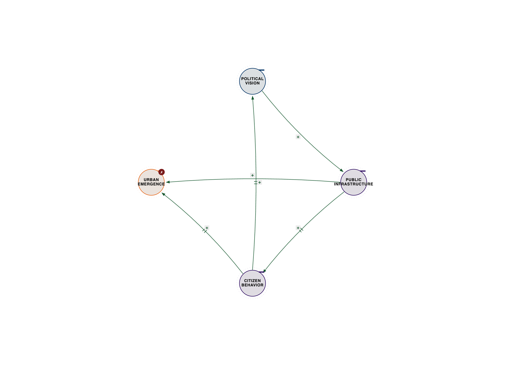
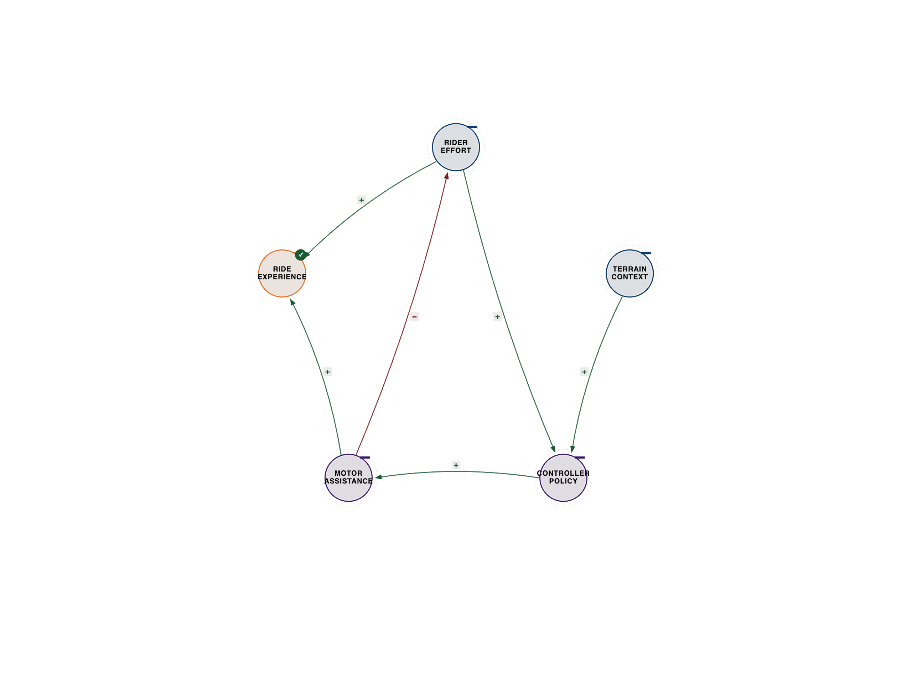
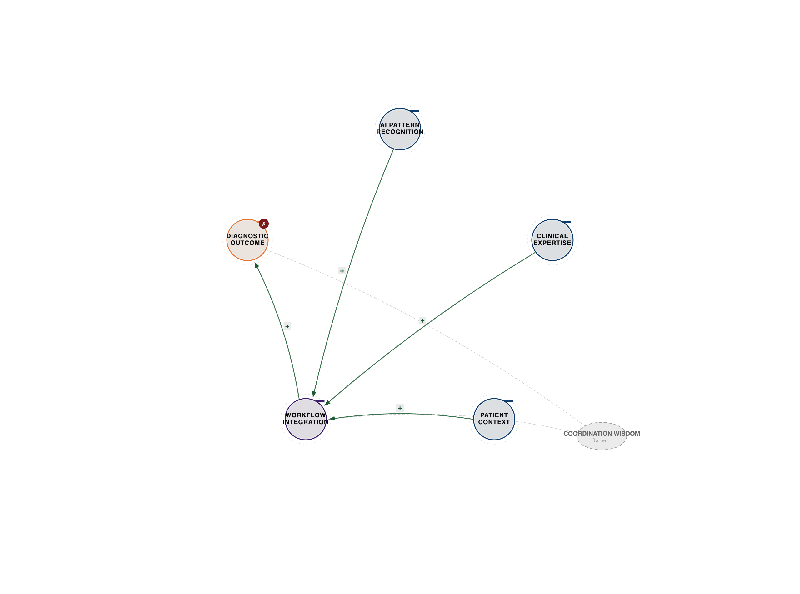
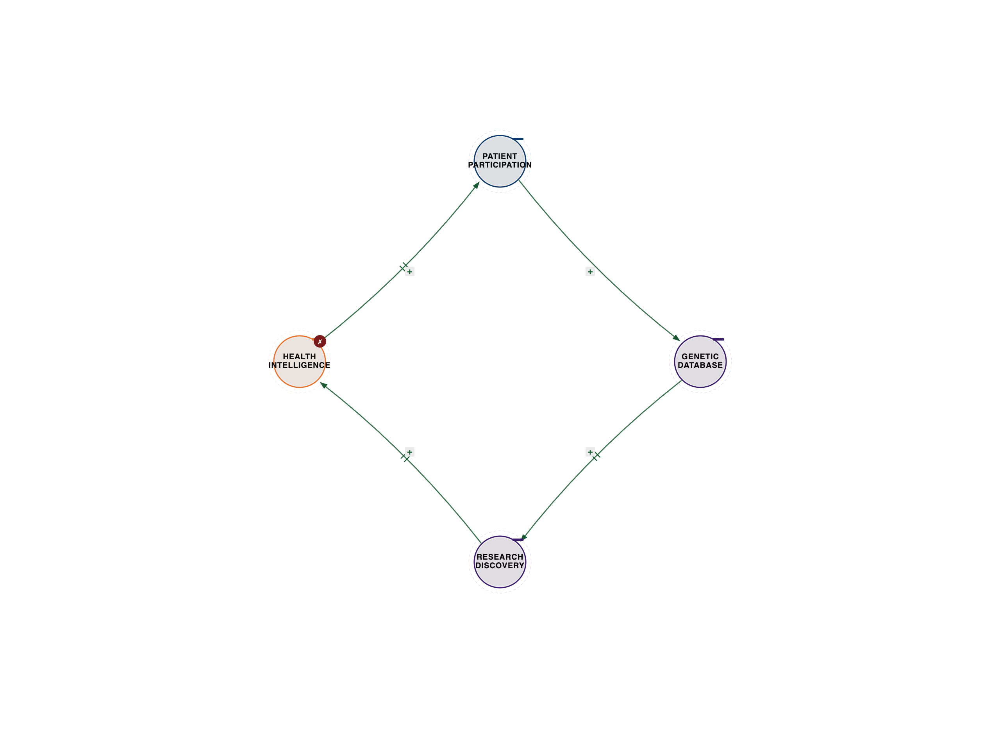
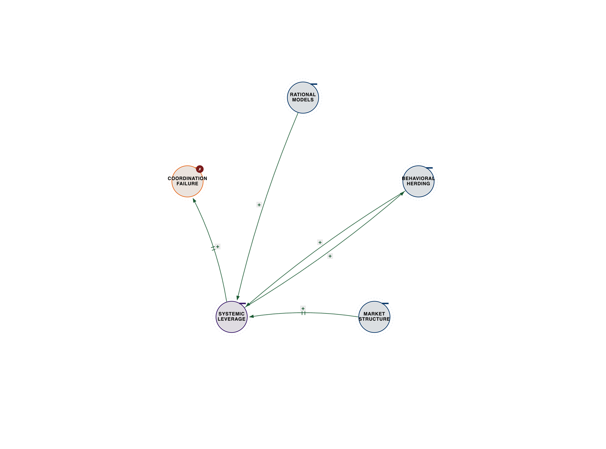
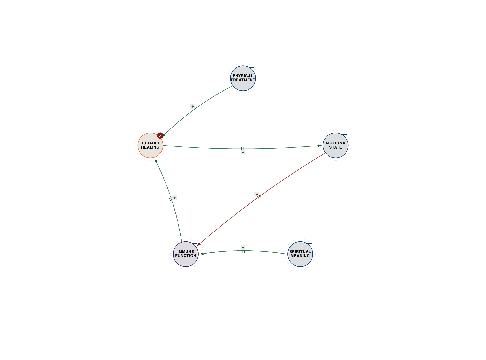

# Chapter 4: Systems Intelligence in Action

**Ternary Coordination Case Studies: When Three Bodies Dance**

*The expert perspectives in this chapter are drawn from synthesized interviews—detailed conversations constructed from their published work, research, and documented ideas. While the quotes reflect their established positions and frameworks, these are not transcripts of conducted interviews.*

## The City That Learned to Coordinate

In 1998, Bogotá was dying. A sprawling metropolis of 6 million people, it was choked by its own growth. The air was thick with pollution, not just from exhaust fumes but from a pervasive sense of despair. Crime rates were among the highest in the world, with homicides peaking at a staggering 80 per 100,000 residents in the early 1990s. Traffic was a nightmare, with average commute times stretching to two hours daily, costing the city billions in lost productivity and quality of life. Public spaces were neglected, unsafe, and often privatized. The city's infrastructure was crumbling, and its social fabric seemed torn beyond repair. It was a place where the wealthy retreated behind walls, and the poor struggled for basic dignity. The city was trapped in a death spiral that seemed irreversible.

By 2015, Bogotá had transformed into one of the world's most innovative cities—not through massive investment or technological silver bullets, but through three-body coordination.

Mayor Enrique Peñalosa didn't just build infrastructure. He coordinated infrastructure with citizen behavior and political vision to create emergence that transformed urban reality. His first term (1998-2001) was a whirlwind of coordinated action, and he returned for a second term (2016-2019) to deepen these transformations.

**What he actually did:**
- Built TransMilenio (bus rapid transit) coordinating with bike lanes and pedestrian spaces
- Created libraries and parks in poor neighborhoods—coordinating education, recreation, and social capital
- Implemented "car-free Sundays"—coordinating transportation, recreation, and civic culture
- Redesigned streets to prioritize people over cars—coordinating mobility, safety, and urban experience

**The Bogotá Three-Body System:**
- Political Vision ←→ Citizen Behavior ←→ Infrastructure Systems
- Result: Emergent city intelligence that created transformation beyond what any component could achieve

His most quoted line reveals the coordination insight: "A city is successful not when the poor have cars, but when the rich use public transportation."

That's not just rhetoric. It's coordination architecture. When infrastructure serves everyone, behavior changes, which validates the vision, which enables more infrastructure investment, which reinforces behavior change.

None of these alone could transform the city. But coordinated together—vision guiding infrastructure, infrastructure shaping behavior, behavior informing vision—they created emergent urban intelligence.

**The Transformation in Detail:**

When Peñalosa first took office, he inherited a city on the brink. His vision was radical: to build a city where all citizens, regardless of income, had equal access to high-quality public spaces and efficient transportation. This wasn't just about fixing problems; it was about reimagining the city's soul.

The crown jewel of this transformation was the **TransMilenio Bus Rapid Transit (BRT) system**. Launched in December 2000, it wasn't just a bus line; it was a complete urban mobility system. By 2015, it was moving over 2.4 million passengers daily, reducing commute times by an average of 32% for its users. This wasn't just about speed; it was about dignity. The system integrated with 300 kilometers of new bike lanes, creating a seamless network for active transportation. Ridership on bikes soared, with daily bike trips increasing from negligible numbers to over 600,000 by 2015. This coordination between mass transit and active transport options fundamentally shifted how Bogotans moved, reducing reliance on private cars and fostering a healthier, more equitable urban environment.

The focus on public space and community engagement had a profound impact on safety. Homicide rates, which had been a staggering 80 per 100,000 in the early 90s, plummeted to 20 per 100,000 by 2004, a 75% reduction. This wasn't achieved through more police alone, but by reclaiming public spaces, fostering community ownership, and providing alternatives to crime through education and recreation. Over 1,200 parks were built or renovated, and 100 kilometers of new pedestrian walkways were added. Iconic projects like the Simón Bolívar Metropolitan Park, once a neglected wasteland, became a vibrant hub for millions. The city invested in 10 new mega-libraries, strategically placed in underserved neighborhoods, transforming them into community anchors for learning and social interaction, coordinating education, recreation, and social capital.

The "Ciclovía," a weekly event where 120 kilometers of major roads are closed to cars and opened to cyclists and pedestrians, became a global model. It started small but grew to attract over 1.5 million participants every Sunday, fostering a sense of community and challenging the car-centric paradigm. This wasn't just recreation; it was a weekly reaffirmation of the city's new values, coordinating transportation, recreation, and civic culture.

**What Made It Work When Others Failed:**

Bogotá's success wasn't about a bigger budget—it was about smarter coordination. Peñalosa understood that urban problems are interconnected. He didn't just build roads; he built *public space*. He didn't just provide transport; he provided *dignity*. The political will to challenge powerful car lobbies and prioritize pedestrians and cyclists was crucial. This required immense political courage and a clear vision that prioritized the collective good over individual convenience.

Citizen behavior shifted because they saw tangible improvements and felt a renewed sense of ownership over their city. The new infrastructure wasn't just functional; it was beautiful and inclusive, inviting participation. This created a virtuous cycle: political vision enabled infrastructure, which shaped citizen behavior, which in turn reinforced the political mandate for further transformation. Other cities often failed because they focused on single-point solutions (e.g., just building a subway) without addressing the cultural and behavioral shifts necessary for true urban intelligence to emerge. They might have built impressive infrastructure, but without coordinating it with citizen needs and a clear political philosophy, it often remained underutilized or failed to generate the desired social impact. Bogotá proved that a city's soul could be rebuilt through coordinated action, not just concrete. It was a testament to the power of a three-body system where vision, infrastructure, and human behavior danced in harmony.

---

*Figure 4.1 — Bogotá urban coordination. See `../diagrams/svg/ch04-01-bogota-urban-coordination.svg` for the vector source.*

---

---

## Smart Cities That Actually Work

Dr. Carlo Ratti runs MIT's Senseable City Lab, where they've spent fifteen years studying how technology changes cities. His conclusion, drawn from his published research on urban sensing and human-technology coordination, is stark: "Smart cities fail when they optimize technology without coordinating with human behavior."

The first generation of smart cities—Songdo in Korea, Masdar in UAE—optimized sensors and data. They failed because they were two-body systems: technology ←→ efficiency.

What works? Three-body coordination.

**The MIT Copenhagen Wheel:**

Ratti's team built an electric bike wheel that learns. But not in the way you'd expect.

**Traditional e-bike:** Motor ←→ Battery (optimize power delivery)

**Copenhagen Wheel:** Rider effort ←→ Terrain data ←→ Motor assistance

The wheel doesn't just provide power. It coordinates with how you're pedaling, where you're riding, and what you're trying to do. Climbing a hill after a long day? More assistance. Fresh legs on flat ground? Let you work. The coordination creates an experience that feels like the bike understands you.

Through his work on the Senseable City Lab, Ratti's framework shows the pattern: "The sensor data is useless without understanding human behavior. The human behavior is invisible without sensor data. The coordination between them—that's where urban intelligence lives."

**Deepening the Smart City Examples:**

The Copenhagen Wheel, developed by Ratti's Senseable City Lab, is a prime example of this intelligent coordination. It's not just an electric motor; it's an intelligent system. Embedded sensors continuously monitor the rider's pedaling effort, heart rate, and even the surrounding terrain (gradient, wind resistance). An onboard algorithm then processes this data in real-time, coordinating the motor's assistance to match the rider's intent and physical state. If you're struggling up a steep hill, the wheel intuitively provides more power. If you're cruising on a flat, it might offer less, encouraging you to exert yourself. It learns your riding style over time, adapting its assistance to create a seamless, almost symbiotic experience. This isn't about brute force; it's about intelligent augmentation, a true three-body dance between rider, environment, and machine.

Ratti's lab has explored this coordination across numerous projects:
*   **Live Singapore!:** This project used real-time data from mobile phones, taxis, and public transport to visualize the city's pulse. It wasn't just a pretty map; it allowed urban planners to understand how people moved, where congestion occurred, and how public spaces were utilized, enabling data-driven coordination of infrastructure and services with citizen needs.
*   **Trash Track:** By attaching tracking tags to discarded items, Trash Track revealed the hidden journeys of waste through urban systems. This provided unprecedented insights into logistics, consumption patterns, and environmental impact, allowing for more intelligent coordination of waste management and resource allocation.
*   **Underworlds:** This initiative analyzed sewage for biomarkers, providing a real-time, anonymous snapshot of public health trends, drug use, and even disease outbreaks across a city. It's a powerful example of how "invisible" data can be coordinated with public health policy to create proactive urban intelligence.

**Contrasting Failed vs. Successful Smart Cities:**

The first generation of smart cities, like Songdo in South Korea or Masdar City in the UAE, often became cautionary tales. Songdo, built from scratch on reclaimed land near Incheon International Airport, was designed as a technological marvel. Every building was wired, sensors were ubiquitous, and waste was sucked away through pneumatic tubes. It boasted a fully integrated smart grid, telepresence systems in every home, and ubiquitous Wi-Fi. Yet, despite billions of dollars in investment, it struggled to attract residents and businesses, earning the moniker "ghost city." Why? Because it was a top-down, technology-first approach. It optimized for efficiency (technology ←→ efficiency) but failed to coordinate with human behavior and organic urban development. There was no existing community, no vibrant street life, no "soul." People didn't want to live in a sterile, perfectly optimized environment if it lacked the messy, unpredictable, human elements that make a city alive. The technology was brilliant, but the human element was an afterthought, leading to a two-body system that lacked the emergent intelligence of a truly coordinated city.

In contrast, cities like Amsterdam or Barcelona have successfully integrated "smart" technologies by coordinating them with existing communities and citizen needs. Amsterdam's "Smart City" initiatives often start with citizen-led projects, using technology to solve local problems, rather than imposing solutions from above. Barcelona's "superblocks" prioritize pedestrians and green spaces, using technology to manage traffic and energy, but always with the explicit goal of improving quality of life and fostering community interaction. These cities understand that technology is a tool, not an end in itself, and its value emerges only when it dances in coordination with human behavior and urban culture. They build on existing social capital and cultural context, allowing technology to augment, rather than dictate, urban life.

---

*Figure 4.2 — Copenhagen Wheel coordination. See `../diagrams/svg/ch04-02-copenhagen-wheel-coordination.svg` for the vector source.*

---

---

## When Medical Intelligence Requires Three Bodies

Dr. Eric Topol is a cardiologist who's spent decades watching medical AI fail to deliver on its promises. His work at Scripps Research Translational Institute reveals why.

Drawing from his research on digital medicine and AI in healthcare, Topol's insight is clear: "We keep deploying AI that's technically brilliant but clinically useless. Why? Because we're treating diagnosis as a two-body problem—patient data and algorithm—when it's actually a three-body coordination problem."

**The Medical AI Three-Body System:**
- Patient Data (symptoms, tests, history)
- Clinical Expertise (doctor's knowledge and judgment)
- AI Pattern Recognition (algorithmic analysis)

Most medical AI replaces the doctor. That's the wrong architecture. The right architecture coordinates all three.

**Example: Diabetic Retinopathy Detection**

AI can detect diabetic retinopathy from retinal scans with 95% accuracy—better than most ophthalmologists. Hospitals deployed it. Many shut it down within months.

Why? Coordination failure.

The AI was accurate, but it didn't coordinate with clinical workflow (doctors didn't trust it), patient context (false positives scared patients), or healthcare economics (who pays for follow-up?).

The systems that work coordinate the AI with doctor expertise with patient reality. The AI flags potential issues. The doctor evaluates in context. The patient understands the recommendation. All three coordinate to create better outcomes than any could alone.

Topol's framework reveals the pattern: "The future of medicine isn't AI replacing doctors. It's AI coordinating with doctors coordinating with patients to create care that's both more effective and more human."

**Deepening the Medical AI Story:**

The initial deployments of AI for diabetic retinopathy detection, while technically impressive, often stumbled because they were treated as standalone solutions, failing to integrate into the complex three-body system of healthcare.

**What specifically went wrong:**
*   **Workflow Disruption:** Doctors, already burdened with heavy workloads, found the AI's output difficult to integrate into their existing electronic health record (EHR) systems. It often generated reports in a separate format, requiring manual transcription or additional steps, adding to, rather than reducing, their administrative load. The AI was an add-on, not an integrated partner.
*   **Lack of Trust & Liability:** Physicians were hesitant to fully trust an AI's diagnosis without understanding its "black box" decision-making process. The legal and ethical implications of relying solely on an AI for a critical diagnosis, especially regarding potential malpractice, created significant friction. Who was responsible if the AI missed something? This lack of transparency and accountability undermined physician confidence.
*   **Patient Anxiety & False Positives:** While highly accurate, even a 5% false positive rate can lead to thousands of unnecessary referrals and anxious patients. The AI didn't have the human empathy or contextual understanding to explain nuances or manage patient expectations, leading to distress and overburdening specialists with non-urgent cases. A false positive for a serious condition, even if later disproven, can cause immense psychological stress.
*   **Reimbursement & Economics:** Healthcare systems struggled with how to bill for an AI diagnosis. Was it a separate service? Part of a doctor's consultation? The lack of clear reimbursement models made it economically unviable for many clinics to sustain its use, despite its diagnostic prowess.

**How successful implementations coordinated differently:**
Successful implementations adopted a three-body coordination model, positioning AI not as a replacement, but as an intelligent assistant:
*   **AI as a Triage & Augmentation Tool:** Instead of replacing the doctor, the AI was positioned as an intelligent assistant. It would rapidly screen all retinal scans, flagging high-risk cases for immediate review by an ophthalmologist, and confidently clearing low-risk cases. This freed up specialists to focus on complex diagnoses, leveraging the AI's speed and consistency for initial screening.
*   **Seamless Integration:** The AI was deeply integrated into the EHR and existing clinical workflows, providing its analysis directly within the doctor's interface, often with visual overlays and clear explanations of its findings. This reduced friction and made the AI a natural extension of the clinical process.
*   **Shared Decision-Making & Education:** Doctors were trained on how to interpret AI results, understand its limitations, and communicate findings to patients. Patients were educated on the AI's role, reducing anxiety and fostering trust. The AI provided data, the doctor provided context and empathy, and the patient participated in their care plan. This collaborative approach transformed a technical tool into a coordinated care system, leading to better outcomes and higher patient satisfaction.

**Another Example: AI in Radiology:**
Another powerful example is AI in radiology. Early attempts to have AI "read" X-rays or MRIs independently often failed for similar reasons. However, when AI is coordinated with human radiologists, it excels. AI can rapidly pre-screen thousands of images, highlighting subtle anomalies that a human might miss due to fatigue or sheer volume. It acts as a "second pair of eyes," improving accuracy and speed. The radiologist then reviews the AI's findings, applies their vast clinical experience, and integrates the image data with the patient's history and other diagnostic information. This coordination leads to faster, more accurate diagnoses and ultimately, better patient outcomes, demonstrating that the most powerful medical intelligence emerges not from AI alone, but from the intelligent dance between algorithm, expert, and patient context.

---

*Figure 4.3 — Medical AI three-body. See `../diagrams/svg/ch04-03-medical-ai-three-body.svg` for the vector source.*

---

---

## Anne Wojcicki: When Patients Coordinate with Data

Anne Wojcicki founded 23andMe on a radical premise: patients should own their genetic data and participate in research—not just receive diagnoses from medical gatekeepers.

Through her work building consumer genomics, Wojcicki's position challenges medical orthodoxy: "The traditional model treats medicine as a two-body system—doctor knows, patient receives. But health is a three-body coordination problem: genetic knowledge, medical expertise, and patient participation."

23andMe coordinates all three:

**1. Individual Genetic Knowledge** (what your DNA says)
**2. Medical Research** (what science knows)
**3. Patient Participation** (how you engage with both)

The breakthrough isn't just "know your genes." It's coordinating personal genetic data with research databases with patient agency to create health intelligence that didn't exist before.

Over 12 million customers have contributed data. This created the world's largest genetic database for research—coordinating individual curiosity with scientific discovery with medical advancement.

Result: discoveries about Parkinson's, depression, and other conditions that traditional research couldn't achieve because they lacked the coordination architecture between patients, data, and research.

**Developing the 23andMe Story:**

23andMe's model fundamentally challenged the traditional medical establishment, which historically viewed patient data as proprietary to institutions and research as a top-down endeavor. By empowering individuals to own and understand their genetic information, 23andMe democratized access to genetic insights, shifting power from medical gatekeepers to the individual. This fostered a new era of patient engagement, where individuals became active participants in their health journey and scientific discovery, rather than passive recipients of care.

**Specific Discoveries Enabled by Patient Participation:**
23andMe's model has led to groundbreaking discoveries that would have been impossible under traditional research paradigms, primarily due to the unprecedented scale and diversity of its participant-contributed data:
*   **Parkinson's Disease:** By analyzing data from hundreds of thousands of participants, 23andMe researchers, often in collaboration with academic institutions, identified novel genetic variants associated with Parkinson's disease, including specific mutations in the *LRRK2* gene. This accelerated drug development efforts, leading to new clinical trials for targeted therapies.
*   **Depression and Bipolar Disorder:** The sheer scale of the dataset allowed for the identification of dozens of new genetic loci linked to major depressive disorder and bipolar disorder, providing crucial insights into the complex biological underpinnings of these conditions. This has opened new avenues for understanding mental health.
*   **Inflammatory Bowel Disease (IBD):** Research using 23andMe data has identified new genetic markers for Crohn's disease and ulcerative colitis, helping to stratify patient risk and explore personalized treatment approaches.
*   **Drug Response (Pharmacogenomics):** The platform has also contributed to pharmacogenomics, identifying genetic variations that influence how individuals respond to certain medications, paving the way for more personalized prescribing and reducing adverse drug reactions.

**Numbers on Research Contributions:**
With over 12 million customers, 23andMe has amassed the world's largest genetic database for research. This unprecedented scale has directly contributed to over 250 peer-reviewed scientific publications in leading journals like *Nature*, *Science*, and *The New England Journal of Medicine*. Beyond publications, the data has been instrumental in advancing drug discovery, with 23andMe itself launching its own therapeutics group, leveraging its genetic insights to develop novel treatments for diseases like Parkinson's and cancer. This represents a paradigm shift, where individual curiosity, aggregated data, and scientific rigor coordinate to accelerate medical breakthroughs.

**How This Challenged the Medical Establishment:**
*   **Direct-to-Consumer (DTC) Testing Controversy:** Initially, 23andMe faced significant pushback and regulatory hurdles, particularly from the FDA, which questioned the validity and utility of DTC genetic health reports. The company had to adapt, demonstrating the scientific rigor and clinical utility of its offerings, eventually gaining FDA authorization for certain health reports. This forced a re-evaluation of how genetic information could be delivered and consumed.
*   **Data Ownership and Democratization:** By empowering individuals to own and understand their genetic information, 23andMe democratized access to genetic insights, shifting power from medical gatekeepers to the individual. This fostered a new era of patient engagement, where individuals became active participants in their health journey and scientific discovery, rather than passive recipients of care.
*   **Accelerated Research:** The traditional research model, often slow and siloed, struggled to recruit sufficient cohorts for complex genetic studies. 23andMe's opt-in research model provided a rapid, cost-effective way to gather vast amounts of phenotypic and genotypic data, dramatically accelerating the pace of discovery and forcing the medical establishment to reconsider its approach to patient recruitment and data sharing. It demonstrated that a coordinated effort between individuals and researchers could yield results far faster than traditional methods.

---

*Figure 4.4 — 23andMe genomic coordination. See `../diagrams/svg/ch04-04-23andme-genomic-coordination.svg` for the vector source.*

---

---

## Trading: Where Coordination Becomes Visible

Andrew Lo is an MIT professor and hedge fund manager who solved one of finance's biggest debates: are markets efficient (rational) or behavioral (irrational)?

His answer, developed through his Adaptive Markets Hypothesis: neither. Markets are coordination systems.

Through his work bridging efficient markets theory with behavioral finance, Lo's framework reveals: "Markets aren't rational OR irrational. They're adaptive coordination systems where rational analysis, behavioral dynamics, and market structure coordinate to create cycles of efficiency and inefficiency."

**The Market Three-Body System:**
- Rational Analysis (fundamental value, statistical models)
- Behavioral Dynamics (fear, greed, herd behavior)
- Market Structure (liquidity, regulation, infrastructure)

When all three coordinate well: efficient markets, price discovery, capital allocation.

When coordination breaks: bubbles, crashes, systemic failure.

The 2008 financial crisis wasn't irrational behavior OR failed models. It was coordination failure—rational models coordinating with behavioral herding coordinating with market structure to create systemic catastrophe.

Linda Raschke, a professional trader with 40+ years of experience, puts it more bluntly through her work on trading psychology and market patterns: "Everyone thinks trading is about predicting the market. It's not. It's about coordinating your pattern recognition with your emotional intelligence with contextual awareness. Miss any one, you lose."

**The Trading Coordination Pattern:**
- Technical Analysis (what patterns say)
- Emotional Discipline (managing fear/greed)
- Market Context (what regime we're in)

Optimize any two, ignore the third, you fail. Coordinate all three, you survive.

**Deepening Andrew Lo's Adaptive Markets and the 2008 Crisis:**

The 2008 global financial crisis serves as a stark, devastating example of coordination failure within Lo's Adaptive Markets framework. It wasn't simply a case of irrational exuberance or flawed models; it was a catastrophic alignment of rational, behavioral, and structural elements.

*   **Rational Analysis Gone Awry:** Financial engineers, using sophisticated mathematical models, created complex derivatives like Collateralized Debt Obligations (CDOs) and Mortgage-Backed Securities (MBS). These models, while individually rational in their design for risk diversification, failed to account for the systemic interconnectedness and the potential for widespread correlation in a downturn. The "rational" pursuit of maximizing returns led to the creation of instruments whose risks were poorly understood and underestimated by almost everyone. Credit rating agencies, using their own "rational" models, assigned AAA ratings to these toxic assets, further legitimizing their widespread adoption, despite inherent conflicts of interest.
*   **Behavioral Herding and Euphoria:** The housing market experienced a massive bubble, fueled by powerful behavioral biases. Lenders engaged in predatory practices, offering subprime mortgages to unqualified borrowers, driven by the "fear of missing out" on lucrative fees and the belief that housing prices would always rise. Homebuyers, caught in the euphoria of ever-increasing property values, took on unsustainable debt. Investors, seeing seemingly endless returns, piled into MBS and CDOs, exhibiting classic herd behavior and overconfidence, ignoring fundamental risks. The belief that "housing prices never fall nationally" became a powerful, irrational anchor, overriding any rational assessment of risk.
*   **Market Structure Vulnerabilities:** The regulatory framework was fragmented and outdated, failing to keep pace with financial innovation. The "shadow banking" system (investment banks, hedge funds, and other non-depository financial institutions) operated with less oversight than traditional banks, creating systemic risk. The interconnectedness of global financial institutions meant that the failure of one (e.g., Lehman Brothers) triggered a domino effect, as counterparty risk spread like wildfire. The lack of transparency in the derivatives market made it impossible to assess who held what risk, leading to a freeze in interbank lending and a complete loss of trust.

These three elements didn't just coexist; they coordinated in a destructive feedback loop. Rational models created complex, opaque instruments. Behavioral biases drove their widespread adoption and mispricing. A weak and interconnected market structure amplified the shocks when the housing bubble burst. The "rational" pursuit of individual profit, combined with collective irrationality and a fragile system, coordinated to create a systemic catastrophe that nearly brought down the global economy. It was a perfect storm of misaligned incentives, flawed assumptions, and a failure to understand the emergent, often destructive, properties of a complex adaptive system.

**Linda Raschke's Trading Insight: Concrete Examples of Coordination in Action:**

Linda Raschke's insight isn't just theoretical; it's a daily practice for successful traders. It highlights the critical need for all three elements to dance together.

Imagine a trader identifies a classic "breakout" pattern on a stock chart – a clear signal for a potential upward move (Technical Analysis/Pattern Recognition). However, the overall market is in a highly volatile, choppy phase, perhaps due to an upcoming economic announcement (Market Context), and the trader has just experienced a series of small losses, making them feel anxious and prone to overtrading (Emotional Discipline).

*   **Failure when elements are missing:** A novice trader might jump in, driven solely by the pattern and a desire to "get back" losses, only to be whipsawed by the volatile market. This is a failure of pattern recognition to coordinate with emotional discipline and market context. The pattern might be valid in a different environment, but here, it's a trap.
*   **Another Failure:** Consider a trader who is excellent at identifying patterns but lacks emotional discipline. They might see a perfect pattern, enter a trade, but then panic at the first sign of a pullback, exiting prematurely and missing the larger move. Or, conversely, they might hold onto a losing trade too long, hoping it will "come back," because their emotions override their risk management rules. This is a failure of pattern recognition to coordinate with emotional discipline.
*   **Yet Another Failure:** A trader might have excellent emotional discipline and recognize patterns, but ignore the broader market context. They might try to short a stock (betting it will go down) based on a bearish pattern, but fail to realize that the overall market is in a strong bull trend, pushing all stocks higher. The context overrides the pattern, leading to a losing trade.

*   **What it looks like to coordinate:** A coordinated trader, however, would recognize the pattern but *pause*. They would acknowledge the market context (high volatility, not ideal for breakouts) and their own emotional state (anxiety, not optimal for clear decision-making). They might decide to wait for clearer market conditions, reduce their position size, or even step away for the day. This isn't about ignoring the pattern; it's about coordinating it with the other two crucial elements. It means being able to say, "Yes, this pattern looks good, but the market is too choppy right now, and I'm feeling a bit off, so I'll pass." Or, "The pattern is strong, the market context is supportive, and I feel calm and focused, so I'll take this trade with appropriate risk management." It's a dynamic, moment-to-moment assessment of all three bodies dancing together, ensuring that decisions are made from a place of holistic intelligence, not just isolated analysis.

---

*Figure 4.5 — Adaptive Markets / 2008 collapse. See `../diagrams/svg/ch04-05-adaptive-markets-2008-collapse.svg` for the vector source.*

---

---

## Healing as Coordination, Not Just Treatment

Caroline Myss has worked with physicians for 30+ years as a medical intuitive, studying how physical treatment, emotional healing, and spiritual transformation coordinate to create actual healing—or fail to when they don't.

Through her work on energy medicine and mind-body connection, Myss' framework challenges medical materialism: "Western medicine treats the body as a machine—fix the broken part, ignore everything else. But healing is a three-body coordination problem: physical treatment, emotional healing, and spiritual transformation must coordinate or the illness returns."

**The Healing Three-Body System:**
- Physical Treatment (surgery, medication, therapy)
- Emotional Healing (trauma, stress, relationships)
- Spiritual Transformation (meaning, purpose, identity)

She's documented hundreds of cases where physical treatment succeeded but the patient didn't heal—because emotional and spiritual coordination was missing. And cases where all three coordinated to create healing that seemed miraculous but was really just complete coordination.

This isn't mysticism. Psychoneuroimmunology—the study of how psychology affects the immune system—validates the coordination pattern. Stress hormones suppress immune function. Emotional trauma manifests as physical illness. Spiritual meaning accelerates healing.

The body, mind, and spirit aren't separate systems. They're three bodies that must coordinate for healing to occur.

**Developing Caroline Myss' Healing Examples:**

Myss's work emphasizes that true healing is an emergent property of a coordinated system, not merely the absence of symptoms. When one body is neglected, the entire system suffers, often leading to chronic illness or recurrence.

**Specific Case Studies (Illustrative):**

*   **Case 1: The Recurrent Illness:** Consider "Sarah," a successful executive who developed a chronic autoimmune condition. She diligently followed her doctor's physical treatment plan—medication, diet, exercise. Initially, her symptoms improved. However, after a few months, the illness returned with renewed vigor. Upon deeper exploration, it became clear that Sarah carried immense, unaddressed emotional trauma from a difficult childhood and was constantly under severe work-related stress. She had never processed her grief or learned healthy coping mechanisms. Her physical body was being treated, but the emotional and spiritual bodies were in disarray, creating a constant internal environment of stress and inflammation that undermined the physical interventions. The lack of coordination between physical treatment and emotional healing meant the illness kept finding a fertile ground to recur, despite the best medical efforts.
*   **Case 2: The "Miraculous" Remission:** Contrast this with "David," diagnosed with an aggressive form of cancer. He underwent conventional chemotherapy and radiation (Physical Treatment). But David also embarked on a profound journey of self-reflection. He engaged in therapy to address long-standing anger and resentment (Emotional Healing). He reconnected with his spiritual beliefs, found a new sense of purpose, and dedicated himself to helping others (Spiritual Transformation). He practiced mindfulness and meditation daily. While his doctors focused on the physical battle, David was actively coordinating all three aspects of his being. His physical treatments seemed to work with unusual efficacy, and he experienced a remission that his doctors described as "remarkable." This wasn't magic; it was the emergent intelligence of a fully coordinated healing system, where each body supported and amplified the healing capacity of the others. The physical treatments were optimized by a mind at peace and a spirit aligned with purpose.

**What Psychoneuroimmunology (PNI) Actually Shows:**

This isn't just anecdotal. Psychoneuroimmunology (PNI) provides the scientific framework for understanding this coordination, demonstrating the intricate connections between the mind (psycho), nervous system (neuro), and immune system (immunology).
*   **Stress Hormones and Immune Suppression:** Chronic emotional stress, for instance, triggers the release of cortisol and other stress hormones. These hormones, while vital for short-term "fight or flight" responses, can, when prolonged, suppress immune function, reduce the production of disease-fighting white blood cells, and increase systemic inflammation throughout the body. This directly links emotional state to physical vulnerability and impaired healing.
*   **Neurotransmitters and Immune Regulation:** Neurotransmitters like serotonin and dopamine, often associated with mood and emotional well-being, also play crucial roles in immune regulation. Emotional balance directly impacts the equilibrium of these chemicals, influencing the body's ability to heal and resist illness.
*   **The Placebo Effect:** The powerful placebo effect, where belief in a treatment can trigger actual physiological changes (e.g., pain reduction, immune response modulation), is another testament to mind-body coordination. It demonstrates how the "spiritual" or belief system can directly influence physical healing pathways, activating the body's innate healing mechanisms.
*   **Trauma Manifestation:** Research shows that unresolved emotional trauma can manifest physically as chronic pain, digestive issues (like Irritable Bowel Syndrome), fibromyalgia, or even increased susceptibility to autoimmune diseases, years or decades after the initial trauma. The body "remembers" what the mind has suppressed, and without emotional release and processing, physical healing remains incomplete.

**How Physical-Emotional-Spiritual Coordination Manifests:**

When all three bodies coordinate effectively:
*   **Physical Treatment** becomes more effective because the body's internal environment is optimized for healing, with a robust immune system and reduced inflammation.
*   **Emotional Healing** is supported by a body that is less burdened by chronic illness, allowing for deeper psychological work and the release of stored trauma.
*   **Spiritual Transformation** provides meaning, purpose, and resilience, which in turn reduces stress, boosts the immune system, and fosters a positive outlook, creating a virtuous cycle that accelerates recovery and promotes long-term well-being.

The absence of any one element creates a drag on the entire system, making true, lasting healing elusive. It's a holistic dance, not a series of isolated interventions, where the emergent property is not just the absence of disease, but a state of vibrant health and wholeness.

---

*Figure 4.6 — PNI healing coordination. See `../diagrams/svg/ch04-06-pni-healing-coordination.svg` for the vector source.*

---

---

## What Makes Coordination Work in Practice

Every successful coordination system—whether urban, medical, financial, or technological—follows the same implementation pattern:

### 1. Design Bidirectional Influence

Each element must be able to affect the others. One-way flows create hierarchies, not coordination.

Bad: Doctor → AI → Patient (one-way)
Good: Doctor ←→ AI ←→ Patient (mutual coordination)

**Concrete Example:** In a modern software development team, bidirectional influence means not just the product manager telling engineers what to build, but engineers providing feedback on technical feasibility, innovative solutions, and potential roadblocks that actively shape the product vision. It also means customer feedback directly influencing both product design and engineering priorities, creating a continuous loop of mutual adjustment.

**Failure Example:** A classic failure is a top-down corporate structure where decisions flow only from leadership to employees. Employees feel disempowered, their valuable insights are ignored, and innovation stagnates. The "customer service" department might collect valuable feedback, but if it doesn't bidirectionally influence product development or strategic planning, it's a dead end. The system becomes rigid, unresponsive, and ultimately brittle because information and influence only flow in one direction.

### 2. Enable Continuous Adaptation

Coordination isn't static. The system must learn from how coordination performs and adapt.

Bogotá didn't just build infrastructure—they monitored how citizens used it and adapted the design. Netflix doesn't just recommend—it learns from viewing patterns and improves coordination.

**Concrete Example:** Consider a self-driving car. It doesn't just follow a pre-programmed route. It continuously senses its environment (other cars, pedestrians, traffic lights, road conditions), adapts its speed and trajectory in real-time, and learns from every mile driven to improve its algorithms and decision-making. This continuous feedback loop is essential for safety, efficiency, and evolving capabilities.

**Failure Example:** A company that launches a product and then never updates it based on user feedback or changing market conditions will quickly become obsolete. Think of early mobile phone manufacturers that failed to adapt to the rise of smartphones and touch interfaces. Their failure to continuously adapt their product and strategy led to their demise. Similarly, a government policy that remains rigid despite changing societal needs will become ineffective or even harmful, failing to serve its intended purpose.

### 3. Build Context Awareness

The same elements coordinate differently in different contexts. Medical AI coordinates differently for emergency care than preventive medicine. Trading coordinates differently in bull markets than bear markets.

**Concrete Example:** A successful educational system doesn't apply a one-size-fits-all curriculum. It builds context awareness by understanding the diverse backgrounds, learning styles, cultural nuances, and socio-economic realities of its students. Teachers adapt their methods, resources, and support based on individual and community context, leading to more effective and equitable learning outcomes.

**Failure Example:** A global marketing campaign that uses the exact same messaging and imagery across all cultures without understanding local nuances will likely fail. What resonates in one country might be offensive or irrelevant in another. Similarly, a medical treatment that works for one demographic might have adverse effects on another if their genetic, environmental, or lifestyle context is ignored. Lack of context awareness leads to misapplication, inefficiency, and often unintended negative consequences.

### 4. Measure Coordination Health, Not Just Outcomes

Traditional metrics measure outputs: revenue, efficiency, speed. Coordination metrics measure how well elements work together: alignment, adaptation rate, emergence quality.

**Concrete Example:** In a hospital, measuring coordination health might involve tracking how seamlessly different departments (ER, surgery, ICU) communicate and transfer patients, or how well nurses, doctors, and specialists collaborate on a patient's care plan. Beyond just patient survival rates (outcome), they might measure "handoff efficiency," "inter-departmental communication scores," "team psychological safety," or the speed of information flow between care providers.

**Failure Example:** A sales team might hit its revenue targets (outcome), but if the internal coordination is poor—sales reps competing fiercely, lack of knowledge sharing, internal conflicts, or a blame culture—the "health" of the team is low. This might lead to burnout, high turnover, and an inability to adapt to future challenges or capitalize on new opportunities, ultimately undermining long-term success despite short-term outcomes. Focusing only on the outcome misses the underlying systemic issues that will eventually lead to collapse.

### 5. Expect Emergence

When coordination works, new capabilities arise that none of the elements possessed alone. Don't just optimize for known outcomes—design for emergent possibilities.

**Concrete Example:** When a diverse group of scientists, artists, and engineers are brought together to solve a complex problem, and their interactions are well-coordinated through open communication, shared purpose, and mutual respect, they often generate entirely novel solutions or technologies that none of them could have conceived alone. This is emergence in action—the creation of something new and greater than the sum of its parts. Think of the early days of the internet, where coordinated protocols led to a global network with emergent properties far beyond its initial design.

**Failure Example:** If a project team is managed with a rigid, highly prescriptive approach, where every task is micro-managed and deviation is discouraged, it might achieve its initial goals, but it will stifle creativity and prevent any emergent, innovative solutions from appearing. The system becomes a predictable machine, but it loses its capacity for breakthrough innovation. It optimizes for known outcomes but sacrifices the potential for unforeseen possibilities, limiting its true potential.

---

## The Pattern Across Domains

From cities to medicine to markets to technology, the pattern is universal:

**Two-body thinking:** Optimize components, maximize efficiency, solve known problems

**Three-body coordination:** Enable emergence, create new capabilities, discover unknown possibilities

Binary thinking asks: "How do we make A better?"

Ternary thinking asks: "What emerges when A, B, and C coordinate consciously?"

The difference isn't incremental. It's a phase transition from optimization to emergence, from improvement to transformation, from solving problems to creating possibilities that didn't exist before.

And once you see this pattern in action, you can't unsee it.