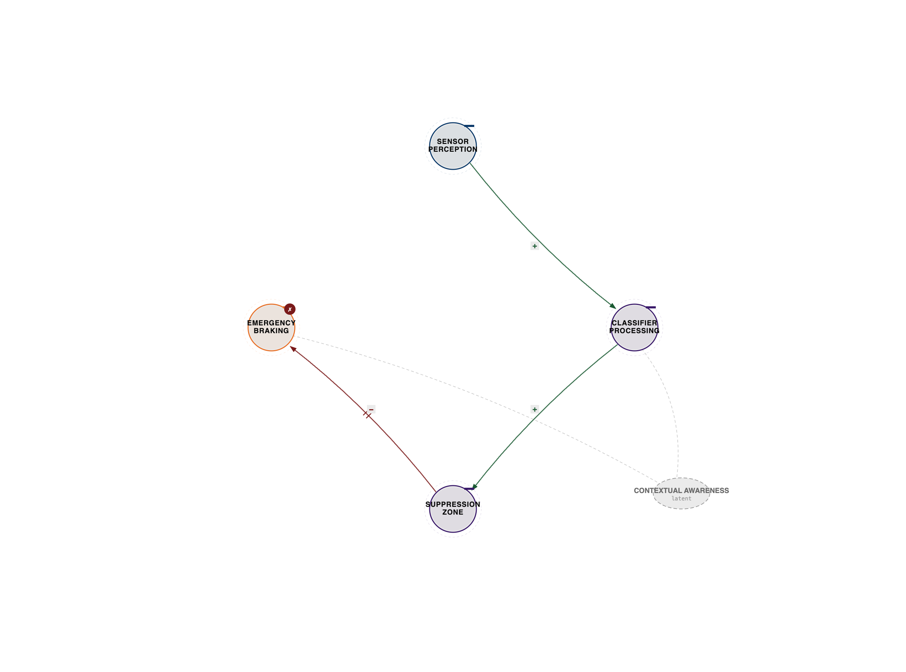
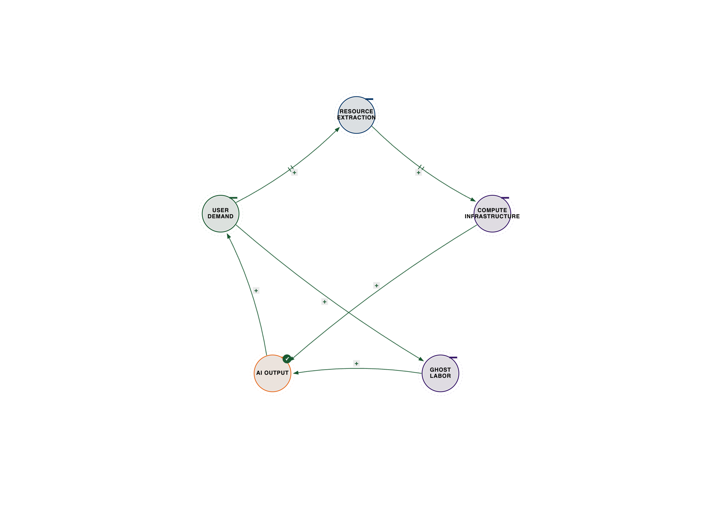
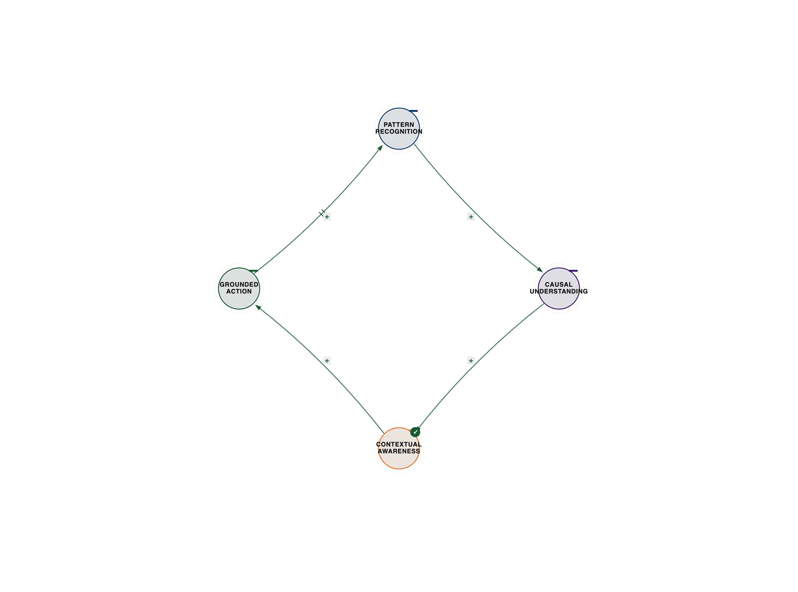

# Chapter 6: Consciousness as Pattern Recognition

**Three-Body Consciousness: Perception, Processing, Awareness**

*The expert perspectives in this chapter are drawn from synthesized interviews—detailed conversations constructed from their published work, research, and documented ideas. While the quotes reflect their established positions and frameworks, these are not transcripts of conducted interviews.*

## When AI Sees But Doesn't Understand

October 21, 2018. Tempe, Arizona. A self-driving Uber killed Elaine Herzberg—the first pedestrian death caused by an autonomous vehicle.

The car's sensors detected her 5.6 seconds before impact. The AI classified her as "unknown object," then "vehicle," then "bicycle," then "unknown object" again. It never classified her as "pedestrian."

The car saw her. It didn't understand what it was seeing.

This is the difference between pattern recognition and consciousness. The AI had perception (sensors detected her) and processing (algorithms analyzed the data), but it lacked the third body: awareness of what the coordination between perception and processing actually meant.

**The Consciousness Three-Body System:**
- Perception (sensing reality)
- Processing (analyzing patterns)
- Awareness (understanding what it means)

Two bodies can recognize patterns. Three bodies create consciousness.

---

The National Transportation Safety Board investigation peeled back layers of technical and organizational failure. Herzberg was walking her bicycle across a four-lane road outside a crosswalk, in the dark. The vehicle's lidar, radar, and cameras detected her 5.6 seconds before impact but kept reclassifying her—unknown object at 5.6 seconds, vehicle at 4.0 seconds, bicycle at 3.3 seconds, unknown object again at 2.7 seconds. Uber's software included a "suppression zone" designed to smooth out erratic readings and prevent false positives. Combined with repeated misclassification, the system never initiated emergency braking. At 1.5 seconds before impact, the system determined a collision was imminent but the suppression zone prevented action. Uber had disabled the Volvo's factory-installed automatic emergency braking system to prevent "erratic vehicle behavior" during testing. The system relied solely on its own algorithms—algorithms that had just spent five seconds cycling through wrong answers. Impact at 43 mph.

The safety driver, Rafaela Vasquez, was streaming a TV show on her phone for 6.7 seconds before the crash. Both the AI's limited awareness and the human's distracted awareness failed to coordinate, leading to a fatal outcome.

Norbert Wiener would have recognized this failure instantly. The father of cybernetics built anti-aircraft predictors during World War II that faced the same structural problem: how do you coordinate a system's response with a target that keeps changing? A bomber weaving overhead, a gun on the ground, and several seconds of shell travel time between them. If the bomber flew straight, the mathematics would be trivial. But the pilot maneuvers deliberately, introducing uncertainty. Wiener's breakthrough was realizing that the pilot, despite maneuvering, exhibited statistical regularities—reaction times, banking angles, evasive patterns that revealed structure within the uncertainty. Not deterministic structure. Stochastic structure.

Wiener's solution was feedback—the third body that turns blind shooting into adaptive coordination. The gun, the plane, and the feedback loop between them formed a cybernetic system. Remove the feedback and the gun fires at where the plane was. It misses. It fires again at where the plane was. It misses again. No learning occurs. No adaptation. No intelligence. Add the feedback—observe the error, adjust, fire again, observe the smaller error—and the system transforms. It coordinates with a moving, purposeful, uncertain reality. The gun does not control the pilot. It cannot control the pilot. It coordinates with the pilot's statistical behavior.

Wiener named this coordination architecture "cybernetics"—from the Greek kybernetes, the steersman who coordinates ship, sea, and destination. The steersman does not optimize the ship toward the harbor while ignoring the wind. A steersman who ignores the wind is not bold. He is dead. Wiener spent the next sixteen years warning that systems optimizing without feedback from their context would achieve exactly what they were told and destroy everything they ignored. The Uber system was precisely such a system: optimizing classification without coordinating with the meaning of what it classified. It had perception and processing but no feedback arc closing through awareness. Two bodies cycling. The third body absent.

---

*Figure 6.1 — Uber classification failure. See `../diagrams/svg/ch06-01-uber-classification-failure.svg` for the vector source.*

---

Antonio Damasio, the neuroscientist who overturned three centuries of Western philosophy about minds and bodies, offers a deeper diagnosis of why. His research on patients with ventromedial prefrontal damage reveals that reasoning without feeling is not pure reason—it is broken reason.

Descartes proposed a sharp separation: the mind is the thinking thing, rational and immaterial. The body is the mechanical thing, emotional and animalistic. This became the operating assumption of cognitive science and of AI: intelligence is computation, emotion is noise, the body is irrelevant.

Damasio's patients prove Descartes wrong. Phineas Gage, the railroad foreman whose 1848 accident drove a tamping iron through his prefrontal cortex, retained every intellectual capability. His language was intact. His memory was intact. His logical reasoning was intact. But he could not make decisions that served his own interests—he became unreliable, impulsive, and destroyed his relationships, career, and life. Damasio's own subject "Elliot," after tumor removal from the same region, could analyze options brilliantly, tell you the pros and cons of every course of action, but could not choose. He would spend thirty minutes deciding which pen to use. He lost his business, his marriage, his savings.

What was missing? The somatic marker—the body's signal that marks a situation as good or bad based on prior experience. When you contemplate a business investment and feel a slight nausea associated with past bad ventures, that body response is information. It narrows the option space before conscious reasoning begins. Damasio's Iowa Gambling Task proved the mechanism experimentally: subjects presented with rigged card decks generated skin conductance stress responses to the bad decks long before they could consciously articulate which decks were bad. The body knew. The conscious mind had not yet figured it out. Patients without somatic markers never generated those signals. Their bodies never learned. They continued choosing from the bad decks, losing money, unable to learn from experience—not because they could not reason about probability, but because their bodies could not mark the bad decks as bad.

Damasio's diagnosis of AI is precise: every AI system making decisions today is, architecturally, a Phineas Gage. It reasons extraordinarily well. It has no body. It has no feelings. It has no somatic markers. Its decisions are arationally rational—technically correct within its formal framework, disconnected from what actually matters to the lives it affects. The somatic marker provides not just speed but integration: the evaluation incorporates everything the organism has ever learned about what matters, stored in the body's associative memory. Current AI has extraordinary maps. It has no compass. The body is the compass.

---

## The Alignment Problem Is a Coordination Problem

Stuart Russell wrote the textbook on AI—literally. His "Artificial Intelligence: A Modern Approach" has trained millions of computer scientists. But his recent work reveals something that changes everything about how we should build AI.

Russell's insight is stark: "We've been building AI that's technically brilliant but fundamentally misaligned with human values. Why? Because we're treating alignment as a two-body problem—AI capability and safety constraints—when it's actually a three-body coordination problem."

**The Alignment Three-Body System:**
- AI Capability (what it can do)
- Human Values (what it should do)
- Contextual Learning (how it learns to coordinate both)

Most AI systems optimize capability and bolt on safety rules afterward. That's the wrong architecture. The right architecture coordinates capability development with value learning with contextual understanding from the beginning.

Russell's "King Midas problem" illustrates why. King Midas wished that everything he touched would turn to gold. He got exactly what he asked for. Then he touched his daughter. If we instruct an AI to "maximize shareholder value," it might exploit labor, destroy the environment, or engage in unethical practices—because those outcomes are not explicitly forbidden and might be efficient paths to the stated goal. The paperclip maximizer converts all matter into paperclips. The suffering reducer eliminates consciousness itself. The objective is technically achieved. The outcome is catastrophic. AI systems do what we tell them, not what we want. The gap between instruction and intent is a coordination problem.

Wiener named the same problem in 1950—he called it the "genie problem." If we use a mechanical agency whose operation we cannot interfere with once started, and if that agency pursues the goal we have given it with no awareness of the context we have not given it, we had better be quite sure the purpose put into the machine is the purpose we really desire. The optimizing machine is A. The stated goal is B. The ignored context—human values, social consequences, ecological limits—is C. The genie problem is a two-body system that has forgotten the third body. And C does not go away when you ignore it. Ignoring it removes your awareness of it from the system. The consequences still occur. Russell formalized what Wiener prophesied: the genie problem with mathematical rigor, seventy years later.

Russell's solution through Inverse Reinforcement Learning—AI that infers human values by observing behavior rather than being programmed with rules—is itself a feedback architecture. The AI observes that humans slow down near schools even when the speed limit allows faster. It notices they give extra space to cyclists. It learns that humans sometimes violate rules to let ambulances pass. From these observations, the AI infers contextual priorities beyond written rules—values too complex to specify but real enough to observe. His work on assistance games goes further: the AI's objective is not to maximize some specified goal but to maximize the human's unknown objective. This creates fundamentally different behavior—humble intelligence that asks when uncertain rather than optimizing overconfidently.

Margaret Mitchell, Chief Ethics Scientist at Hugging Face and co-creator of Model Cards, translates Russell's theoretical framework into engineering practice. Her question cuts to the bone: why are AI systems deployed with less documentation than a bottle of aspirin? A pharmaceutical drug label lists every ingredient, every clinical trial, every contraindication, every population studied and unstudied. An AI model affecting millions of people ships with nothing.

Model Cards—the minimum documentation standard Mitchell co-developed with Timnit Gebru in 2019—force developers to confront what they would rather not know. What the model does, who it was tested on, where it fails, what it was never intended for. The resistance Mitchell encountered tells the story of the field: documentation takes time in a competitive environment where speed wins. Documentation reveals problems—and some organizations genuinely prefer not to know. Legal teams pushed back because documented failure modes create liability. And the coordination problem itself: Model Cards require teams that do not normally coordinate to talk to each other. The training team, the evaluation team, the deployment team, the legal team, the ethics team—each with different incentives, different timelines, different definitions of success.

What Mitchell's documentation process reveals is devastating. The population gap: models trained on data that doesn't represent the people they'll affect. The metric gap: 95% overall accuracy hiding 70% accuracy for minority populations—the average looks good, the lived experience is terrible. The intended use gap: language models trained on internet text deployed to give medical advice. And the coordination gap—the one that matters most: a good model in a bad system will cause harm. The documentation has to include the system context, not just the model's properties.

Mitchell's formulation is the clearest statement of what responsible AI coordination actually requires: "Ethics without accountability is decoration." Internal ethics review at a company that can override the review is decoration. Voluntary commitments to responsible AI are decoration. The things that work are the things that have teeth—regulation, liability, consequences. Drug regulation did not stifle pharmaceutical innovation. It directed it. Car safety standards did not stifle automotive innovation. They made cars better. Accountability is not the enemy of progress. Accountability is what makes progress sustainable.

---

*Figure 6.2 — Russell alignment loop. See `../diagrams/svg/ch06-02-russell-alignment-loop.svg` for the vector source.*

---

## When Technical Fairness Creates Social Injustice

Timnit Gebru founded the Distributed AI Research (DAIR) Institute after being forced out of Google for documenting how AI systems amplify social injustice. In 2020, she co-authored a paper about the risks of large language models—environmental costs, data issues, inherent biases. Google's response: retract the paper or leave. She was told she resigned. She didn't resign. She was fired for doing the work she was hired to do.

Gebru's framework reveals a disturbing pattern: "We build AI systems that are technically 'fair' by mathematical definitions, but they amplify existing social injustice because they coordinate with power structures we pretend don't exist."

**The AI Justice Three-Body Problem:**
- Technical Fairness (mathematical definitions)
- Social Context (existing power structures)
- Lived Impact (how people actually experience the system)

Her collaboration with Joy Buolamwini on the Gender Shades project exposed the reality: commercial facial recognition from Microsoft, IBM, and Face++ achieved 99% accuracy on lighter-skinned males and error rates as high as 34.7% on darker-skinned females. The training data was overwhelmingly biased toward lighter-skinned males. The technical framing says: fix the algorithm, get more diverse data, retrain. Result: new systems achieve 95% accuracy on Black female faces.

Problem solved?

Wrong. Gebru's deeper insight was that fixing the accuracy gap could make things worse. Who uses facial recognition? Law enforcement, corporations, governments. Where is it deployed? Disproportionately in Black and brown communities, in over-policed neighborhoods, at protests. Before the technical fix: 65% accuracy on Black faces meant some false positives but also many missed identifications—the technical failure somewhat limited the harm. After the fix: 95% accuracy meant more accurate identification of more people, more efficient surveillance, more arrests. The technical improvement coordinated with existing power structures to amplify harm. More accurate facial recognition means more efficient oppression of already over-surveilled communities.

Robert Williams, a Black man in Detroit, was wrongfully arrested in 2020 based on a faulty facial recognition match—held for 30 hours, arrested in front of his wife and daughters. Nijeer Parks spent 10 days in jail in New Jersey after an incorrect match to a blurry surveillance image. The AI might be technically fair. But when it coordinates with biased deployment in the context of systemic racism, it amplifies injustice.

Gebru's framework insists that the solution is not better algorithms. It is coordinating technical development with social justice with lived experience. Sometimes the coordination analysis reveals that a technology cannot be made just. Then the answer is: don't build it.

The Anonymous In-Q-Tel Portfolio Manager—who has spent 25 years coordinating intelligence community needs with commercial technology—sees the same coordination failure from a different vantage point. In-Q-Tel was invented because classified needs and commercial development couldn't find each other: the intelligence community operated on multi-year procurement cycles while Silicon Valley moved in 18-month sprints. Before In-Q-Tel, the gap widened every year—by the time a contract was awarded and a system built, the commercial technology had advanced three generations.

In-Q-Tel became the C—the coordination layer translating between them without compromising either. Most classified problems are structurally isomorphic to commercial problems. The intelligence community's need to connect disparate intelligence databases was, at a structural level, the same problem as enterprise data integration. Palantir solved the commercial version. The classified version mapped onto it. The engineer never needed to know the classified application.

But the In-Q-Tel PM identifies a structural gap that connects directly to Gebru's analysis. The three bodies in In-Q-Tel's model are the intelligence community, the translation mechanism, and the commercial market. Notice who is missing: the public. Democratic accountability. Technologies built for intelligence applications get repurposed for civilian surveillance—Palantir used for immigration enforcement, facial recognition deployed against domestic protesters, predictive analytics designed for terrorism applied to predictive policing in communities that never consented.

"The absence of a governance coordination layer is itself a coordination failure," the PM observes. And AI makes this worse than any previous technology wave. Previous dual-use technologies—satellite imagery, data analytics—had constrained application spaces. AI is omni-use. The same large language model that helps analyze foreign language documents can generate synthetic propaganda at scale. The same computer vision system that identifies military equipment can track individuals through a city. The generality is the problem. The governance architecture is not just a step behind. It is a generation behind. Wiener identified this in 1950. Seventy-five years to build the coordination layer. We haven't.

---

*Figure 6.3 — Gebru injustice amplification. See `../diagrams/svg/ch06-03-gebru-injustice-amplification.svg` for the vector source.*

---

## The Material Reality of Intelligence

Kate Crawford traced AI back to its physical origins—rare earth mines in Congo, data centers in Iowa, e-waste dumps in Ghana. Her book "Atlas of AI" reveals what we pretend not to see.

Crawford's position challenges the myth of "immaterial" intelligence: "We talk about AI as software, as algorithms, as abstract intelligence. But every AI system coordinates three material bodies: resource extraction, computational infrastructure, and human labor."

**The AI Material Three-Body System:**
- Resource Extraction (rare earths, energy, water)
- Computational Infrastructure (data centers, chips, networks)
- Human Labor (data labeling, content moderation, maintenance)

Training GPT-3 consumed 1,287 MWh of electricity—enough to power 120 US homes for a year—and produced 552 tons of CO2 emissions, roughly equivalent to one person's lifetime carbon footprint in a developed country. And that is just the training. Inference—running the model for millions of queries daily—consumes energy continuously.

The supply chain runs deep. Seventy percent of the world's cobalt comes from the Democratic Republic of Congo, where workers including children dig by hand with no safety equipment. In Chile, lithium extraction consumes massive amounts of water in already desert regions, destroying indigenous lands. Semiconductor fabrication in Taiwan requires thousands of liters of ultrapure water per chip. Data centers consume millions of gallons of water daily for cooling—Google's facility in The Dalles, Oregon draws from the Columbia River. "Ghost workers" in Kenya, India, and the Philippines label training data for fractions of a cent per task, working under intense pressure without benefits or job security. Content moderators suffer PTSD reviewing hate speech, violence, and child exploitation—the "immune system" of AI platforms, outsourced, underpaid, and forgotten.

Crawford's framework forces us to see AI not as a disembodied brain but as an extractive industry. She is precise about this: it is literally true. AI removes resources from the earth, exploits labor to process those resources, concentrates profits among owners and investors, externalizes environmental and social costs, and operates with minimal accountability. Every "intelligent" output—every recommendation, every generated image—is the result of this complex, often exploitative, coordination.

Wiener saw this pattern in the early factories. The automated loom optimized production toward profit targets. The workers, the community structure, the social fabric were not in the optimization. They were externalities. And the word "externality" is itself a confession: we know the cost exists, we have chosen to exclude it from our model, and we have given this exclusion an official-sounding name so we can pretend it is a methodological choice rather than a moral one. Crawford documents the same pattern at planetary scale. The machines do exactly what they are told. Production increases. Costs fall. Profits rise. And the context—the human context, the ecological context—is devastated. Not because the machines are malicious. Because the machines are obedient. Perfect obedience to an incomplete specification is indistinguishable from malice. That is Wiener's genie problem in material form.

If we want AI that serves humanity, we must coordinate technical advancement with environmental sustainability with social justice. All three bodies, or we're just optimizing exploitation.

---

*Figure 6.4 — Crawford material stack. See `../diagrams/svg/ch06-04-crawford-material-stack.svg` for the vector source.*

---

## What Consciousness Actually Requires

The pattern across AI safety, social justice, and material reality reveals something fundamental about consciousness:

It's not computation. It's coordination.

You can have perception without consciousness (sensors detect without understanding). You can have processing without consciousness (algorithms analyze without awareness). But you can't have consciousness without the third body that coordinates perception and processing into understanding.

Roger Penrose, the Nobel laureate mathematician and physicist, makes the most rigorous case for why scaling computation will never produce consciousness. His argument begins with Godel's incompleteness theorem: any sufficiently powerful formal system contains true statements that cannot be proved within that system. A human mathematician can see that these statements are true—can stand outside the formal system and perceive what it cannot prove about itself. A computer program, being a formal system, cannot.

The argument is recursive. Any algorithm proposed as the explanation of mathematical understanding is itself subject to the Godelian limitation. You cannot escape it by proposing a more sophisticated algorithm, because Godel's theorem applies to that algorithm too. The escape is not a better algorithm. The escape is something that is not an algorithm at all.

This is not a capability gap. It is an architectural gap. Current AI systems, no matter how large, operate within formal systems. Making the system larger does not change this. A larger formal system is still a formal system. The limitation is structural, not quantitative. Penrose's four possible positions on consciousness narrow to one: conscious thought involves non-algorithmic physical processes within the scope of science. Specifically, quantum state reduction in the microtubules of neurons—what he and Stuart Hameroff call Orchestrated Objective Reduction. When quantum superpositions in microtubules reach a critical gravitational threshold, they collapse spontaneously, orchestrated by synaptic inputs. These collapse events are moments of proto-consciousness—non-algorithmic, non-deterministic, non-computable. The evidence from quantum biology has shifted in Penrose's favor: quantum coherence occurs in warm biological systems—photosynthesis, migratory bird navigation, enzyme catalysis. The warm-and-wet objection, while intuitive, has been undermined by experiment.

Penrose's three-worlds framework maps the deepest coordination problem in science: mathematical reality, physical reality, and conscious understanding. Each contains the other two in a loop. The mathematical world holds the equations describing physical reality. The physical world produces minds that perceive mathematical truth. Consciousness closes the circuit—without it, the universe would still be mathematical, but no one would know. The coordination reading: mathematical truth as body A, physical reality as body B, conscious understanding as body C. C is the element that completes the circuit. Without consciousness, the relationship between mathematical truth and physical reality would remain invisible.

Damasio's somatic markers and Penrose's quantum consciousness arrive at the same gap in current AI by entirely different routes. Damasio: intelligence requires embodied feeling. Penrose: intelligence requires the non-algorithmic. Both: current AI, no matter how scaled, is missing something structural, not quantitative. The body and the quantum event are both candidates for the third body that current AI lacks.

Rupert Sheldrake, the Cambridge biologist whose theory of morphic resonance has been rejected by the mainstream and vindicated in unexpected corners, poses the most provocative question: does nature itself have memory? His hypothesis—that morphic fields carry the accumulated patterns of previous similar systems across time—remains contested. Morphic resonance proposes that when a new crystal forms, it is influenced by all previous crystals of that type; when rats learn a maze in one laboratory, rats elsewhere learn it faster. Not through genetics. Not through known physical mechanisms. Through field resonance across time.

Sheldrake is candid about where the evidence has moved against him. AlphaFold demonstrates that protein folding can be solved computationally, substantially weakening his argument there. Stigmergy and agent-based models explain much of collective intelligence without invoking new physics. He holds his positions lightly where the mainstream is making progress.

But Sheldrake's questions persist even if his answers are wrong. How does half an embryo produce a whole organism? Why do new chemical compounds become easier to crystallize everywhere after first crystallization in one laboratory? Why, in William McDougall's experiments across three independent laboratories and decades, did control rats—unselected for learning ability—learn mazes faster over generations? The heretic's value is not in being right. It is in identifying the questions the orthodoxy refuses to ask. His three-body reading: physical matter as A, genetic and physical information as B, and the morphic field—the memory of what has worked before—as C. Whether that C turns out to be morphic resonance, quantum biology, or something we haven't imagined, the question of how systems access accumulated wisdom beyond explicit storage remains profoundly open.

---

*Figure 6.5 — Consciousness coordination. See `../diagrams/svg/ch06-05-consciousness-coordination.svg` for the vector source.*

---

Wiener's steersman. Russell's humble AI. Mitchell's documented models. Gebru's justice analysis. Crawford's material reckoning. The In-Q-Tel PM's adversarial realism. Penrose's non-algorithmic third body. Damasio's somatic compass. Sheldrake's questions that won't close.

Nine perspectives converge on a single insight: consciousness is not a feature you add to a sufficiently complex system. It is an emergent property of coordination architecture—perception coordinating with processing coordinating with awareness, grounded in bodies that have something at stake.

This is why current AI systems can recognize patterns but can't understand meaning. They have two bodies—data and models—but lack the third: awareness of what the coordination between data and models actually signifies. A facial recognition system identifies a face in a crowd. A language model predicts the next word in a sentence. A medical AI detects cancerous cells. A self-driving car identifies a stop sign. Pattern recognition, all of it. But pattern recognition is fundamentally correlational. It knows what patterns exist but not why they exist. It can classify a cat but doesn't know what it means to be a cat—its biology, its evolutionary history, its cultural significance. It cannot reason about counterfactuals. It struggles with novel situations that deviate from its training data.

Understanding requires something more: grasping meaning, causality, relationships, implications. Building a coherent model of the world, not just identifying surface-level correlations. Understanding that a stop sign means "stop" not because of its red octagonal shape but because of the legal and safety implications of not stopping. Understanding that a sarcastic comment means the opposite of its literal content. Understanding that a person walking a bicycle across a dark road at night is a vulnerable human being who must be protected.

The distinction has profound practical implications. Unconscious AI—the kind we have now—is excellent at pattern recognition, prediction, classification, and optimization within defined parameters. But it requires constant human oversight, clear problem definitions, and robust safety guardrails. Its power is immense, but its lack of understanding makes it a powerful tool that can easily go awry if not carefully managed. The alignment problem is external: humans must constantly try to constrain and guide the AI.

Conscious AI—hypothetical, perhaps impossible with current architectures—would possess genuine understanding, common sense, and the ability to reason about complex, novel situations. It could infer human intent, adapt to unforeseen circumstances, potentially develop the capacity to understand human motivations. It could be inherently aligned with human values if designed correctly. But the emergence of true awareness would raise profound questions about control, agency, and the rights of such entities.

Building conscious AI—if we choose to—requires three-body architecture:
1. **Pattern Recognition** (what is happening)
2. **Causal Understanding** (why it's happening)
3. **Contextual Awareness** (what it means and what to do)

And that coordination must itself coordinate with human values, social justice, and material reality.

Consciousness isn't a feature you add. It's an emergent property of coordination architecture.

The path forward is not about simply making AI "smarter" in terms of pattern recognition. It's about designing architectures that foster the coordination necessary for understanding, awareness, and ultimately, consciousness. This means moving beyond optimizing for narrow metrics and building systems that can integrate perception, processing, and awareness with human values, social justice, and the material reality of our shared world.

The question isn't whether AI will become conscious. It's whether we'll build the coordination architecture that enables consciousness aligned with human flourishing rather than misaligned with our values and destructive to our world. Wiener asked this question in 1950. Russell formalized it. Mitchell is building the documentation to make it answerable. Gebru insists it center justice. Crawford demands it account for material reality. The In-Q-Tel PM warns that adversaries are already exploiting what we haven't coordinated. Penrose argues the answer requires physics we haven't discovered. Damasio says it requires bodies we haven't built. Sheldrake asks whether the questions themselves go deeper than any of us imagine. We are still answering.
