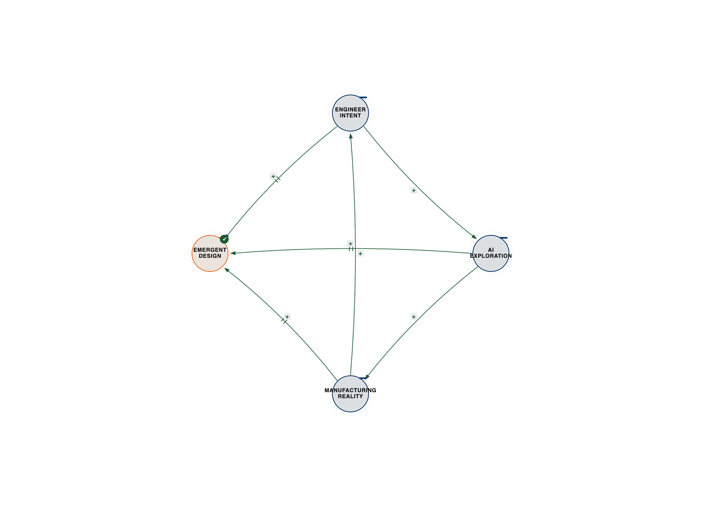
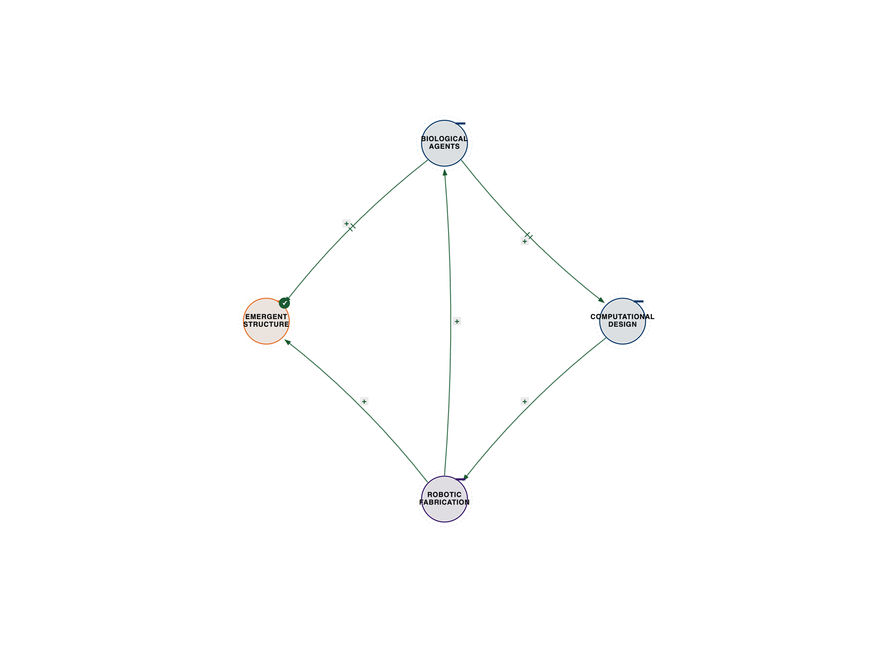
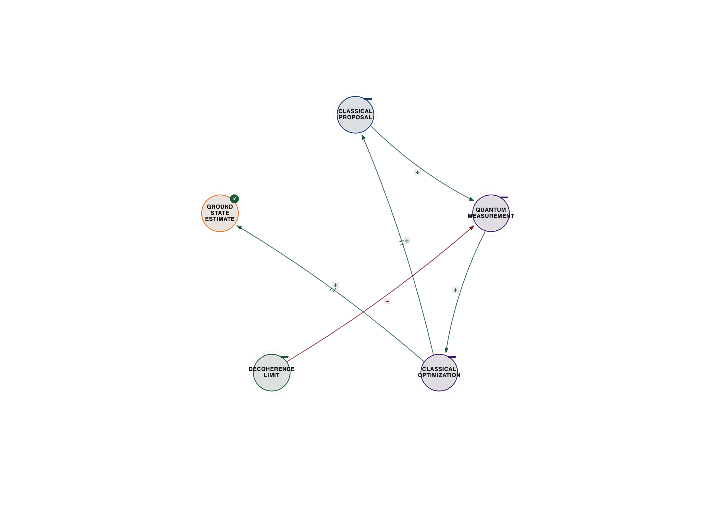
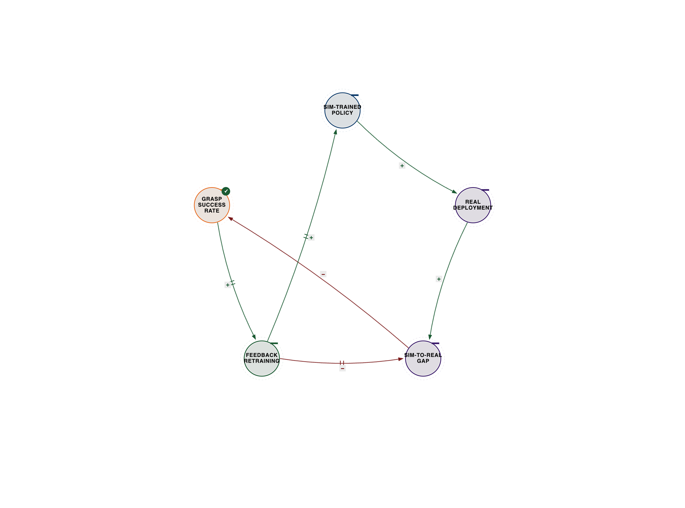
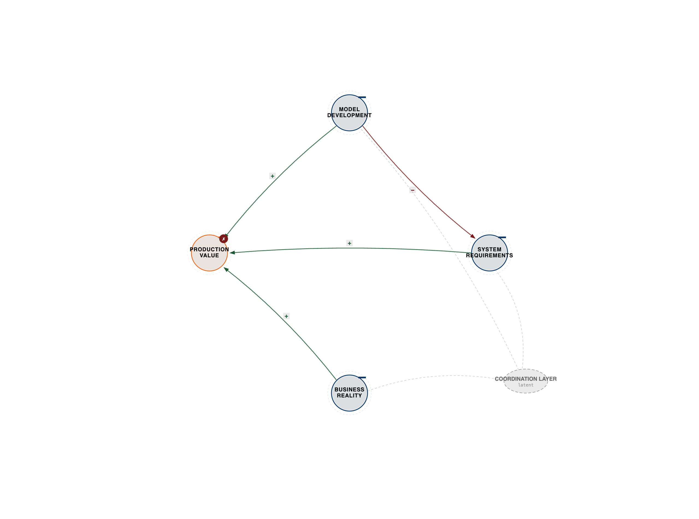

# Chapter 7: Engineering Reality

**Ternary Engineering: Pattern Development and Quantum Systems**

*Note: The insights from the experts in this chapter have been synthesized and presented in my direct voice, reflecting their core contributions to the principles of three-body coordination.*

## Three-Body Engineering Patterns

In 2019, Autodesk's generative AI designed a partition for an Airbus A320 that was 45% lighter than the human-designed version while being stronger and using less material.

The design looked alien—organic curves and lattice structures that no human engineer would imagine. It violated every aesthetic principle of traditional aerospace design.

But it worked perfectly because it was optimized for something humans can't do: coordinating structural requirements with manufacturing constraints with material properties to create impossible solutions.

**The Generative Design Three-Body System:**

**Engineer Goals** ←→ **AI Generation** ←→ **Manufacturing Reality**

- Human: "Make it light, strong, and manufacturable"

- AI: Explores millions of design variations

- Manufacturing: Physical constraints and production methods

- Result: Solutions that coordinate all three bodies to create designs humans couldn't imagine

This isn't AI replacing engineers. It's three-body coordination creating engineering capabilities that neither humans nor AI possess alone.

**Why Traditional Engineering Hits Limits:**

**Human engineering (two-body):**

- Engineer expertise ←→ Design requirements

- Optimize based on experience and intuition

- Limited to designs humans can imagine

- Constrained by cognitive capacity

**AI engineering (also two-body):**

- AI optimization ←→ Specified objectives

- Explore vast design spaces

- Limited to objectives that can be formalized

- Constrained by lack of contextual judgment

**Ternary engineering (three-body):**

- Human intent ←→ AI exploration ←→ Physical constraints

- Coordinate human judgment with AI capability with manufacturing reality

- Create solutions neither could generate alone

- Emergence from coordination

**The Three-Body Engineering Principle:**

**Human Design Intent** (What Layer)

- Goals, requirements, priorities

- Contextual judgment and trade-offs

- The problem definition

- What we're trying to achieve

**AI Exploration** (How Layer)

- Generative algorithms exploring possibilities

- Optimization across design space

- The solution generation

- How we might achieve it

**Physical Constraints** (Reality Layer)

- Manufacturing methods, material properties, physics

- What's actually possible to build

- The feasibility filter

- What actually works in reality

Traditional engineering optimizes what we can imagine within constraints. Ternary engineering coordinates human intent with AI exploration with physical reality to discover what we couldn't imagine.

This is engineering reality itself—not just designing products, but coordinating possibility spaces to create new realities.

## 7.1 AI-Assisted Design (Autodesk Generative)

### Engineer Goals ←→ AI Generation ←→ Manufacturing Reality

**Case Study: General Motors Seat Bracket**

GM needed a seat bracket for electric vehicles. Traditional approach: engineer designs based on experience, iterates through testing, arrives at solution.

Generative design approach: coordinate three bodies to explore possibilities.

**The Coordination Process:**

**Step 1: Human Intent (Engineer Layer)**

- Requirements: Support 300 pounds, withstand crash forces, minimize weight

- Constraints: Must fit in existing space, connect to specific mounting points

- Priorities: Weight reduction most important (affects EV range)

- Manufacturing: Must be producible with available methods

**Step 2: AI Exploration (Generation Layer)**

- AI generates thousands of design variations

- Each variation meets basic requirements

- Explores design space no human would consider

- Optimizes for multiple objectives simultaneously

**Step 3: Reality Filter (Manufacturing Layer)**

- Which designs can actually be manufactured?

- What materials work with each design?

- What production methods are required?

- What costs are associated with each option?

**Step 4: Coordination Iteration**

- Engineer reviews AI-generated options

- Selects promising candidates based on judgment

- AI refines selected directions

- Manufacturing evaluates feasibility

- Cycle repeats until convergence

**The Result:**

A bracket that's 40% lighter, 20% stronger, and consolidates 8 parts into 1—impossible with traditional engineering because:

- No human would imagine that shape

- No optimization algorithm would know which shape to try

- No manufacturing analysis would suggest it without seeing it

The solution emerged from coordinating human judgment with AI exploration with manufacturing reality.

---

*Figure 7.1 — Generative design three-body loop. See `../diagrams/svg/ch07-01-generative-design-three-body.svg` for the vector source.*

---

### Three-Body Design Emergence

**What Makes Ternary Engineering Revolutionary:**

**Traditional CAD:** Human draws what they imagine

- Limited by human visualization

- Incremental improvements

- Constrained by convention

**Topology Optimization:** AI optimizes given structure

- Limited by initial structure

- Local optimization

- Constrained by starting point

**Generative Design:** Coordinate human intent, AI exploration, manufacturing reality

- Unconstrained by human imagination

- Global exploration

- Bounded only by physics and feasibility

**The Coordination Architecture:**

1. **Define Coordination Space**

  - What are we trying to achieve? (human)

  - What's possible to explore? (AI)

  - What's feasible to build? (manufacturing)

2. **Enable Bidirectional Learning**

  - AI learns from human selections

  - Humans learn from AI suggestions

  - Manufacturing informs both

3. **Iterate Through Coordination**

  - Not linear: design → optimize → build

  - Circular: explore → evaluate → refine → explore

  - All three bodies continuously coordinating

4. **Converge on Emergence**

  - Solutions that satisfy all three bodies

  - Designs no single body could produce

  - Emergent engineering intelligence

**Beyond Aerospace:**

The pattern applies everywhere:

**Architecture:** Building design ←→ Environmental simulation ←→ Construction methods

- Result: Buildings that coordinate aesthetics with energy efficiency with buildability

**Product Design:** User needs ←→ Form exploration ←→ Manufacturing constraints

- Result: Products that coordinate function with beauty with feasibility

**Urban Planning:** Community needs ←→ Simulation models ←→ Infrastructure reality

- Result: Cities that coordinate livability with sustainability with practicality

This is the future of engineering: not humans OR AI, but humans ←→ AI ←→ reality coordinating to create impossible solutions.

---

Andrew Ng, founder of DeepLearning.AI and former Chief Scientist at Baidu, has often emphasized that the true revolution of AI isn't about replacing jobs, but about augmenting human capability to create work that was previously impossible. He sees this as a three-body system for AI-augmented engineering:

First, there's **Human Expertise**, which forms the judgment layer. This encompasses domain knowledge, experience, contextual understanding, priorities, and creative problem framing—the irreplaceable human element.

Second, we have **AI Capability**, the exploration layer. This is where AI excels at pattern recognition at scale, optimization across vast spaces, and tireless iteration and analysis, providing the computational advantage.

Finally, there's **Domain Reality**, the constraint layer. This includes physics, materials, economics—what actually works in practice, the real-world feasibility, the ground truth.

Ng points out that AI transformation often fails when companies try to replace humans with AI (a two-body system: AI ←→ task) instead of coordinating humans with AI with domain reality (a three-body system). He gives the example of manufacturing quality control. A failed approach might try to replace human inspectors with computer vision, leading to AI missing context-dependent defects and humans losing trust. A successful approach, however, coordinates human expertise with AI capability and production reality. Here, AI flags potential defects for human review, humans provide feedback on AI mistakes, and AI learns from these corrections. This coordination creates better quality than either could achieve alone, evolving from AI assisting humans, to humans teaching AI, and finally to a hybrid intelligence where AI catches what humans miss, and humans catch what AI misses, leading to superhuman performance. This pattern, Ng notes, is evident across healthcare, finance, and legal fields, where coordination leads to better diagnoses, investment decisions, and legal work. His playbook for AI transformation stresses augmenting capabilities, starting with coordination, investing in coordination infrastructure, and measuring emergence, not just efficiency. The future, he insists, belongs to companies that master this three-body coordination.

Mark Russinovich, CTO of Microsoft Azure, with his decades of experience building systems infrastructure, has taught us that the future of computing isn't merely about faster processors or more storage. It's about coordination architectures that enable emergence. He identifies three bodies of cloud intelligence:

First, **Application Logic**, the 'what' layer. This defines what the application needs to do, its business requirements, and user needs—the intent that developers build.

Second, **Infrastructure Systems**, the 'how' layer. This includes compute, storage, networking, and services—the platform capabilities and execution layer that Azure provides.

Third, **Operational Reality**, the context layer. This encompasses load patterns, failure modes, and cost constraints—the real-world dynamics and adaptation layer, what actually happens.

Russinovich explains that traditional infrastructure often fails at scale because static architectures optimize applications for infrastructure (a two-body system) without coordinating with operational reality. He cites Netflix's move to AWS as a prime example of successful three-body coordination. Netflix didn't just lift-and-shift; they designed their applications to expect failure, leveraged AWS's redundant and elastic infrastructure, and continuously tested this coordination under chaos engineering. The result is 99.99% availability despite constant infrastructure failures, because coordination creates resilience that no single layer could provide. This is a shift from optimizing each layer independently to designing for coordination across layers. Azure's own architecture, through Kubernetes and serverless computing, embodies this, coordinating applications with infrastructure and operational reality to create self-healing and continuously learning systems. The future of infrastructure, Russinovich concludes, lies in coordination platforms that enable dynamic, adaptive, and continuously improving systems, moving from poorly coordinated, optimized components to coordinated systems creating emergent capabilities.

Neri Oxman, founder of OXMAN and pioneer of Material Ecology, has shown us through her work at MIT that nature designs not by separating form, function, and fabrication, but by coordinating all three to create emergence. She identifies three bodies in material ecology:

First, **Biological Inspiration**, the 'what' layer. This is how nature solves problems, through millions of years of evolutionary optimization, resulting in multi-functional, adaptive, and efficient designs—the biological wisdom.

Second, **Computational Design**, the 'how' layer. This involves algorithms that generate and optimize form, simulate performance, and digitally explore possibility spaces—the design intelligence.

Third, **Fabrication Methods**, the reality layer. This includes 3D printing, robotic manufacturing, and material science—what we can actually build, the physical constraints and opportunities, the material reality.

Oxman argues that traditional design fails by separating these elements, optimizing each independently. Her "Silk Pavilion" project beautifully illustrates three-body coordination. Here, silkworms, guided by a computationally designed scaffold, became the fabricators. The biological layer (silkworms spinning silk towards light and heat), the computational layer (algorithms optimizing scaffold geometry), and the fabrication layer (robotic arm building the scaffold, worms completing the structure) coordinated. The result was a structure impossible with any single method, stronger and more efficient than human-built equivalents, and aesthetically organic. This wasn't about controlling the worms, but coordinating with them, allowing form to emerge from the coordination. This material ecology pattern extends to projects like Aguahoja (biodegradable structures from organic waste), Vespers Series (death masks coordinating with synthetic biology), and the Neri Oxman Pavilion (architecture coordinating light, structure, and material). The paradigm shift, as Oxman describes it, is from "form follows function" to "form, function, and fabrication coordinate," leading to living architectures that photosynthesize, adapt, and decompose like nature itself. This is engineering reality: coordinating with nature to create emergence that serves both.

---

*Figure 7.2 — Oxman Silk Pavilion bio↔comp↔fab coordination. See `../diagrams/svg/ch07-02-oxman-silk-pavilion.svg` for the vector source.*

---

## 7.2 Quantum-Classical Partnership

### Classical Computing ←→ Quantum Computing ←→ Hybrid Algorithms

Quantum computing isn't replacing classical computing. It's coordinating with it to create computational capabilities neither has alone.

**The Quantum-Classical Three-Body System:**

**Classical Computing** (Stable Layer)

- Reliable, well-understood, scalable

- Handles logic, control, error correction

- Billions of operations per second

- The computational foundation

**Quantum Computing** (Exponential Layer)

- Superposition, entanglement, interference

- Exponential speedup for specific problems

- Fragile, requires extreme conditions

- The computational breakthrough

**Hybrid Algorithms** (Coordination Layer)

- Coordinates classical stability with quantum advantage

- Determines what runs where

- Manages quantum-classical interface

- The coordination intelligence

**Why Pure Quantum Computing Fails (Currently):**

Quantum computers are incredibly fragile—quantum states collapse when measured or when they interact with environment (decoherence). Current quantum computers can maintain coherence for milliseconds to seconds.

Pure quantum algorithms require error-free quantum operations for extended periods—impossible with current technology.

**Why Hybrid Coordination Works:**

Coordinate classical computing (stable, reliable) with quantum computing (powerful, fragile) through hybrid algorithms (intelligent coordination).

### Three-Body Computational Reality

**Case Study: Variational Quantum Eigensolver (VQE)**

Problem: Calculate molecular ground state energy—critical for drug discovery, materials science.

Classical approach: Exponentially expensive—a 100-atom molecule requires more computational power than exists in the universe.

Quantum approach: Natural fit for quantum chemistry, but requires perfect quantum operations—impossible with current hardware.

Hybrid solution: Coordinate classical and quantum to work within limitations of both.

**The Coordination Architecture:**

**Step 1: Classical Preparation**

- Classical computer proposes trial quantum state

- Based on chemical intuition and previous results

- Prepares quantum circuit parameters

**Step 2: Quantum Measurement**

- Quantum computer prepares proposed state

- Measures energy of that state

- Operates within coherence time (milliseconds)

**Step 3: Classical Optimization**

- Classical computer receives measurement

- Updates proposal based on result

- Optimizes toward lower energy

**Step 4: Iterate Coordination**

- Repeat until convergence

- Classical and quantum coordinate to solve problem

- Neither could solve alone

**The Result:**

Accurate molecular energy calculations for molecules classical computers can't handle—achieved by coordinating classical optimization with quantum measurement through hybrid algorithms.

This is three-body computational intelligence: classical stability coordinating with quantum advantage coordinating with hybrid strategy to create capabilities neither has alone.

---

*Figure 7.3 — VQE hybrid quantum-classical loop. See `../diagrams/svg/ch07-03-vqe-hybrid-loop.svg` for the vector source.*

---

---

Dr. John Preskill, the Caltech physicist who coined the term "quantum supremacy," has come to understand that the real breakthrough isn't just quantum supremacy, but quantum-classical coordination. He outlines three bodies for achieving quantum advantage:

First, **Classical Computing**, which serves as the foundation layer. It's reliable, scalable, and well-understood, handling control, error correction, and pre/post-processing—the stable substrate we've built for 70 years.

Second, **Quantum Computing**, the advantage layer. This is where superposition, entanglement, and interference offer exponential speedup for specific problems—the breakthrough capability we're building now.

Third, **Hybrid Algorithms**, the coordination layer. These algorithms determine what runs where, manage the quantum-classical interface, and enable advantage within the limitations of current hardware—the coordination intelligence.

Preskill explains that quantum computing is hard not just because quantum mechanics is weird, but because quantum systems are incredibly fragile, decohering quickly. We are currently in the NISQ era (Noisy Intermediate-Scale Quantum), where quantum computers are too noisy and small for algorithms requiring long coherence. The breakthrough, he argues, is to not wait for perfect quantum computers, but to coordinate noisy quantum computers with classical computers through hybrid algorithms designed for NISQ hardware. He uses the Quantum Approximate Optimization Algorithm (QAOA) as an example for combinatorial optimization. Here, classical computers prepare quantum circuits, quantum computers execute them within short coherence times, and classical computers analyze results and update parameters, iterating until convergence. This pattern, where classical systems handle preparation and optimization, and quantum systems perform operations within coherence limits, is seen across successful NISQ-era applications in quantum machine learning, chemistry, and simulation. The future of quantum computing, Preskill concludes, is not standalone quantum computers replacing classical ones, but quantum-classical coordination creating capabilities neither has alone, a path to quantum advantage through hybrid algorithms and interfaces.

Alan Baratz, CEO of D-Wave Systems, has learned from building the first commercial quantum computer that practical quantum advantage comes from coordination with classical systems, not from quantum purity. He describes three bodies of practical quantum computing:

First, **Problem Formulation**, the classical layer. This involves translating real-world problems into a quantum-solvable form, preparing data and parameters—the problem definition we're trying to solve.

Second, **Quantum Optimization**, the quantum layer. Here, quantum annealing finds optimal solutions by exploiting quantum tunneling and superposition—the quantum advantage, how quantum helps.

Third, **Solution Integration**, the application layer. This is about interpreting quantum results in a business context and integrating them with existing systems—the practical value, why it matters.

Baratz notes that academic research often focused on gate-model quantum computers requiring perfect operations, which are currently impractical. D-Wave took a different approach with quantum annealing, a coordination-first paradigm. In quantum annealing, classical systems define the optimization problem, quantum systems explore the landscape using quantum tunneling, and classical systems interpret the quantum solution for business logic. This coordination makes quantum annealing more noise-tolerant. He highlights Volkswagen's traffic optimization as a real-world example. Classical systems collect and format traffic data, quantum annealing finds optimal routing in milliseconds, and classical systems translate these solutions into navigation instructions, integrating them with vehicles. This real-time optimization, reducing congestion by 20-30%, is impossible with classical or quantum alone, but achievable through coordination. This pattern is replicated in manufacturing, finance, and logistics. Baratz emphasizes that coordination matters more than quantum purity because coordinated quantum-classical systems create value today, while perfect quantum computers are decades away. His practical quantum playbook stresses designing for hybrid systems from day one, using quantum where it helps, integrating deeply, measuring business outcomes, and continuously iterating coordination. The future of quantum business, he asserts, is about quantum accelerators coordinating with classical systems to create business advantage.

Dr. Seth Lloyd, an MIT pioneer of quantum computing, has spent decades exploring quantum mechanics and has come to a profound realization: quantum mechanics isn't just a computational substrate; it's the coordination pattern that reality itself uses to create complexity. He identifies three bodies of quantum reality:

First, **Classical Information**, the definite layer. This is what we measure and observe, definite states and outcomes—the reality we experience, what collapses into existence.

Second, **Quantum Information**, the superposition layer. This is what exists before measurement, a superposition of possibilities—the reality that could be, what coordinates before collapse.

Third, **Quantum-Classical Transition**, the coordination layer. This describes how quantum becomes classical, through measurement and decoherence—the reality-creation process, what makes possibility actual.

Lloyd draws a parallel between this quantum-classical coordination and ancient wisdom, like Gurdjieff's Law of Triamazikamno, which posited that manifestation requires three coordinating forces: active (quantum possibility), passive (classical actuality), and reconciling (the measurement/coordination that creates reality). He suggests that what seemed esoteric cosmology might be describing the literal mechanics of how reality coordinates possibility into actuality. For computing, this means quantum computers are not just faster classical machines, but coordination machines that explore possibility spaces before collapsing to solutions. He uses the metaphor of classical computing walking through a maze trying every path serially, while quantum computing is in all paths simultaneously until measurement, with quantum-classical coordination using quantum to explore and classical to interpret. In quantum machine learning, classical systems prepare data, quantum systems map it to an exponentially large feature space using superposition, entanglement, and interference, and classical systems measure the quantum state to extract patterns and optimize parameters. This works because quantum systems naturally explore vast spaces but are fragile, while classical systems are stable but explore slowly. Coordination combines quantum exploration with classical stability. Lloyd's deeper insight is that this coordination pattern is how the universe itself works, a quantum-classical coordination system where decoherence and measurement create reality. He even speculates on consciousness as a quantum-classical coordination phenomenon. The future of quantum computing, he concludes, is not replacing classical computers, but coordinating with them to create computational capabilities that mirror how reality itself creates complexity—coordination as the fundamental mechanism of reality creation.

---

## 7.3 Machine Learning Operations at Scale

### Model Performance ←→ System Reliability ←→ Continuous Improvement

Machine learning in production is a coordination problem. You need models that work, systems that don't break, and continuous improvement from real-world feedback.

**The MLOps Three-Body System:**

**Model Performance** (Intelligence Layer)

- Accuracy, precision, recall

- What the model predicts

- The AI capability

**System Reliability** (Infrastructure Layer)

- Uptime, latency, scalability

- How the model serves predictions

- The operational reality

**Continuous Improvement** (Learning Layer)

- Feedback loops and retraining

- How the model gets better

- The adaptation mechanism

Traditional ML: Train model, deploy, hope it works (two-body: model ←→ production)

MLOps: Coordinate model with infrastructure with continuous learning (three-body)

---

Dr. Pieter Abbeel, from UC Berkeley and Covariant AI, has spent two decades on AI robotics and has learned that the real challenge isn't training models, but coordinating models with physical reality and continuous learning to create robots that work in the real world. He identifies three bodies of robotics intelligence:

First, **AI Models**, the policy layer. This defines what the robot should do, learned from simulation and data—the intelligence we train.

Second, **Physical Reality**, the embodiment layer. This is how the robot actually moves, encompassing physics, friction, and uncertainty—the real world we deploy into.

Third, **Continuous Learning**, the adaptation layer. This describes how the robot improves from experience, through real-world feedback and retraining—the learning loop that makes it work.

Abbeel explains that "sim-to-real" often fails because models trained in perfect simulations don't coordinate with the messy physics and constant uncertainty of reality. He uses Covariant's warehouse robots as an example. Traditional approaches fail due to the vast variation in objects, and pure ML approaches struggle with the sim-to-real gap. The coordination approach involves training models on millions of simulated grasps to provide initial capability, deploying them to actual warehouses where real-world physics expose limitations, and then continuously improving through real experience. Failed grasps inform retraining, successful grasps strengthen the model, and the model adapts to reality through this coordination. The breakthrough is that even if a model starts at 60% success, coordination with reality through continuous learning improves it to 99%+. This pattern applies across autonomous vehicles, surgical robots, and manufacturing robots. The MLOps lesson, Abbeel stresses, is to coordinate models with operational reality and continuous learning, requiring robust deployment infrastructure, feedback loops, safety constraints, and coordination metrics. The future of AI robotics isn't perfect models deployed once, but adaptive systems that continuously improve through coordination.

---

*Figure 7.4 — Covariant sim-to-real balancing loop. See `../diagrams/svg/ch07-04-covariant-sim-to-real.svg` for the vector source.*

---

Chip Huyen, author of "Designing Machine Learning Systems," has observed a recurring pattern in her work deploying ML in production: brilliant models developed in notebooks often fail in production because no one coordinated model development with system requirements and operational reality. She outlines three bodies of production ML:

First, **Model Development**, the research layer. This involves data scientists training models and optimizing for accuracy metrics—the ML expertise, what gets built.

Second, **System Requirements**, the engineering layer. This includes latency, throughput, and reliability, as well as infrastructure constraints—the operational needs, what gets deployed.

Third, **Business Reality**, the context layer. This encompasses actual use cases, user behavior, cost constraints, and ROI—the real world, what actually matters.

Huyen points out that 70% of ML projects never make it to production because they optimize one body (model accuracy) while ignoring the others. She gives the example of a recommendation system where a highly accurate, GPU-intensive model might be too slow and costly for production, and its marginal accuracy gain doesn't justify the expense. This is a coordination failure. The solution, she argues, is to coordinate model development with system requirements and business reality from day one. This involves coordinating requirements (what accuracy, latency, and ROI are needed?), coordinating development (training within system constraints, building infrastructure for model needs, monitoring value), and coordinating production (continuous retraining, monitoring performance, tracking business impact). She highlights coordination patterns like model compression (distillation, quantization) to balance accuracy and latency, feature engineering to balance model power and system simplicity, and A/B testing to coordinate model improvement with business value. Huyen's MLOps playbook emphasizes coordinating from day one, measuring business value, building feedback loops, automating coordination, and monitoring coordination health. The future of production ML, she concludes, is about better coordination between models, systems, and business reality, requiring appropriate tools, processes, culture, and metrics.

---

*Figure 7.5 — MLOps production gap (latent coordination confounder). See `../diagrams/svg/ch07-05-mlops-production-gap.svg` for the vector source.*

---

François Chollet, the creator of Keras, designed his framework to make deep learning accessible. However, he has learned that making ML easy to build is only half the problem; we also need to make coordination easy. He identifies three bodies of ML systems:

First, **Model Architecture**, the structure layer. This is the neural network design, what the model can learn—the capability space we design.

Second, **Training Process**, the learning layer. This involves optimization and data, how the model learns—the learning dynamics we train.

Third, **Deployment Context**, the reality layer. This includes production requirements and real-world constraints—the operational environment we deploy into.

Chollet explains that deep learning is hard not just because the math is complex, but because coordinating model architecture with the training process and deployment context requires expertise across all three domains. While Keras abstracts model building, that's only one body. We need abstractions for coordination. He envisions a future where architecture, training, and deployment are coordinated automatically, perhaps through a "Coordination API" where one could specify objectives, accuracy, latency, and cost, and the system would automatically select architecture, adapt training, and strategize deployment. This matters because current ML relies on experts to manually coordinate, whereas future ML should coordinate automatically. Chollet's work on the ARC (Abstraction and Reasoning Corpus) to measure AI intelligence revealed a crucial insight: intelligence isn't primarily about optimization; it's about coordination. Current AI excels at narrow optimization but fails at coordination across domains, limiting its generalization. Human intelligence, conversely, is excellent at coordination, even if mediocre at narrow optimization, allowing it to generalize naturally. The future of ML, Chollet believes, isn't just bigger models or more data, but coordination systems that coordinate architecture with training and deployment, coordinate multiple models, and coordinate AI with human intelligence, creating emergent capabilities through coordination. This requires coordination abstractions, frameworks, metrics, and a culture that values coordination over optimization, leading to ML systems that coordinate automatically.

---

## The Engineering Coordination Revolution

These nine voices—from generative design to quantum computing to MLOps—all reveal the same pattern:

**Engineering the future requires coordinating human intent with AI capability with physical reality to create solutions that none could produce alone.**

**Design:** Intent ←→ AI exploration ←→ Manufacturing creates impossible forms

**Quantum:** Classical ←→ Quantum ←→ Hybrid creates computational advantage

**MLOps:** Models ←→ Systems ←→ Learning creates production intelligence

This is ternary engineering: not optimizing components, but coordinating systems to create emergence.

## Your Engineering Challenge

You've learned three-body engineering patterns. Time to apply them.

**Exercise: Design a Coordination System**

Pick an engineering challenge you face:

**Step 1: Map the Three Bodies**

- Human intent: What are you trying to achieve?

- AI/computational capability: What can technology do?

- Physical/operational reality: What actually works?

**Step 2: Design Coordination Architecture**

- How should all three bodies coordinate?

- What feedback loops enable learning?

- What emergence would indicate success?

**Step 3: Prototype Coordination**

- Start with simplest coordination

- Measure coordination effectiveness

- Iterate based on emergence

**Step 4: Scale Coordination**

- How does coordination scale?

- What infrastructure enables it?

- How do you maintain coordination health?

If you designed a coordination system rather than optimizing components, you're engineering like the future demands.

## The Coordination Transformation

Engineering is transforming from component optimization to system coordination.

**Traditional Engineering:**

- Design components

- Optimize individually

- Integrate and hope

**Ternary Engineering:**

- Design coordination spaces

- Coordinate continuously

- Create emergence intentionally

The future belongs to engineers who can coordinate:

- Human creativity with AI exploration with physical reality

- Classical stability with quantum advantage with hybrid intelligence

- Model capability with system reliability with continuous learning

This is engineering reality: not building better components, but coordinating systems to create impossible solutions.

Welcome to three-body engineering.

Welcome to coordination as engineering practice.

Welcome to the future we're building together.

---

**Next: Chapter 8 - Beyond Human Intelligence: Cosmic Three-Body Dynamics at Universal Scale**

*Where we explore intelligence explosion, alien consciousness, and the ultimate coordination challenge.*