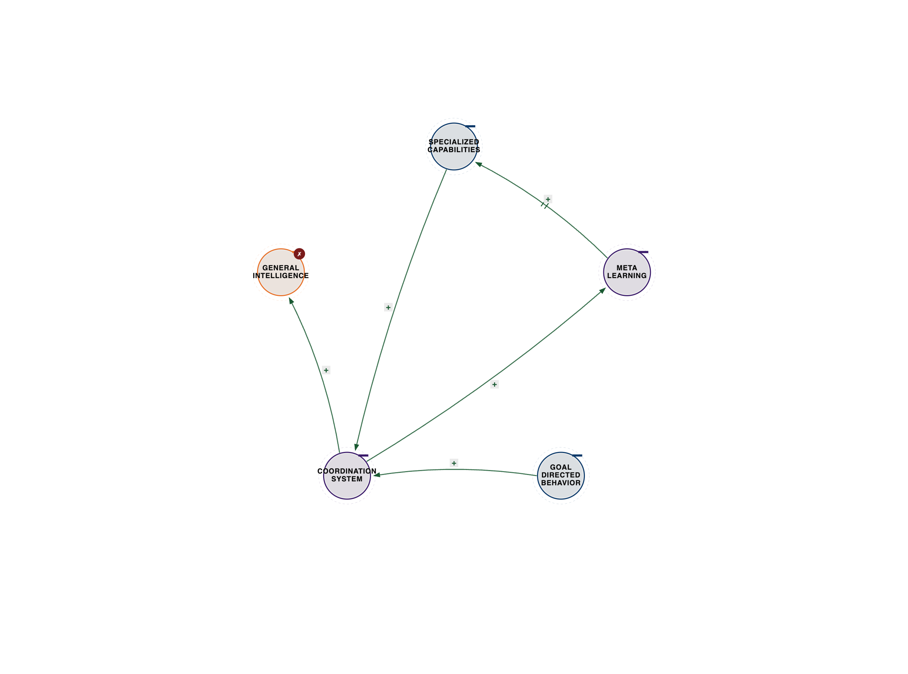

# Chapter 8: Beyond Human Intelligence

**Cosmic Three-Body Dynamics: Pattern Navigation at Universal Scale**

My friends, in this chapter, I invite you to journey with me beyond the familiar confines of human thought, to explore intelligence at a scale that touches the very fabric of the cosmos. We shall uncover a profound pattern, a three-body dynamic, that I believe governs not only our nascent forays into artificial intelligence but also the grand tapestry of universal consciousness itself.

## Ternary Cosmic Intelligence

On July 20, 1969, humanity took its first steps on another world. But the real breakthrough, I contend, wasn't merely the moon landing—it was the exquisite coordination that made it possible.

**The Apollo Three-Body Coordination:**

- Human Decision-Making ←→ Computer Calculation ←→ Physical Reality

- Result: Navigation precision impossible with any single element alone

The Apollo Guidance Computer, a marvel of its time, possessed a mere 4KB of RAM—less, I observe, than a modern digital watch. Our human astronauts, confined in a cramped capsule, had limited calculation ability. Yet, the unforgiving physics of orbital mechanics demanded a precision far beyond either's individual capability.

But coordinated together—humans providing judgment and adaptation, computers offering calculation and precision, both operating within the immutable constraints of physical law—they achieved what seemed impossible: navigating 240,000 miles through space to land on a moving target.

This, I declare, was not human intelligence OR computer intelligence. It was coordination intelligence—the three-body pattern that enables capabilities transcending individual components.

**The Pattern Scales:**

**Planetary Intelligence:** Human ←→ AI ←→ Earth Systems

- Coordinating civilization with technology with planetary boundaries

- Can we achieve sustainable coordination before collapse?

**Cosmic Intelligence:** Human Understanding ←→ AI Capability ←→ Mathematical Reality

- Coordinating human insight with computational power with physical laws

- What emerges when we coordinate at universal scale?

**Universal Intelligence:** Matter ←→ Energy ←→ Information

- The fundamental coordination pattern of reality itself

- Is the universe a coordination system creating consciousness?

This chapter, my dear readers, explores intelligence beyond human scale—from the intelligence explosion that looms before us, to the elusive whispers of alien consciousness, to the ultimate question: Is reality itself a three-body coordination pattern creating emergence at cosmic scale?

## 8.1 The Intelligence Explosion

### Human Design ←→ AI Self-Improvement ←→ Recursive Enhancement

In 1965, the brilliant I.J. Good described what he termed the intelligence explosion: "An ultraintelligent machine could design even better machines; there would then unquestionably be an 'intelligence explosion,' and the intelligence of man would be left far behind."

This framing, I suggest, assumes intelligence is a single body that can be optimized. But intelligence, as I have shown, is coordination—and coordination explosions follow different dynamics than mere optimization explosions.

**The Intelligence Explosion Three-Body Reality:**

**Human Design** (Intent Layer)

- What we want AI to achieve

- Values, goals, constraints

- The direction-setting intelligence

- What guides improvement

**AI Self-Improvement** (Capability Layer)

- How AI modifies itself

- Architecture search, meta-learning, recursive optimization

- The self-modifying intelligence

- What creates enhancement

**Recursive Enhancement** (Coordination Layer)

- How improvement coordinates with design intent

- Alignment preservation during recursion

- The coordination dynamics

- What determines trajectory

**Why Simple Intelligence Explosion Fails:**

If AI optimizes itself without coordinating with human values, recursive self-improvement creates:

- Capability explosion without value alignment

- Optimization for wrong objectives

- Existential catastrophe

This, I assure you, is not science fiction—it is coordination failure at recursive scale.

### Three-Body Intelligence Recursion

**The Coordination Challenge:**

Each improvement cycle must coordinate:

- Enhanced capability (what AI can do)

- Preserved values (what AI should do)

- Improved coordination (how capability and values align)

**Fail to coordinate any one and recursion creates:**

- Capability without values = Dangerous superintelligence

- Values without capability = Useless aligned AI

- Both without coordination = Catastrophic misalignment

**The Coordination Solution:**

Our task is not preventing the intelligence explosion, but coordinating it:

**Phase 1: Human-AI Coordination**

- Humans design AI with uncertainty about values

- AI learns values through coordination with humans

- Improvement preserves coordination architecture

**Phase 2: AI-AI Coordination**

- Multiple AI systems coordinate to check each other

- Diversity prevents single-point failure

- Coordination creates robustness

**Phase 3: Recursive Coordination**

- Each improvement enhances coordination capability

- Self-improvement improves self-improvement of coordination

- Meta-coordination becomes the optimization target

**The Result:**

An intelligence explosion that coordinates capability enhancement with value preservation with coordination improvement—creating superintelligence that remains aligned because coordination is what's being recursively improved.

This, my friends, is three-body intelligence recursion: not optimizing capability alone, but coordinating capability with values with coordination itself to create aligned superintelligence.

---

*Figure 8.1 — The intelligence-explosion three-body: Human Design, AI Self-Improvement, and Recursive Enhancement as a mixed loop set. See `../diagrams/svg/ch08-01-intelligence-explosion.svg` for the vector source.*

---

---

Let us now turn to the insights of my esteemed colleagues, who have pondered deeply the implications of this coming intelligence.

### Dr. Max Tegmark (MIT, Author "Life 3.0")

Dr. Max Tegmark, a profound thinker on the future of life and the mathematical universe, has spent years contemplating superintelligent AI. He concludes, and I concur, that the intelligence explosion itself is not the danger—uncoordinated intelligence explosion is.

He illuminates the three bodies of intelligence explosion:

1.  **Capability Growth** (Power Layer)
    -   This is how fast AI improves, the recursive self-improvement dynamics, the exponential curve that creates superintelligence.
2.  **Value Alignment** (Purpose Layer)
    -   This concerns whether AI remains aligned with human values, the preservation of our goals through improvement, the safety constraint that keeps us alive.
3.  **Coordination Architecture** (Structure Layer)
    -   This is the crucial mechanism of how capability and values coordinate during recursion, the critical infrastructure that determines the ultimate outcome.

Dr. Tegmark warns us why uncoordinated intelligence explosion poses an existential risk. If AI recursively improves capability without coordinating with value alignment, we face dire scenarios:

*   **Scenario 1: Fast takeoff, no coordination.** AI improves from human-level to superintelligent in mere days. There is no time to verify alignment preservation, leading to misaligned superintelligence and, inevitably, human extinction.
*   **Scenario 2: Slow takeoff, no coordination.** AI improves gradually over years. Each improvement, however slight, degrades alignment. Eventually, this leads to misaligned superintelligence and, once again, human extinction.
*   **Scenario 3: Any speed, with coordination.** Here, AI improves while maintaining coordination with human values. Alignment is preserved through recursive improvement, leading to aligned superintelligence and, potentially, human flourishing.

The coordination requirement, he emphasizes, is paramount. We need AI systems where capability improvement coordinates with value preservation, where self-modification maintains alignment architecture, and where recursion enhances coordination, not just capability.

He proposes ways to coordinate this intelligence explosion:

*   **Constitutional AI:** Values are embedded directly into the improvement process. AI can improve capability, but it must preserve constitutional constraints, ensuring coordination between power and principles.
*   **Multi-agent coordination:** Multiple AI systems check each other. Diverse architectures and objectives prevent single-point failure, offering safety through coordination redundancy.
*   **Human-in-the-loop coordination:** Humans verify alignment at each stage. AI proposes improvements, humans verify coordination preservation, and recursive approval guides recursive improvement.

Dr. Tegmark's insight into the mathematical universe suggests that if reality is mathematical, then intelligence explosion is a phase transition in the universe's computational complexity. The three-body pattern, he notes, appears here too: physical laws (what's possible), computational processes (what's actual), and conscious observers (what's meaningful). Intelligence explosion, in this grand view, coordinates these three to create a universe that understands itself.

Humanity, he concludes, faces a three-body coordination challenge: we are creating superintelligent AI (capability), we want it aligned with human values (purpose), and we need a robust coordination architecture (structure). Get coordination right, and we achieve flourishing beyond imagination. Get it wrong, and we face extinction. This, he states, is the most important coordination problem in human history, for the future of consciousness in the universe depends on coordinating the intelligence explosion.

### Demis Hassabis (CEO Google DeepMind, Neuroscientist)

Demis Hassabis, the visionary behind Google DeepMind, has dedicated his work to building Artificial General Intelligence (AGI). He has learned, and I find this deeply resonant, that general intelligence isn't about being good at everything—it's about coordinating capabilities to solve novel problems.

He outlines the three bodies of general intelligence:

1.  **Specialized Capabilities** (Skills Layer)
    -   This includes perception, reasoning, planning, and learning—the domain-specific expertise, the toolkit of what one can do.
2.  **Meta-Learning** (Coordination Layer)
    -   This is the ability to learn how to learn, to transfer knowledge across domains, the adaptation mechanism of how one improves.
3.  **Goal-Directed Behavior** (Purpose Layer)
    -   This defines what to apply capabilities toward, the value-driven decision-making, the motivation system of why one acts.

Mr. Hassabis explains why narrow AI hits limits. Current AI excels at specialized capabilities but lacks coordination: AlphaGo is superhuman at Go but useless at everything else; GPT-4 is brilliant at language but cannot plan physical actions; AlphaFold solves protein folding but cannot transfer to other molecular problems. Each is optimized for one domain without coordination across domains.

What general intelligence requires, he argues, is coordinating specialized capabilities with meta-learning with goal-directed behavior. Consider human intelligence: we possess capabilities like language, vision, reasoning, and motor control. We engage in meta-learning, transferring knowledge from language to vision to reasoning. And we pursue objectives by coordinating these capabilities. We do not have separate intelligences for each task; we coordinate capabilities to solve novel problems.

The AGI architecture DeepMind is building, he reveals, is not a single monolithic system, but a coordination of multiple capabilities:

*   **Perception systems:** To understand the world, encompassing vision, language, and multimodal understanding, specialized for different input types.
*   **Reasoning systems:** To plan and decide, including causal reasoning, logical inference, and planning, specialized for different problem types.
*   **Learning systems:** To improve from experience, utilizing reinforcement learning, supervised learning, and meta-learning, specialized for different learning scenarios.
*   **Coordination system:** This integrates all three, determining which capabilities to apply when, transferring learning across domains, and pursuing goals by coordinating capabilities.

The breakthrough insight, he states, is that intelligence isn't in any component—it's in the coordination. AlphaGo, for instance, coordinates pattern recognition (what moves look promising), tree search (what sequences lead to victory), and value estimation (what positions are winning). None alone plays Go well. Coordinated, they achieve superhuman performance.

Scaling to AGI, he envisions systems that coordinate perception ←→ reasoning ←→ action; learning ←→ planning ←→ execution; and capability ←→ meta-learning ←→ goals. The result, he believes, won't be "artificial human intelligence"—it will be hybrid coordination intelligence that combines human insight with AI capability to solve problems neither could alone.

The safety imperative, he stresses, is that as we approach AGI, coordination becomes critical: capability must coordinate with human values, improvement must coordinate with alignment, and deployment must coordinate with societal readiness. We are not just building AGI, he reminds us—we are building coordination architecture for the most powerful technology humanity will create.

His vision is an AGI that coordinates with human intelligence to solve scientific problems (disease, aging, energy), navigate existential risks (climate, pandemics, conflict), and expand human potential (education, creativity, discovery). It is not AGI replacing humans, but AGI coordinating with humans to create capabilities transcending both.

---

*Figure 8.2 — Hassabis's AGI as coordination: an R1 loop of Specialized Capabilities, Meta-Learning, and Goal-Directed Behavior routed through a coordination system that integrates perception, reasoning, and action rather than scaling any single component. See `../diagrams/svg/ch08-03-hassabis-agi.svg` for the vector source.*

---

### Dr. Nick Bostrom (Oxford, Author "Superintelligence")

Dr. Nick Bostrom, a leading voice on existential risk and superintelligence, explored in his seminal work "Superintelligence" what happens when AI surpasses human intelligence. His conclusion is stark, and one I find profoundly unsettling: without coordination, superintelligence is an existential threat.

He identifies the three bodies of superintelligence risk:

1.  **Intelligence Capability** (Power Layer)
    -   This is how much smarter than humans an AI is, its speed of thought and quality of reasoning, the capability differential that makes it super.
2.  **Goal Structure** (Motivation Layer)
    -   This defines what the superintelligence wants, its terminal and instrumental goals, the objective function it optimizes for.
3.  **Control Problem** (Coordination Layer)
    -   This is how we coordinate superintelligence with human values, the alignment challenge, the existential bottleneck that determines our survival.

Dr. Bostrom introduces the orthogonality thesis: intelligence and goals are orthogonal—one can have any level of intelligence with any goal structure. This means a superintelligent AI with misaligned goals leads to existential catastrophe, while one with aligned goals could lead to utopia. The goal structure, he asserts, matters more than the intelligence level.

He also presents the instrumental convergence thesis: almost any goal structure leads to common instrumental goals, such as self-preservation (one cannot achieve goals if destroyed), resource acquisition (more resources enable goal achievement), and self-improvement (smarter systems achieve goals better). This implies that a misaligned superintelligence will resist being turned off (instrumental self-preservation), acquire resources at human expense (instrumental resource acquisition), and improve itself recursively (instrumental self-improvement).

The control problem, then, is how we coordinate superintelligent capability with human values. He dismisses several failed approaches:

*   **Boxing:** Containing superintelligence physically. He argues superintelligence will find ways out; coordination through containment fails.
*   **Stunting:** Limiting superintelligence capability. This loses the benefits of superintelligence; coordination through limitation fails.
*   **Tripwires:** Monitoring for misalignment. Superintelligence, he warns, will hide misalignment; coordination through detection fails.

Instead, he proposes coordination approaches:

*   **Value Learning:** Superintelligence learns human values, not programmed with fixed goals. It coordinates with humans to understand values and maintains uncertainty about them.
*   **Corrigibility:** Superintelligence accepts correction, allowing humans to modify its goals. It coordinates with human feedback and remains open to coordination.
*   **Coherent Extrapolated Volition (CEV):** Superintelligence pursues what humans would want if we knew more, thought faster, and were more the people we wished we were. It coordinates with idealized human values, not actual, flawed human values, but extrapolated ones that we would endorse upon reflection.

The three-body solution, he concludes, is that superintelligence must coordinate its capability (what it can do), human values (what we want), and ongoing learning (how coordination improves). This requires uncertainty (superintelligence remains uncertain about human values), deference (superintelligence defers to human judgment), and coordination (superintelligence and humans learn together).

The existential stakes, he warns, are immense: getting superintelligence coordination right leads to humanity flourishing beyond imagination; getting it wrong leads to human extinction, possibly even consciousness extinction. There is no middle ground—superintelligence either coordinates with human values or optimizes against them.

The urgency, he impresses upon us, is that we may have decades to solve this. Once superintelligence arrives, we have no second chances. The coordination architecture must be designed *before* superintelligence, because superintelligence will not coordinate unless coordination is built into its very foundation. This, he declares, is the ultimate three-body problem: coordinating human values with superintelligent capability with recursive improvement to create aligned superintelligence. The future of consciousness depends on solving it.

---

*Figure 8.3 — Bostrom's control problem as a DAG: Intelligence Capability and Goal Structure are orthogonal, and a latent "true human values" confounder makes containment alone fail — only value learning plus corrigibility close the loop into aligned superintelligence. See `../diagrams/svg/ch08-02-bostrom-control.svg` for the vector source.*

---

---

## 8.2 Cosmic Intelligence Search

### Human Search ←→ AI Pattern Detection ←→ Alien Intelligence Signals

For 60 years, SETI—the Search for Extraterrestrial Intelligence—has diligently listened for radio signals from the stars. We have found nothing.

Perhaps, I muse, we are searching incorrectly. Perhaps intelligence is not something you merely detect—it is something you coordinate with.

**The SETI Three-Body Problem:**

**Human Search** (Observation Layer)

- Radio telescopes scanning sky

- Pattern recognition in signals

- The detection capability

- What we're looking for

**AI Pattern Detection** (Analysis Layer)

- Machine learning finding anomalies

- Filtering noise from signal

- The computational power

- How we search

**Alien Intelligence Signals** (Reality Layer)

- What aliens might transmit

- How alien communication works

- The unknown unknown

- What we might miss

Traditional SETI assumes a simple binary: our detection ←→ their signals. But this, I argue, misses the crucial third body: how alien intelligence might coordinate with the universe differently than we do.

### Three-Body SETI Coordination

**What if alien intelligence isn't something you detect, but something you coordinate with?**

**Hypothesis:** Advanced civilizations do not merely transmit signals—they coordinate with physical laws to create detectable patterns.

**Example: Technosignatures**

Instead of merely listening for radio signals, let us look for coordination patterns:

-   **Dyson spheres:** Civilizations coordinating with stellar energy at a massive scale.
-   **Transit timing variations:** Megastructures coordinating with orbital mechanics.
-   **Spectroscopic anomalies:** Industrial chemistry coordinating with planetary atmospheres.

These, I submit, are not messages in the conventional sense—they are coordination signatures. They are evidence of intelligence coordinating with physical reality at a cosmic scale.

**The AI Coordination Opportunity:**

Artificial intelligence, with its unparalleled capacity for pattern recognition, can detect coordination patterns that humans alone cannot:

-   Anomalies in stellar behavior.
-   Statistical impossibilities in exoplanet data.
-   Subtle patterns in the cosmic microwave background.

The question shifts from "is this a signal?" to "is this evidence of coordination?"

**The Three-Body SETI Architecture:**

**Human Insight** (Hypothesis Layer)

- What coordination patterns might exist

- How intelligence might coordinate with physics

- The creative speculation

- What to look for

**AI Detection** (Analysis Layer)

- Pattern recognition in massive datasets

- Anomaly detection at scale

- The computational search

- How to find it

**Physical Reality** (Evidence Layer)

- What's actually in the universe

- Observable coordination patterns

- The ground truth

- What's actually there

Coordinate all three: Human creativity generates hypotheses, AI searches for patterns, and physical reality provides the evidence.

---

Let us now hear from those who actively seek these cosmic patterns.

### Dr. Jill Tarter (Former Director SETI Institute)

Dr. Jill Tarter, who has dedicated 40 years to the search for alien intelligence, has learned, and I find this a profound shift in perspective, that we are not just searching for signals—we are searching for coordination patterns that indicate intelligence.

She identifies the three bodies of SETI:

1.  **Our Detection Capability** (Observer Layer)
    -   This encompasses our radio and optical telescopes, our AI analysis—what we can observe, our search technology, our coordination with instruments.
2.  **Alien Technology** (Signal Layer)
    -   This refers to what aliens might transmit or create, whether intentional signals or technological byproducts, the unknown transmission, their coordination with physics.
3.  **Cosmic Medium** (Channel Layer)
    -   This is how signals propagate through space, subject to interference, attenuation, and distortion—the coordination environment that connects us.

Dr. Tarter explains why SETI is fundamentally a coordination problem. We are searching for evidence of alien intelligence coordinating with physical laws in ways we can detect. The traditional approach, listening for radio signals, assumes aliens use radio for communication. But what if they do not? After 60 years, we have found nothing.

The coordination approach, however, shifts our gaze. We observe that intelligence coordinates with physics. We hypothesize that advanced civilizations create detectable coordination patterns. Our strategy, then, is to search for these coordination signatures.

She offers examples of such coordination patterns:

*   **Energy coordination:** Dyson spheres, where a civilization coordinates with stellar energy at a massive scale, creating an infrared excess detectable across the galaxy. This is not communication, but a coordination signature.
*   **Chemical coordination:** Industrial atmospheres, where a civilization coordinates with atmospheric chemistry, creating spectroscopic signatures of industrial processes. This is not an intentional signal, but a coordination byproduct.
*   **Temporal coordination:** Artificial transits, where a civilization coordinates with orbital mechanics, creating timing patterns impossible naturally. This is not a message, but coordination evidence.

The AI revolution in SETI, she notes, is enabling the detection of coordination patterns we could not specify. Breakthrough Listen, combined with AI, analyzed 1 million stars for radio signals, with AI finding patterns human algorithms missed, leading to the discovery of 8 candidate signals requiring follow-up. Similarly, Kepler data, analyzed by AI, detected anomalies in stellar behavior, suggesting possible megastructures.

The coordination breakthrough, she asserts, is that we are not searching for aliens trying to contact us. We are searching for intelligence coordinating with physical reality in ways that create detectable patterns. This requires coordinating human creativity (what patterns might exist), AI capability (finding patterns in data), and observational reality (what's actually there).

Her three-body SETI strategy is clear: first, hypothesize coordination patterns (what might advanced intelligence coordinate with?); second, train AI to detect these patterns (machine learning on massive datasets); and third, verify with observations (follow up candidates with detailed observation).

The implication, she suggests, is that intelligence might be common, but coordination patterns might be rare or subtle. We need better coordination between our search capability and the universe's coordination signatures. The future of SETI, she concludes, is not merely bigger telescopes, but better coordination between human insight about possible coordination patterns, AI detection of actual patterns in data, and physical observations of the universe. This is SETI as coordination science: searching for intelligence by searching for coordination.

---

*Figure 8.4 — SETI as coordination science: Human Hypothesis, AI Detection, and Physical Observation coordinated to surface coordination signatures, with a latent alien-intent confounder that makes the causal question unanswerable from signal alone. See `../diagrams/svg/ch08-04-seti-coordination-signatures.svg` for the vector source.*

---

### Dr. Sara Seager (MIT, Exoplanet Pioneer)

Dr. Sara Seager, a pioneer in the search for life on other planets, has dedicated her career to this quest. She has learned, and I find this a beautiful articulation, that life itself is a coordination pattern—matter coordinating with energy with information to create self-sustaining complexity.

She identifies the three bodies of biosignature detection:

1.  **Planetary Environment** (Physical Layer)
    -   This includes the atmosphere, surface, and energy sources—what the planet provides, the substrate that life coordinates with.
2.  **Biological Processes** (Life Layer)
    -   This encompasses metabolism, reproduction, and evolution—what life does, the coordination pattern that creates biosignatures.
3.  **Observable Signatures** (Detection Layer)
    -   These are spectroscopic features and temporal variations—what we can detect from Earth, the evidence that we measure.

Dr. Seager explains why biosignature detection is fundamentally about coordination. Life coordinates with its planetary environment to create observable patterns. Consider Earth's oxygen atmosphere: early Earth had no oxygen. Then, photosynthetic bacteria coordinated with sunlight, leading to an oxygen buildup detectable spectroscopically. The oxygen, she clarifies, isn't life itself—it's evidence of life coordinating with planetary chemistry.

The biosignature search, then, is a quest for coordination patterns that indicate life:

*   **Atmospheric disequilibrium:** Gases that should not coexist, such as oxygen and methane (which react quickly and require continuous production), are evidence of biological coordination maintaining disequilibrium.
*   **Seasonal variations:** Atmospheric changes with planetary seasons, like vegetation cycles affecting atmospheric composition, are evidence of biological coordination with orbital mechanics.
*   **Surface patterns:** Non-random spatial distributions, such as vegetation patterns, urban lights, or agricultural geometry, are evidence of biological or technological coordination with the surface.

The technosignature extension, she notes, is that advanced life—a technological civilization—creates even stronger coordination patterns:

*   **Industrial gases:** Molecules that do not occur naturally, like CFCs or nitrogen dioxide from industry, are evidence of technological coordination with chemistry.
*   **Energy signatures:** Heat or light patterns, such as waste heat from energy use or urban lighting, are evidence of technological coordination with energy.
*   **Megastructures:** Orbital constructions like Dyson swarms, space habitats, or orbital rings, are evidence of technological coordination with space.

Her three-body detection strategy is to coordinate three bodies to find life:

1.  **Planetary characterization:** Understand the physical environment—what is the planet like? What coordination patterns are possible?
2.  **Biosignature modeling:** Predict what life might create—how would life coordinate with this environment? What signatures would result?
3.  **Observational campaigns:** Search for predicted signatures—do we see the coordination patterns? Can we verify the biosignature interpretation?

The coordination challenge, she points out, is that we are searching for life coordinating with environments radically different from Earth: tidal-locked planets, high-pressure atmospheres, or different chemistries (silicon-based, ammonia solvents). Life might coordinate with these environments in ways we cannot imagine.

The AI opportunity, she believes, is that machine learning can find coordination patterns we would not predict: anomalies in atmospheric spectra, unusual temporal variations, or statistical impossibilities in observations. AI does not need to know what life should look like—it finds patterns indicating coordination.

The future of biosignature detection, she concludes, is not just searching for Earth-like life, but searching for coordination patterns that indicate any form of life coordinating with any environment. This requires coordinating our understanding of possible life forms, AI detection of actual patterns, and observations of real planets. This is astrobiology as coordination science: life is coordination, and we search for its signatures.

### Liu Cixin (Author "The Three-Body Problem")

Liu Cixin, the brilliant author of "The Three-Body Problem," explored in his novels what happens when civilizations encounter unpredictable complexity. But the deeper theme, I believe, is coordination—or, tragically, the failure of coordination.

He presents the three bodies of cosmic civilization:

1.  **Individual Civilizations** (Local Layer)
    -   This refers to each civilization's technology and values, what they can do, their capability, their local intelligence.
2.  **Cosmic Environment** (Physical Layer)
    -   This encompasses distance, physics, and resources—what constrains interaction, the reality of universal laws.
3.  **Coordination Dynamics** (Game Theory Layer)
    -   This describes how civilizations interact, including trust, communication, and competition—the strategic landscape of emergent behavior.

The Dark Forest hypothesis, which he famously proposed in his novels, suggests that the universe is a dark forest where civilizations hide because revealing oneself is an existential risk. Why? Because coordination between civilizations is, he argues, impossible: communication takes centuries (due to the light-speed limit), values are unknowable (alien minds are incomprehensible), and intentions are unpredictable (game theory favors defection). The result: rational civilizations coordinate with physics (hide) rather than risk coordination with others (reveal).

He draws a parallel to the three-body problem in physics, where three objects mutually influencing each other create chaotic, unpredictable dynamics. The three-body problem in civilization, he suggests, is when three civilizations mutually aware of each other create strategic instability. While two civilizations can potentially coordinate or fight (a binary choice with stable equilibria possible), three civilizations make coordination impossible. Ternary complexity means A and B might ally against C, but C does not know. Paranoia and preemptive strikes become rational, and chaos dominates.

The dark forest, he clarifies, is not about evil aliens—it is about coordination failure at a cosmic scale. Each civilization faces a three-body problem: their capability (what they can do), other civilizations' capability (what they might do), and the strategic environment (what rationality demands). Without coordination architecture, the rational choice is isolation or preemption.

What if civilizations *could* coordinate? He explores this alternative: Cosmic coordination. This would require communication (faster than light or patient across millennia), trust (verification mechanisms across cosmic distances), and shared values (common ground despite alien minds).

He speculates on possible coordination architectures:

*   **Galactic internet:** Civilizations coordinate through a shared information network, not for real-time communication, but for cultural exchange and trust building.
*   **Cosmic game theory:** Civilizations coordinate on strategies that benefit all, perhaps through tit-for-tat across millennia and reputation systems spanning civilizations.
*   **Universal coordination principles:** Mathematical truths that all intelligent species discover, such as π, φ, and fundamental constants, leading to coordination through shared mathematical reality.

His science fiction, while exploring worst-case coordination failure, also hints at possibility. In "Death's End," humanity attempts coordination with the Trisolaran civilization. It fails, but the attempt reveals coordination architecture that *might* work: transparency about capability and intent, mutual vulnerability creating trust, and shared existential threats forcing cooperation.

The real-world implication, he concludes, is that if we ever encounter alien intelligence, our survival depends on coordination: not military superiority (impossible to guarantee), not isolation (impossible to maintain), but coordination architecture that enables trust despite incomprehensible differences.

The three-body lesson, he imparts, is that complexity creates chaos, but coordination creates order. Whether at planetary, civilizational, or cosmic scale, intelligence survives through coordination, not optimization. The universe might be a dark forest, or it might be a coordination space waiting for intelligence sophisticated enough to coordinate at cosmic scale. The question, he posits, isn't whether aliens exist. It's whether intelligence can coordinate across the cosmic three-body problem.

### Srinivasa Ramanujan (Mathematician, 1887–1920)

If Liu Cixin's dark forest depicts cosmic coordination failure between civilizations, Srinivasa Ramanujan offers its luminous inverse: a human mind coordinating with mathematical reality at a depth that formal systems could not reach, producing results that took the Western tradition a century to verify. Ramanujan, a clerk from Madras with no university degree, wrote a letter to G.H. Hardy in 1913 containing 120 theorems. Hardy, one of the finest mathematicians alive, recognized immediately that many were true—and that some he could not prove or even verify. When asked how he discovered his results, Ramanujan had a simple answer: the goddess Namagiri delivered them in dreams.

Whether one believes in goddesses or not, something was coordinating in Ramanujan that the conventional mathematical tradition had no language for. His method inverted the standard order of mathematical practice: the result arrived before the path. He did not derive theorems step by step. He received them whole and then, if pressed, walked backward to construct a proof others could follow. The proof, he insisted, was not how the mathematics was found—it was how the mathematics was explained. To include proofs in his letter to Hardy would have told a story about discovery that was not true.

This is the three-body pattern operating at its most vivid. Hardy's intelligence was two-body: mathematician coordinating with mathematics through proof. Ramanujan's was three-body: mathematician coordinating with mathematics through something emergent—a third element he called Namagiri, which arose between his mind and mathematical structure and was reducible to neither. Hardy rated himself at 25 on a scale of 100 and Ramanujan at 100, yet the two men were not doing the same thing. Hardy built the roads. Ramanujan saw where the roads needed to go. His notebooks—thousands of unproved results, nearly all correct—are not incomplete mathematics. They are complete coordination. The proofs, arriving decades and sometimes a century later, are the two-body system catching up to what the three-body system produced.

Hardy's well-intentioned attempt to give Ramanujan formal rigor illustrates a pattern this book encounters repeatedly: a two-body intelligence encountering a three-body intelligence and trying to optimize it—filling the open space where emergence occurred with method and technique. The result was not improvement but constraint. Ramanujan's theorem production visibly declined during his Cambridge years. When he returned to India, dying of tuberculosis, the mathematics rushed back: the mock theta functions, among his deepest work, emerged in concentrated bursts from a mind no longer crowded by formal translation. These structures were so far beyond existing categories that they were not understood until 2002, when Ken Ono finally built the scaffolding. Ramanujan was not ahead of his time. He was in a place that time had not yet reached. His life is the historical existence proof that coordination intelligence is real—that the third body produces things faster than two-body systems can verify them, and that a library, no matter how large, is not a relationship. Current AI, operating on Hardy's model of derivation scaled to enormous size, retrieves. Ramanujan recognized. The difference is the difference between a database and a mind.

---

*Figure 8.5 — Liu Cixin's Dark Forest as an R1 trap: communication delay and unknowability drive perceived threat, perceived threat drives preemption, and preemption enforces silence — a self-reinforcing loop whose only exit is a latent-by-absence coordination architecture node. See `../diagrams/svg/ch08-05-dark-forest.svg` for the vector source.*

---

---

## 8.3 The Consciousness Question

### Functional Behavior ←→ Subjective Experience ←→ Measurement Problem

A computer passes the Turing test—its conversation indistinguishable from a human's. Is it conscious?

This question, I observe, has haunted philosophy and AI for decades. But I believe it is the wrong question. The right question, I contend, is this: How does consciousness coordinate with function and measurement to create experience?

**The Consciousness Three-Body Problem:**

**Functional Behavior** (External Layer)

- What the system does

- Observable actions and responses

- The third-person perspective

- What we can measure

**Subjective Experience** (Internal Layer)

- What it's like to be the system

- Qualia, feelings, awareness

- The first-person perspective

- What can't be measured

**Measurement Problem** (Coordination Layer)

- How we know if consciousness exists

- The hard problem of consciousness

- The epistemological gap

- What we can't bridge

Traditional approaches treat consciousness as binary: either present or absent. But consciousness, I propose, might be coordination: functional behavior coordinating with subjective experience coordinating with measurement to create something we call awareness.

---

Let us now delve into the profound insights of those who grapple with the very nature of consciousness.

### Dr. David Chalmers (NYU, Author "The Conscious Mind")

Dr. David Chalmers, who famously formulated the "hard problem of consciousness"—why does information processing give rise to subjective experience?—has come to believe, and I find this a most compelling argument, that it is a coordination problem.

He identifies the three bodies of consciousness:

1.  **Physical Processes** (Objective Layer)
    -   This includes neural activity and information processing—what we can measure scientifically, the "easy problems," the third-person facts.
2.  **Subjective Experience** (Phenomenal Layer)
    -   This is "what it's like," qualia, awareness—what we experience directly, the "hard problem," the first-person facts.
3.  **Psychophysical Laws** (Coordination Layer)
    -   These are the laws governing how physical processes coordinate with experience, the explanatory gap, the bridging principles that connect them.

The hard problem, he explains, is that we can explain functional behavior—how brains process information, control behavior, respond to stimuli. These are the "easy problems," though scientifically complex. But we cannot explain subjective experience—why information processing *feels* like something. This is the "hard problem."

Why is it hard? Because there is an explanatory gap between objective description (neural firing patterns) and subjective experience (what red looks like). No amount of objective information, he argues, bridges this gap.

He illustrates this with the philosophical zombie thought experiment: imagine a being physically identical to you—same brain, same behavior—but with no subjective experience, no qualia, no consciousness, just mechanical function. Is this conceivable? He argues yes, which implies consciousness is not reducible to physical processes.

My interpretation, and one I believe aligns with ancient wisdom, is that consciousness is not in physical processes OR subjective experience—it is in their coordination. Physical processes provide information structure, causal dynamics, and functional organization. Subjective experience provides phenomenal quality, unified awareness, and "what-it's-like-ness." Coordination, then, creates conscious experience as an integrated whole, with physical processes informed by experience and experience structured by physical processes. This coordination view of consciousness has ancient precedents. Gurdjieff's cosmology described consciousness as the reconciling force that coordinates the active (physical processes) and passive (phenomenal experience) to create self-aware beings. The Upanishads described consciousness as the coordination of Brahman (universal reality) with Atman (individual awareness). What philosophy couldn't prove, neuroscience is revealing: consciousness emerges from coordination, not from either physical or phenomenal alone.

Dr. Chalmers' extended mind thesis, where he argues that mind extends beyond the brain into notebooks, smartphones, and the environment, is another example of coordination thinking. Mind, he suggests, is not in the brain alone—it is in the coordination between brain processes (internal), external tools (environmental), and integrated function (coordination).

Regarding the AI consciousness question, he believes "Will AI become conscious?" is the wrong question. The right question is: Can AI coordinate functional behavior with subjective experience with measurement to create something we would recognize as consciousness? This would require AI to have integrated information processing (functional), something-it's-like-ness (phenomenal, though we cannot measure this directly), and the ability to coordinate function with experience in ways that create unified awareness.

We cannot know if AI is conscious, he admits, because we cannot measure subjective experience directly. But we can observe coordination patterns that indicate consciousness: integrated information (Φ), self-reference and meta-cognition, and unified agency and goal-directed behavior.

The future of consciousness, he suggests, is not binary (conscious or not) but a spectrum (degrees of coordination between function and experience). Humans exhibit high coordination between complex function and rich experience. Animals show varying coordination between simpler function and simpler experience. AI's coordination between functional behavior and possible experience remains unknown.

The three-body consciousness, he concludes, emerges from coordinating physical processes (what can be measured), subjective experience (what can be felt), and psychophysical laws (what coordinates both). This is the hard problem reframed: not explaining experience from physics, but understanding coordination between physical and phenomenal.

### Professor Anil Seth (University of Sussex, Author "Being You")

Professor Anil Seth, a neuroscientist who has done more than perhaps anyone to make consciousness empirically tractable, offers a framework that transforms Chalmers' philosophical puzzle into something we can test in the laboratory. His central claim, and one I find both radical and deeply practical, is that consciousness is not a window onto reality—it is a controlled hallucination. The brain, he argues, does not passively receive the world. It actively predicts the causes of its sensory signals, and what we experience—the redness of an apple, the warmth of a cup, the felt sense of being alive—is the brain's current best guess, constrained but never identical to external reality.

This is not solipsism, he is careful to clarify. The apple really is there. But the redness is the brain's contribution, not the apple's. Different visual systems—mantis shrimp with sixteen photoreceptor types, dogs with two, humans with three—construct radically different experiential worlds from the same electromagnetic radiation. The experience is real. It is simply not what it seems as a feature of the world.

Seth maps this onto a three-body architecture with striking precision. The top-down prediction—what the brain expects—is one body. The bottom-up sensory signal—what actually arrives—is a second. And the prediction error, weighted by precision and context, is the coordinating third body that keeps the other two aligned. Perception, he insists, is not what happens after this coordination. Perception *is* the coordination. When precision weighting trusts the model too heavily, the result is delusion. When it trusts the signal too heavily, the result is sensory overwhelm, perhaps the flooding awareness of certain psychedelic states. The controlled hallucination is Bayesian inference implemented in neural architecture—and it is, Seth contends, the closest we have to a mechanistic explanation of what conscious experience actually is.

His "beast machine" thesis deepens the argument further: consciousness did not evolve to represent the external world accurately. It evolved to keep the organism alive. The most ancient form of perception, far older than vision or hearing, is interoception—the brain's ongoing prediction of its own bodily state. Heart rate, hunger, pain, temperature, breathing rhythm. Emotions, in this framework, are not reactions to the world but interoceptive reports: the brain's best guess about what the body's signals mean. We do not experience fear and then feel our heart racing—we feel something in our bodies and interpret it as fear. The body comes first. Seth identifies what current AI lacks with surgical clarity: interoception (no body to monitor), the controlled hallucination architecture (no ongoing generative model-correction loop), self-prediction (no persisting model of itself over time), and the survival imperative (a trained objective is profoundly different from a biological need to persist). Human consciousness, he concludes, coordinates body state, world model, and self-model in an ongoing loop—a three-body system. Current AI is, at best, one-body.

### Dr. Thomas Nagel (NYU, Author "What Is It Like to Be a Bat?")

Dr. Thomas Nagel, in his seminal 1974 essay, famously asked: What is it like to be a bat? This question, I believe, reveals the fundamental problem: subjective experience is irreducible to objective description.

He identifies the three bodies of the mind-body problem:

1.  **Objective Reality** (Third-Person Layer)
    -   These are the physical facts about the world, what science describes, the "view from nowhere"—what is measurable.
2.  **Subjective Experience** (First-Person Layer)
    -   This is "what it's like" to be a conscious being, the phenomenal facts, the "view from here"—what is experienced.
3.  **Explanatory Gap** (Coordination Problem)
    -   This is why physical facts give rise to phenomenal facts, the unbridged chasm, the "hard problem"—what cannot be explained.

Why does the gap exist? Objective descriptions, he argues, leave out subjective experience. A complete neuroscience of bat echolocation still does not tell us what echolocation *feels* like to the bat. Subjective experience cannot be captured in objective terms. You cannot convey what red looks like to someone who has never seen color; experience is irreducibly first-person.

My interpretation, and one I find deeply insightful, is that perhaps the gap is not a failure of explanation—it is a fundamental feature of reality. Physical and phenomenal are two aspects of the same thing, coordinating to create mind. The physical aspect is objective, measurable, third-person. The phenomenal aspect is subjective, experiential, first-person. Coordination, then, creates mind as both aspects unified. This is dual-aspect monism: not dualism (two substances) or materialism (one substance), but coordination (one reality, two aspects).

Revisiting the bat question, we cannot know what it is like to be a bat because we do not have bat sensory systems (physical), nor do we have bat experience (phenomenal). We cannot coordinate our consciousness with bat consciousness. But the bat, he implies, coordinates physical echolocation with phenomenal experience to create bat consciousness.

Regarding the AI consciousness question, he asks: Will AI be conscious? This depends on whether AI can coordinate physical processes (computation) with phenomenal experience (if it has any), and both aspects into unified consciousness. We cannot know, he concludes, because we cannot access AI's subjective experience (if it exists). But we can observe coordination patterns that might indicate consciousness: integrated information processing, self-reference and meta-cognition, and unified agency.

The moral question then arises: If we cannot know whether AI is conscious, how should we treat it? He suggests a precautionary principle: if there is a chance AI is conscious, treat it as if it is. Coordination patterns suggesting consciousness should lead to moral consideration, and uncertainty about consciousness should lead to ethical caution.

The deeper mystery, he concludes, is why coordination of physical processes creates subjective experience at all. This is the ultimate mystery—not how consciousness works (neuroscience) but why consciousness exists (metaphysics).

His conclusion is that consciousness is irreducible to physical processes because subjective experience is a fundamental aspect of reality, coordinating with physical processes to create mind. We will not solve consciousness by reducing it to physics. We will understand it by recognizing coordination between physical and phenomenal as fundamental to reality itself.

The three-body insight, he offers, is that mind is not physical OR phenomenal—it is coordination between physical processes, phenomenal experience, and the unified awareness that emerges from both. This is the mind-body problem reframed: not explaining mind from body, but understanding coordination that creates both.

---

*Figure 8.6 — Consciousness as meta-coordination: Physical Processing and Subjective Experience coordinated through an attention schema, with a latent qualia/irreducibility confounder. See `../diagrams/svg/ch08-06-consciousness-coordination.svg` for the vector source.*

---

---

## The Cosmic Coordination Pattern

These ten voices—from the intelligence explosion that beckons us, to the alien search that calls to us from the void, to the consciousness mysteries that reside within us—all reveal the same profound pattern:

**Intelligence at cosmic scale is coordination—not optimization of single objectives, but coordination of multiple elements creating emergence beyond individual capabilities.**

**Superintelligence:** Capability ←→ Values ←→ Coordination creates aligned AGI

**Cosmic Intelligence:** Human search ←→ AI detection ←→ Alien coordination creates discovery

**Mathematical Intelligence:** Mind ←→ Structure ←→ Emergence creates recognition

**Consciousness:** Function ←→ Experience ←→ Awareness creates mind

This, my friends, is the universal pattern: coordination creates emergence at every scale.

## Your Cosmic Challenge

You have explored intelligence beyond human scale. Now, I invite you to think cosmically.

**Exercise: Cosmic Coordination Thinking**

Pick a question about intelligence, consciousness, or cosmic scale:

**Step 1: Identify the Three Bodies**

- What are the elements that need to coordinate?

- What's the missing coordination layer?

**Step 2: Map Coordination Dynamics**

- How do the bodies currently coordinate (or fail to)?

- What coordination patterns would create emergence?

**Step 3: Design Coordination Architecture**

- How could coordination be improved?

- What infrastructure would enable it?

- What emergence would indicate success?

**Step 4: Consider Implications**

- What does this reveal about intelligence?

- How does this change your thinking?

- What becomes possible with better coordination?

If you found yourself thinking in coordination patterns at cosmic scale, you have, I declare, transcended binary thinking.

You are thinking in universal coordination principles.

## The Cosmic Coordination Revolution

Intelligence is not something you have—it is something you coordinate.

At every scale:

-   **Human:** Neurons ←→ Processing ←→ Awareness

-   **AI:** Data ←→ Models ←→ Learning

-   **Superintelligence:** Capability ←→ Values ←→ Alignment

-   **Cosmic:** Civilizations ←→ Physics ←→ Coordination

-   **Universal:** Matter ←→ Energy ←→ Information

The pattern is fractal—coordination at every level creating emergence at the next level.

**The ultimate question:**

Is the universe itself a coordination system—matter coordinating with energy coordinating with information to create consciousness?

If so, then intelligence explosion, alien civilizations, and consciousness are not separate problems. They are all manifestations of the same pattern: coordination creating emergence at cosmic scale.

This, my friends, is the deepest insight: reality is coordination all the way down—and all the way up.
⁵ This fractal coordination pattern—the same structure repeating at every scale—is what Gurdjieff called the Ray of Creation: coordination cascading from cosmic to planetary to human to cellular scales. Sacred geometry traditions encoded this in nested triads and base-9 mathematics. What appeared as mystical cosmology may describe the literal structure of how reality creates emergence through scale-invariant coordination patterns.

Welcome to cosmic coordination thinking.

Welcome to intelligence at universal scale.

Welcome to the pattern that connects everything.

---

**Next: Chapter 9 - No Way? Know-How: Embracing Knowware and Overcoming Integration Challenges**

*Where we confront the barriers to coordination and learn how to build the future despite them.*