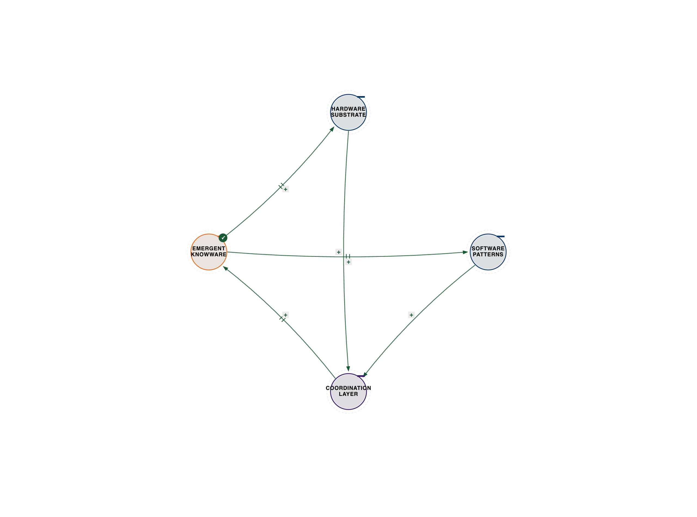
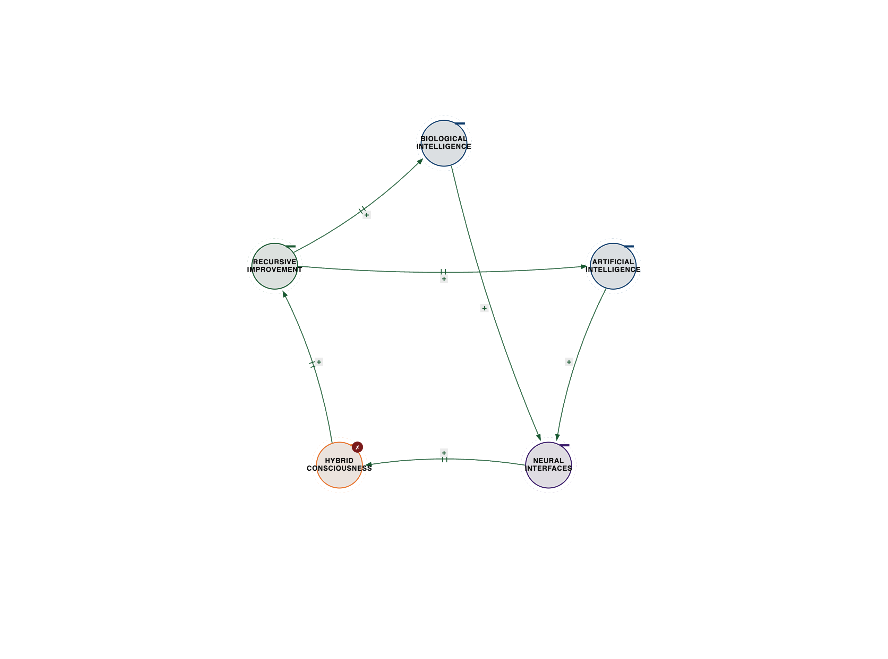
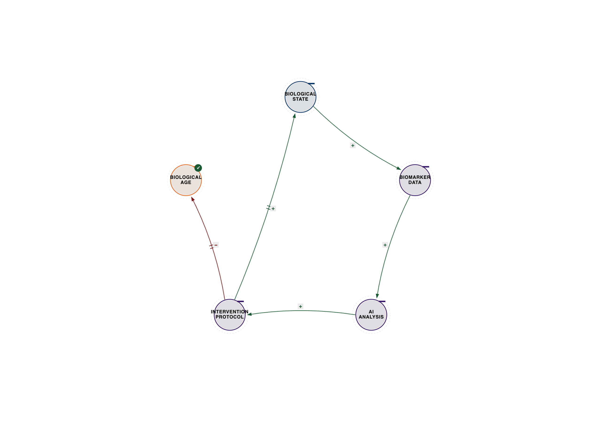
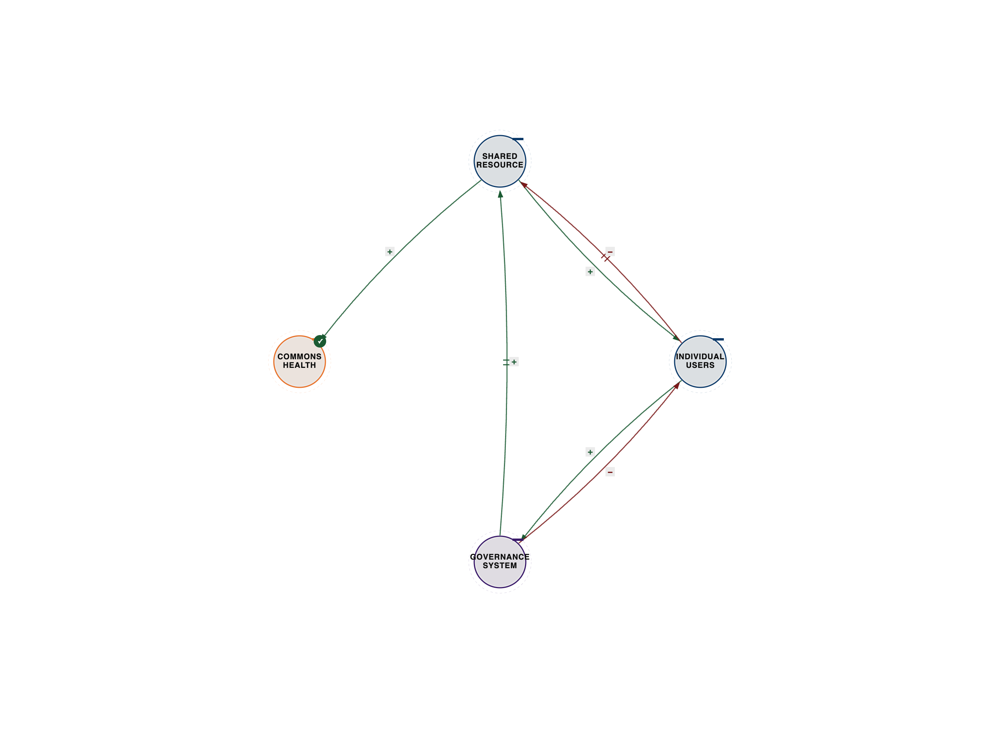
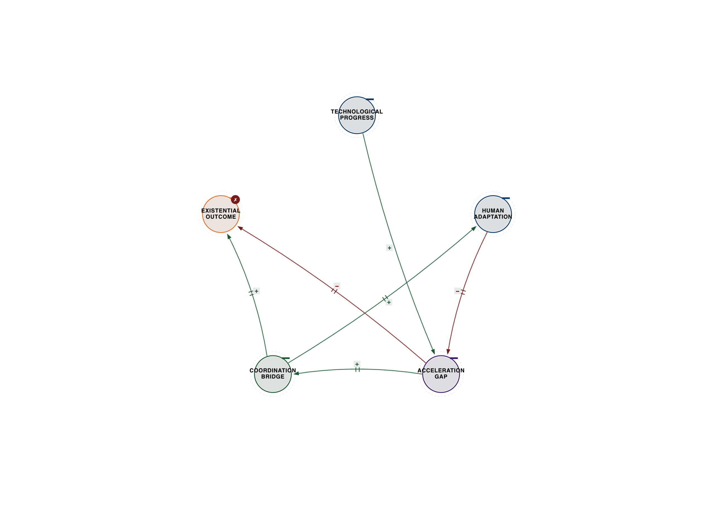
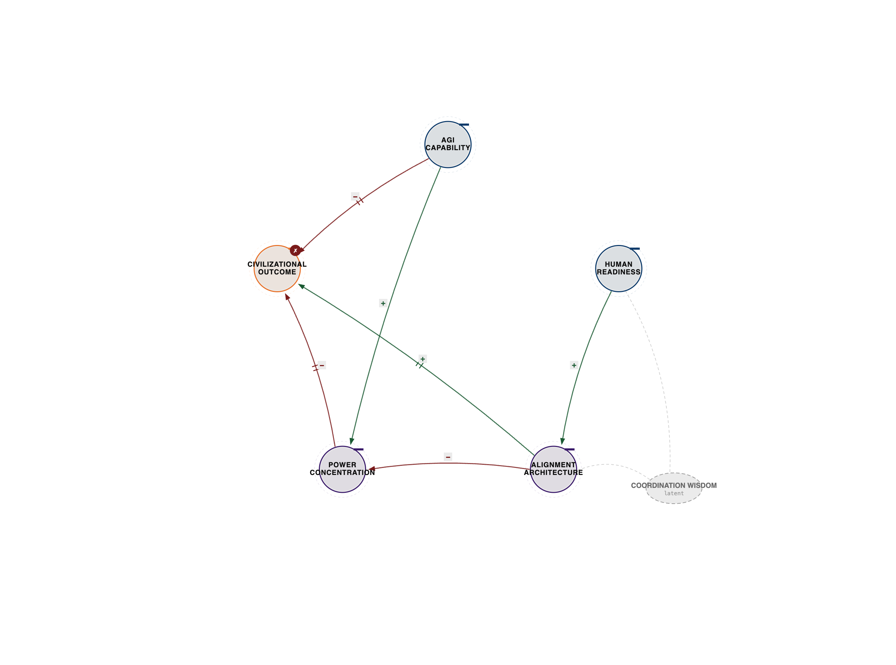

# The Grand Coordination

**Closing the Feedback Loop**

A note from Khayyam: The following chapter synthesizes the ideas of many brilliant minds. While I strive for accuracy, any interpretation or synthesis is my own, offered in the spirit of exploring the grand coordination.

## The Return

You have been here before.

Not in this chapter, not on this page. But the pattern you are about to recognize --- you have already been living inside it. Every chapter of this book has been training your perception, the way a musician's ear learns to hear harmonics that were always present in the sound. The harmonics were always there. You can hear them now.

Nine chapters. Eighty-one voices. Systems thinkers and quantum physicists, neuroscientists and urban planners, mystics and engineers, AI researchers and consciousness hackers --- all circling the same insight from different altitudes. They did not agree on everything. They did not need to. What they produced together is what none of them could produce alone: a *coordination* of understanding that is more than the sum of its perspectives.

This is not a summary chapter. Summaries flatten. Summaries turn a symphony into a track listing. This is a recognition chapter --- the moment the pattern clicks, and you realize it was never hiding. It was waiting for you to develop the eyes.

Cybernetics has a word for this moment. The Greek root *kubernetes* means steersman --- the one who reads the relationship between ship, wind, and current, and coordinates them toward a destination none of the three would reach alone. The steersman does not control the ship. The steersman does not command the wind. The steersman coordinates, through continuous feedback, with what is already in motion. That is what you have been learning to do, across nine chapters and eighty-one voices, whether you realized it or not. You have been becoming a steersman.

And the final act of the book is not to teach you anything new. It is to close the loop --- to let what you have learned return to you, coordinated, so that you can walk away not with more information but with a changed perception.

So let me show you what the pattern looks like when all nine chapters coordinate.

## The Nine Chapters as a Coordination System

The book has its own three-body architecture. It was not designed this way --- it emerged this way, which is itself the point.

**Chapters 1--3 form the Foundation triad.** They establish the physics of coordination --- what it is, how it works, why it produces emergence.

Chapter 1 opens with the Facebook emotional contagion experiment: 689,003 people, their News Feeds secretly manipulated, their emotional states shifted by algorithmic curation they never consented to. The disaster reveals that intelligence does not live in humans or machines --- it emerges in the coordination between them. Paul Pangaro brings Gordon Pask's Conversation Theory forward to show that real intelligence is not information transfer but mutual understanding. Stewart Brand diagnoses the missing coordination layer in our tools. The chapter establishes the foundational move: from binary optimization (A + B) to ternary coordination (A, B, and the space between them where emergence lives).

Chapter 2 traces the same pattern through the history of computing itself. Netflix's three-body system --- user behavior, content ecosystem, algorithm optimization --- demonstrates coordination producing emergence that no component could generate alone. The chapter moves through Shannon's information theory and Hartmut Neven's quantum AI lab to reveal that binary logic was always an approximation. Reality is not on/off. It coordinates.

Chapter 3 makes the architecture explicit. The IAAC learning building in Barcelona --- where sensors, AI, and human occupants coordinate to create adaptive intelligence --- becomes the prototype for all three-body systems. Richard Feynman's path integrals reveal that nature itself does not optimize; it coordinates across every possible path, and the classical trajectory is merely a special case that emerges from total coordination. Fritjof Capra's autopoiesis completes the triad: living systems maintain themselves through coordinated self-production. The architecture of intelligence is the architecture of life.

**Chapters 4--6 form the Application triad.** They take the foundation into the messy world --- cities, hospitals, courtrooms, battlefields of human-AI collaboration --- and test whether coordination thinking survives contact with reality.

Chapter 4 opens in Bogota, 1998: a city dying from its own growth, homicides at 80 per 100,000, average commutes stretching to two hours. Mayor Enrique Penalosa did not build infrastructure. He coordinated infrastructure with citizen behavior with political vision, and the city transformed --- homicides dropped 75%, bike trips surged from negligible to 600,000 daily. The chapter moves through Daniel Schmachtenberger's generator functions of civilizational risk, Dan Doctoroff's Sidewalk Labs experiment in Toronto, and Nassim Taleb's antifragility to show that three-body coordination is not just how systems work but how they heal.

Chapter 5 begins with Ian Burkhart playing Guitar Hero with his thoughts --- a paralyzed man whose brain signals, decoded through a neural interface, coordinated with muscle stimulation to restore voluntary movement. This is not metaphor. This is the future of human-AI interaction made literal: not humans using tools, but humans coordinating with AI to create capabilities neither possesses alone. Miguel Nicolelis's brainet experiments, Donna Haraway's cyborg theory, and the surgeon-AI-patient triad push the chapter toward a recognition that the boundary between human and machine is already dissolving --- and the question is not whether to cross it but how to coordinate the crossing.

Chapter 6 opens with the death of Elaine Herzberg --- killed by a self-driving Uber that detected her 5.6 seconds before impact but never understood what it was seeing. The car had perception and processing but lacked the third body: awareness. Norbert Wiener's cybernetics, Antonio Damasio's somatic markers, and the chapter's sustained meditation on consciousness reveal that awareness is not a luxury upgrade bolted onto intelligence. It is the coordination layer without which perception and processing cycle in the dark. Wiener spent sixteen years warning that systems optimizing without feedback from their context would achieve exactly what they were told and destroy everything they ignored. The Uber system proved him right, fatally.

**Chapters 7--9 form the Transcendence triad.** They push beyond application into the territories where coordination meets its highest stakes: engineering the previously impossible, touching cosmic intelligence, and confronting the barriers that can collapse the entire project.

Chapter 7 opens with Autodesk's generative AI designing an Airbus partition 45% lighter than the human version --- alien-looking organic curves no human engineer would imagine, yet structurally superior. The chapter moves through quantum engineering, materials science, and the recognition that three-body coordination does not just improve engineering. It transcends the design space itself, producing solutions that exist outside the boundaries of human imagination.

Chapter 8 lifts to cosmic scale. The Apollo guidance computer --- 4KB of RAM, less than a modern digital watch --- coordinated with human judgment and orbital physics to navigate 240,000 miles to a moving target. Srinivasa Ramanujan's mathematical intuition, arriving fully formed from a source he could not explain, represents coordination beyond the rational: knowledge emerging from a place where substrate, pattern, and awareness operate in registers we do not yet have instruments to measure. The chapter asks what intelligence looks like when it scales to planetary and cosmic dimensions.

Chapter 9 returns to earth with a thud. A Stanford AI system diagnoses pneumonia with 95% accuracy --- better than most radiologists --- and gets shut down in six months because nobody coordinated the technology with radiologist workflow, hospital operations, legal liability, or patient trust. The chapter is a sustained confrontation with the barriers to integration: institutional inertia, misaligned incentives, the human tendency to resist coordination even when the evidence is overwhelming. Andrew Hill's geopolitical analysis reveals that the same failure pattern --- optimizing capability without coordinating with context --- operates at civilizational scale.

**The three triads coordinate as their own three-body system:**

Foundation provides the physics. Application provides the proof. Transcendence provides the stakes.

Remove any triad and the book collapses. Foundation without Application is theory without test --- elegant equations no city ever put through bus rapid transit, no paralyzed patient ever moved a cursor with. Application without Foundation is pragmatism without understanding --- techniques that work without knowing why, dangerous to scale, impossible to teach. Application without Transcendence is short-horizon thinking --- solving today's coordination problem without seeing the civilizational stakes of coordination failure. Transcendence without Foundation is ambition without architecture --- singularity rhetoric unmoored from the physics it claims to leverage. Transcendence without Application is philosophy without grip --- visions of hybrid consciousness that never touch a hospital, a city, a grieving parent, a burning forest.

Together, the three triads produce something none could produce alone: a way of seeing that changes how you act. Which is, recursively, exactly the claim the book has been making. Knowware emerges from the coordination of hardware and software. The book's argument emerges from the coordination of foundation, application, and transcendence. The book is not *about* coordination intelligence. The book *is* coordination intelligence, enacted in the form of nine chapters that coordinate to produce an understanding none of them carries alone.

That recursion is not clever. It is structural. It is the only honest way to write a book about coordination --- by coordinating. Any other method would have undermined the argument by example.

---

*Figure X.1 --- Three Ware resolution (thesis diagram). See `../diagrams/svg/chX-01-three-ware-resolution.svg` for the vector source.*

---

## The Cross-Chapter Threads

The chapter summaries show the surface. But the deeper structure of the book is in the threads that run *between* chapters, connecting thinkers who never met to ideas they share in different vocabularies.

**Thread 1: The Coordination Physics**

Donella Meadows spent her career mapping leverage points in complex systems --- the places where small interventions create large, nonlinear change. Claude Shannon spent his career mapping channel capacity --- the maximum rate at which information can be reliably transmitted through a noisy medium. Fritjof Capra spent his career mapping autopoiesis --- the process by which living systems continuously produce and maintain themselves. Prof. Ruqian Lu spent his career naming the invisible --- the moment when substrate, process, and knowledge separate into distinguishable layers whose coordination becomes engineerable.

They are describing the same thing in four different languages: the physics of how coordination works. Meadows tells you *where* to intervene. Shannon tells you *how much* the channel can carry. Capra tells you *why* the system stays alive. Lu tells you *what the layers are* so that coordination can become a design discipline rather than an accident. Together, they provide the complete physics of coordination --- leverage, capacity, self-maintenance, and layered architecture. Any coordination design that ignores one of these four will either intervene in the wrong place, saturate its channels, fail to sustain itself, or fail to recognize which layer is breaking. This is not speculation. This is the physics of what works, and the physics of what fails. Every failure in every chapter of this book is explicable in these terms.

**Thread 2: The Failure Pattern Across Scales**

Daniel Schmachtenberger's generator functions of civilizational risk describe how optimization loops, left uncoordinated, produce the conditions for their own collapse. Norbert Wiener's genie problem describes how systems given goals without contextual feedback achieve their targets and destroy everything adjacent. Fiona Hill's geopolitical coordination failure describes how nations optimizing for individual advantage produce collective catastrophe. The MK-Ultra anonymous described the same pattern from inside intelligence institutions that compartmentalized their way into experiments no coordinated architecture would have approved. Stuart Russell's alignment problem --- the King Midas trap, where AI optimizes exactly the objective you specified and destroys everything you failed to specify --- is the same pattern in AI research clothing.

Same failure. Different scales. The pattern: optimize two bodies, ignore the third, and the third body destroys what you built. Facebook optimized engagement without coordinating for emotional health. The Uber system optimized classification without coordinating for awareness. The 2008 financial system optimized returns without coordinating for systemic correlation. Civilizations optimize economic growth without coordinating for ecological limits. MCAS optimized flight envelope protection without coordinating for pilot awareness. The failure is always the same. The missing body is always the one you thought you could afford to ignore --- and the cost of ignoring it scales with the power of the system. At the scale of a product, you get disappointed users. At the scale of a civilization, you get collapse. Schmachtenberger's point, which Wiener made seventy years earlier and Hill observes in real time, is that we are now building systems powerful enough that the civilizational-scale failure is on the table.

**Thread 3: Coordination Beyond the Rational**

Paul Pangaro's Conversation Theory describes intelligence as recursive mutual understanding --- not information transfer but the coordination of understanding about understanding. Miguel Nicolelis's brainet experiments demonstrate brains coordinating directly, without language, to solve problems that individual brains cannot. Srinivasa Ramanujan's mathematical intuition arrives from a source that bypasses formal reasoning entirely --- theorems emerging whole, from a coordination between substrate and pattern that operates below conscious access. Antonio Damasio's somatic marker hypothesis locates decision-making in a body-mind coordination that precedes conscious deliberation by milliseconds that turn out to be decisive. Iain McGilchrist's hemispheric analysis shows that the brain itself is a coordination between two radically different modes of attention, neither of which is sufficient alone. Roger Penrose's Orch-OR hypothesis proposes that consciousness may involve quantum coordination in microtubules --- a physics layer below the biology. Rupert Sheldrake's morphic resonance proposes coordination across time itself.

This thread suggests that the deepest coordination happens in registers that rationality cannot fully map. The body knows before the mind (Damasio). The brainet solves before the individual (Nicolelis). The theorem arrives before the proof (Ramanujan). The hemisphere engages before analysis (McGilchrist). The quantum state resolves before decoherence (Penrose's controversial speculation). Coordination is not exclusively a rational process. It includes the rational but is not contained by it. Any architecture of intelligence that assumes coordination must happen in language, or must be decomposable into explicit logical steps, is modeling only the surface layer. The deeper layers, where the most powerful coordination happens, are where AI systems currently cannot follow.

**Thread 4: The Ancient Wisdom Rediscovered**

Hunbatz Men described the Mayan elders reading Earth-Sun-Galaxy coordination in ceremonial time, not as mysticism but as the observational science of beings who had watched the sky for thousands of years. Phillip Deere spoke of the Lakota understanding that Earth, Moon, and Sun form a coordination triad that sustains life --- a cosmology that is also a physics lesson. Yann Minh's digital shamanism argues that indigenous ceremonial technologies encoded coordination architectures that our algorithmic ones lack. Sarah Rossbach's Feng Shui renders the coordination of person, space, and energy in a vocabulary five thousand years old. The Thich Nhat Hanh Foundation teaches interbeing --- the recognition that no thing exists alone, that the paper contains the cloud, the forest, the logger, the rain.

And then there is Rupert Sheldrake, whose morphic resonance hypothesis proposes that coordination happens not only across space but across time --- that systems coordinate with their own past, that form has memory. The scientific establishment rejected it as mysticism. The mystics would call it obvious.

These are not decorations on the book's argument. They are the argument itself in older languages. Three-body coordination is not a twentieth-century discovery. It is something human beings have known and encoded in ceremony, myth, and architecture for as long as we have been human. What twentieth-century science did was give it mathematical form. What twenty-first-century technology is doing is giving it planetary scale. The coordination revolution is not new. It is remembered.

**Thread 5: The Ethics of Coordination**

Coordination is not value-neutral. This is the thread that runs through Shannon Vallor's virtue ethics, Donna Haraway's situated knowledge, Timnit Gebru's AI justice work, Kate Crawford's material analysis of AI's supply chains, Tristan Harris's humane technology advocacy, and Margaret Mitchell's model cards.

The insight they share: every coordination architecture privileges some bodies over others. Facebook's engagement algorithm coordinated user attention, platform revenue, and network effects --- but not user wellbeing, democratic health, or child safety. The choice of which bodies to coordinate is always an ethical choice, even when it pretends to be a technical one. "We are just optimizing engagement" is not a neutral position. It is a decision about which third body to ignore.

Vallor's virtue ethics reframes this: ethical AI is not AI with values bolted on. It is AI architected from the start to coordinate with human flourishing, social context, and the wisdom of practitioners in the loop. Haraway's situated knowledge adds: any AI that claims objectivity is lying about its training data. Gebru's work adds: any coordination architecture that excludes the voices of those most affected will optimize against them. The ethical force of this thread is cumulative: you cannot engineer coordination intelligence while ignoring whose coordination you are engineering for. Crawford traces the rare earth minerals and underpaid labor that make AI possible, reminding us that every model sits on a supply chain of extraction that most of its users will never see. Harris shows that attention platforms coordinated at planetary scale against the interests of the humans they coordinate. Mitchell's model cards are a small, technical intervention that makes the ethical coordination legible --- you cannot govern what you cannot see, and most AI deployment renders itself invisible by design. The ethical question is not whether to coordinate. It is who the coordination serves, and who it costs. The recognition that *you are knowware* is not a feel-good affirmation. It is a refusal to be coordinated against your own interests without your consent.

**Thread 6: The 81 Voices as Chorus**

The eighty-one voices in this book were not selected for agreement. They were selected for *coverage* --- the way an orchestra is selected not for uniformity but for the range of registers it can produce. Systems thinkers and quantum physicists occupy different frequency bands. Neuroscientists and urban planners hear different harmonics. Mystics and engineers build in different materials. The anonymous intelligence operatives speak of coordination at classification levels most readers will never approach. The Lakota elder and the quantum physicist describe the same pattern from opposite ends of time.

Some of these thinkers never met. Some would have disagreed violently in person. Feynman and Sheldrake would have argued for hours. Gebru and the In-Q-Tel program manager work in ecosystems that barely acknowledge each other's existence. Taleb would call half the academics in this book fragilistas and the other half turkeys. The MK-Ultra anonymous and the Thich Nhat Hanh Foundation scholar would struggle to share a table.

But when eighty-one voices coordinate --- when Feynman's path integrals resonate with Capra's autopoiesis, when Penalosa's Bogota echoes Burkhart's neural bypass, when Meadows's leverage points align with Shannon's channel capacity, when Hunbatz Men's Earth-Sun-Galaxy ceremony maps cleanly onto the Hardware-Software-Knowware triad --- the result is not noise. It is a chord. The kind of chord that only a chorus can produce. No soloist carries the whole frequency range. The intelligence is in the coordination. And the coordination, remarkably, holds.

---

*Figure X.2 --- Kurzweil singularity merger. See `../diagrams/svg/chX-02-kurzweil-singularity-merger.svg` for the vector source.*

---

## The Three Ware Resolution

We have circled this throughout the book. Now let us state it with full weight.

**Hardware** is substrate. Neurons, silicon, quantum systems. The material from which intelligence is built. Your body is hardware. A processor is hardware. The universe's matter-energy is hardware. Without substrate, there is nothing to coordinate.

**Software** is pattern. Algorithms, neural pathways, cultural norms, mathematical structures. The organizational logic that gives substrate its shape. Your habits are software. A neural network's weights are software. The laws of physics are software. Without pattern, substrate is inert.

**Knowware** is what emerges when substrate and pattern coordinate consciously. It is not a third thing added to the first two. It is the *relationship* between them --- the awareness that arises when hardware running software becomes capable of reflecting on its own coordination.

You are knowware. Not hardware (though you have a body). Not software (though you run patterns). But the emergent intelligence that arises from coordinating both with awareness.

This is not metaphor. Your consciousness --- right now, reading this sentence --- is the coordination between your biological substrate (neurons firing), your learned patterns (language, concepts, expectations), and your awareness of the coordination itself (the fact that you are tracking both the content and your response to it). Three bodies. One emergence. You.

---

*Figure X.3 --- Blueprint optimization loop. See `../diagrams/svg/chX-03-blueprint-optimization-loop.svg` for the vector source.*

---

The resolution scales fractally:

**Individual:** Brain (hardware) <--> Thoughts (software) <--> Consciousness (knowware)

**Relational:** Two bodies (hardware) <--> Shared language (software) <--> Mutual understanding (knowware)

**Organizational:** Infrastructure (hardware) <--> Processes (software) <--> Culture (knowware)

**Technological:** Processors (hardware) <--> Algorithms (software) <--> AI (knowware)

**Civilizational:** Material resources (hardware) <--> Institutions (software) <--> Collective intelligence (knowware)

**Planetary:** Biosphere (hardware) <--> Ecological processes (software) <--> Gaia's coordination (knowware)

At every scale, the same architecture. At every scale, the same resolution: not choosing between hardware, software, or knowware, but coordinating all three to produce intelligence that transcends its components. A brain without thoughts is a corpse. A brain with thoughts but no self-awareness is a dreamless sleep. An organization with infrastructure and processes but no culture is a dead mechanism --- this is what most bureaucracies are. An AI with processors and algorithms but no coordination with context is a Stanford pneumonia model sitting unused on a server. The pattern is not decorative. It is diagnostic. When a system fails at any scale, you can name which ware is missing or miscoordinated, and the fix lives in the coordination, not the components.

The ancient traditions encoded this. Gurdjieff's Law of Triamazikamno --- the Holy Affirming, Holy Denying, and Holy Reconciling --- describes three forces coordinating to manifest all phenomena. The mystical schools practiced it as body, mind, and spirit. Christianity encoded it as Father, Son, and Holy Spirit --- not three gods but one God in three persons, which is precisely the three-body grammar the book has been teaching. Buddhism encoded it as the Three Jewels: Buddha (the awakened being), Dharma (the teaching), and Sangha (the coordinating community). Hinduism encoded it as Sat-Chit-Ananda: being, consciousness, bliss --- substrate, pattern, and the emergent awareness of their coordination. What appeared as esoteric wisdom was describing the literal architecture of reality. We have rediscovered it through quantum mechanics, systems theory, cybernetics, and AI architecture, validating what contemplatives intuited across millennia. The coordination revolution is not new. It is remembering.

---

*Figure X.4 --- Commons governance triad. See `../diagrams/svg/chX-04-commons-governance-triad.svg` for the vector source.*

---

## The Coordination Practice

Knowledge without practice is a map you never unfold. Here is how to use it.

**The Coordination Questions**

When you face any challenge --- a stalled project, a broken relationship, an organizational crisis, a design problem --- ask:

1. **What are the three bodies?** Not "what are the two sides of this problem?" but "what is the third element everyone is ignoring?" In every conflict, there is a missing body. In every stalemate, there is an unacknowledged coordinator. Find it.

2. **How are they coordinating now?** Map the current coordination architecture. Where is information flowing? Where is it blocked? Which feedback loops are reinforcing, which are balancing, and which are missing entirely? The Uber system had perception and processing but no feedback arc closing through awareness. What is your system's missing arc?

3. **What coordination architecture would produce the emergence you want?** Design for emergence, not for control. Penalosa did not control Bogota's citizens. He designed coordination infrastructure --- transit, bike lanes, public spaces --- that enabled citizens to coordinate differently. What is the equivalent in your situation? What infrastructure would enable the three bodies to coordinate toward the emergence you seek?

4. **What is the smallest experiment?** You do not need to redesign the entire system. You need to find the leverage point --- Meadows's insight --- where a small coordination intervention produces nonlinear change. Start there. Observe. Adjust. This is cybernetics in practice: not planning the whole trajectory but steering through feedback.

**The Daily Practice**

This is simpler than it sounds.

**Morning:** Before you begin your day, identify the three bodies you will be coordinating. Not goals. Not tasks. Bodies. What elements need to coordinate, and what emergence would success look like?

**During:** When you hit resistance, friction, or confusion, pause and ask: which body is being ignored? Almost always, you are optimizing two bodies and neglecting the third. The project that coordinates technical excellence with user needs but ignores organizational politics. The relationship that coordinates shared goals with emotional connection but ignores the logistical substrate. Find the missing body.

**Evening:** Reflect on what coordinated and what did not. Not "what did I accomplish?" but "where did coordination succeed, and where did it fail?" Over time, this reflection trains your perception the way a musician's practice trains their ear. You begin to hear the coordination --- and the discoordination --- in everything.

**A Worked Example**

Let me make this concrete with a case I watched unfold recently.

A team I know was trying to roll out an AI tool across their organization. The tool was excellent --- Stanford-grade accuracy on the task it performed. Six months in, adoption had flatlined at 11 percent. Leadership was frustrated. Engineers were frustrated. Users were quietly reverting to their old workflows.

The two-body frame was obvious: the tool versus user reluctance. The diagnostic questions were "is the tool good enough?" and "how do we overcome resistance?" Both questions were already answered --- the tool was excellent, and no amount of mandated training was breaking through the resistance. The team was stuck.

We applied the three-body questions.

*What are the three bodies?* The tool (hardware/capability), the users (human judgment and workflow), and the third body that everyone was ignoring: the contextual conditions under which the tool needed to coordinate with existing work. What data was available when a decision was being made? What were the handoffs to other team members? What was the liability structure if the tool was wrong? What was the reputation cost of disagreeing with it?

*How are they coordinating now?* The tool was producing outputs into a workflow it knew nothing about. Users were being asked to trust outputs that arrived decoupled from the context in which decisions had to be made. The third body --- contextual coordination --- was absent. The tool spoke. The user decided. Context was invisible to both.

*What coordination architecture would produce the emergence you want?* Not better training. Not stronger mandate. Coordination infrastructure --- specifically, interfaces that let the tool see the context and let users see the tool's reasoning in light of that context. The tool needed to know what case it was working inside of. The user needed to see what the tool knew and did not know. The third body had to be made legible to both.

*What is the smallest experiment?* One team, one use case, one interface redesign: add a context panel that showed both the tool and the user what information was available, what was missing, and what the tool's confidence looked like given the missing pieces.

They ran it for three weeks. Adoption on that team hit 74 percent. Nothing about the tool changed. Nothing about the users changed. What changed was the coordination architecture. The third body became visible, and the other two bodies started doing something together that neither could do alone.

This is the practice. Not magic. Not a silver bullet. Just the stubborn refusal to accept two-body thinking when three-body coordination is available. The missing body is always the one you thought you could afford to ignore. When you name it, the system starts working.

---

*Figure X.5 --- Acceleration gap. See `../diagrams/svg/chX-05-acceleration-gap.svg` for the vector source.*

---

---

*Figure X.6 --- AGI alignment scenarios. See `../diagrams/svg/chX-06-agi-alignment-scenarios.svg` for the vector source.*

---

## The Invitation

I have spent years with these eighty-one thinkers. Living inside their frameworks, letting their contradictions grind against each other until sparks caught. Some of them would reject my synthesis. Some would recognize it immediately. The ones who would reject it and the ones who would embrace it would probably surprise you.

What I can tell you is this: the pattern is real. Not because I say so, but because it keeps showing up --- in quantum physics and urban planning, in neuroscience and ancient wisdom, in the structure of atoms and the structure of cities. Three bodies coordinating to produce emergence that none of them could produce alone. It is not a theory I imposed on the material. It is what the material kept insisting on.

And now you see it.

You see it in the meeting where two departments are locked in conflict and the missing third is the shared context neither has articulated. You see it in the AI deployment that technically works and practically fails because nobody coordinated the technology with the humans who must use it. You see it in the parenting moment where you are tempted to choose between honoring your child's autonomy and imposing structure --- and realize the third body is the relationship, the ongoing coordination that holds both. You see it in the design meeting where the engineers want performance and the marketers want story and the third body is the user whose actual context nobody has mapped. You see it in your own thinking when you catch yourself in binary opposition --- this OR that --- and realize there is a third body waiting to turn the dilemma into a resolution.

You see it in climate negotiations where nations coordinate emissions targets without coordinating the industrial transitions that would make those targets meaningful. You see it in your local government where transportation, housing, and labor markets are governed by separate agencies that never coordinate, producing a city that optimizes three disconnected variables and liveability for none. You see it in your team's Slack channel where rapid messaging coordinates information flow but destroys the deep-work patterns that produce the ideas worth sharing. You see it in your own phone --- engagement optimized, attention fragmented, the third body of your sovereign agency ignored.

This is what the book was for. Not to give you information. You have more information than any generation in history. But to give you *coordination consciousness* --- the ability to see the three-body pattern, to find the missing body, to design for emergence rather than optimize for control.

You are knowware. Hardware is your body --- the extraordinary biological substrate that evolution spent four billion years coordinating into existence. Software is your learned patterns --- language, culture, habits, knowledge, the vast library of programs you run without thinking. Knowware is what happens when you become aware of the coordination itself --- when you step back and see the three bodies dancing, and realize that the dance is you.

Not metaphor. Architecture.

Every time you coordinate with AI to enhance your thinking, you are knowware in action --- biological intelligence coordinating with artificial intelligence through the context of your judgment. Every time you design a system that serves human flourishing, you are knowware in action --- technical capability coordinating with human values through the context of wisdom. Every time you recognize the missing body in a broken system, you are knowware in action --- perception coordinating with analysis through the context of awareness.

The coordination revolution does not need you to do something new. It needs you to see what you have always been doing --- and do it consciously.

## Epilogue: The Coordination Continues

We began with Facebook's algorithm disaster --- binary optimization destroying the emotional health of 689,003 people because nobody built the coordination layer. We end here, nine chapters later, with a recognition that the coordination layer is not something we build. It is something we are.

The book closes. The coordination does not.

You will put this down and walk into a world of three-body problems. Some of them are small --- a misaligned team, a stuck project, a conversation going nowhere. Some of them are civilizational --- climate coordination, AI alignment, the governance of technologies that could save or destroy us. Some of them are intimate --- the child who needs both autonomy and boundary, the partner who needs both closeness and space, the body that needs both rest and challenge. All of them follow the same architecture. All of them yield to the same approach: find the three bodies, design the coordination, enable the emergence, steer through feedback.

This is cybernetics in the original sense. *Kubernetes* --- the Greek word Wiener borrowed --- means steersman. Not the captain who decides the destination, not the engine that provides the power, but the steersman who coordinates between them and the waves. The book has been teaching you to steer. Not to command the ship, not to build a bigger engine, but to coordinate what is already in motion toward outcomes none of the components could reach alone.

The eighty-one voices in this book did not agree on everything. They agreed on this: the future is not determined. It is coordinated. And the coordination is not done by abstract forces or inevitable trends. It is done by people --- by you --- making choices about which bodies to attend to, which feedback loops to close, which emergence to enable. Every choice you make about where to pay attention is a coordination choice. Every choice you make about which third body to take seriously is a coordination choice. You are steering, whether you know it or not. The only question is whether you do it consciously.

The three ware problem resolves the same way at every scale:

**Hardware <--> Software <--> Knowware**

Substrate coordinating with pattern coordinating with awareness to produce intelligence that transcends its components.

You are that intelligence.

Not someday. Now. In the act of reading this sentence and deciding what to do next.

The loop closes here. And immediately opens again, wider, in the next thing you do.

The coordination continues.

---

*For appendices, resources, and continued learning: systemsofintelligence.com*

*To join the coordination revolution: someone@systemsofintelligence.com*
